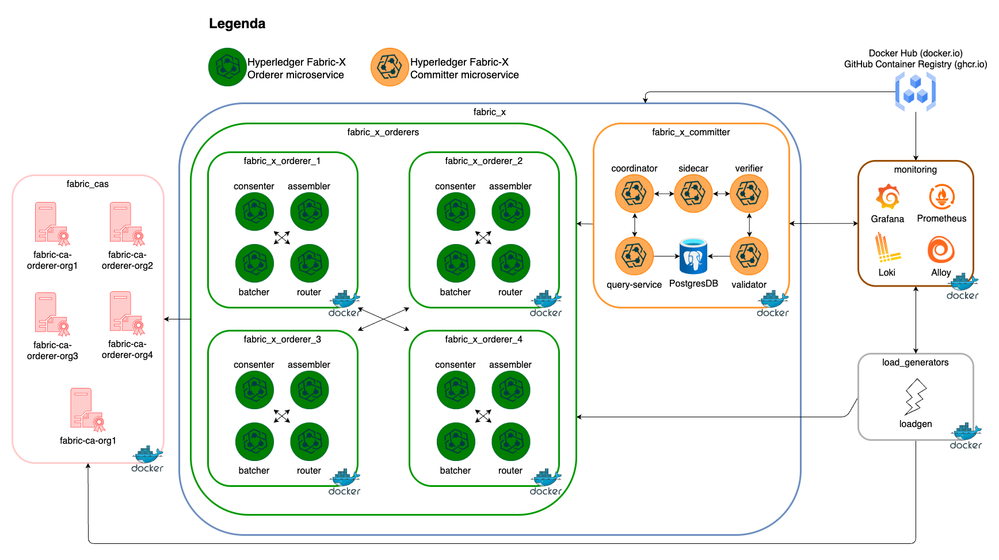
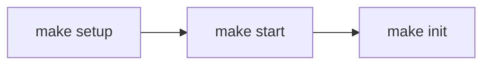

# Hyperledger Fabric-X Ansible Collection

[](LICENSE) [](https://lf-decentralized-trust-labs.github.io/fabric-x-ansible-collection/)   

Hyperledger Fabric-X is an open source project that builds on top of Hyperledger Fabric and is tailored specifically for digital asset use cases. Fabric-X builds on the core principles of Hyperledger Fabric (_sovereign_, _horizontally scalable smart contract execution_ and a _modular_, _agile_ architecture), making it well-suited to meet the governance and compliance needs of regulated digital assets.

This repository contains the `hyperledger.fabricx` Ansible collection, which can be used to deploy a Hyperledger Fabric-X network locally, on Kubernetes, or across multiple nodes.

## Table of Contents <!-- omit in toc -->

- [Installation](#installation)
  - [Option 1: Install from Ansible Galaxy](#option-1-install-from-ansible-galaxy)
  - [Option 2: Clone under `ANSIBLE_COLLECTIONS_PATHS` (for development)](#option-2-clone-under-ansible_collections_paths-for-development)
  - [Option 3: Install from source](#option-3-install-from-source)
- [Usage](#usage)
- [Prerequisites](#prerequisites)
  - [Setup the control node](#setup-the-control-node)
  - [Setup the remote nodes](#setup-the-remote-nodes)
- [Run a sample Fabric-X network](#run-a-sample-fabric-x-network)
  - [Choose another sample inventory](#choose-another-sample-inventory)
  - [Run with Podman/Docker on macOS](#run-with-podmandocker-on-macos)
  - [1. Setup the network](#1-setup-the-network)
  - [2. Start the network](#2-start-the-network)
  - [3. Initialize the network](#3-initialize-the-network)
  - [4. Observe the network](#4-observe-the-network)
  - [5. Teardown the network](#5-teardown-the-network)
- [Supported commands](#supported-commands)
  - [Restrict commands to a group of hosts](#restrict-commands-to-a-group-of-hosts)
- [Contributing](#contributing)
  - [Updating role documentation](#updating-role-documentation)
- [License](#license)

## Installation

### Option 1: Install from Ansible Galaxy

To install the latest published version of the `hyperledger.fabricx` collection from [Ansible Galaxy](https://galaxy.ansible.com/ui/repo/published/hyperledger/fabricx/), run:

```shell
ansible-galaxy collection install hyperledger.fabricx
```

Then install the collection's dependencies:

```shell
ansible-galaxy collection install -r ~/.ansible/collections/ansible_collections/hyperledger/fabricx/requirements.yml
```

### Option 2: Clone under `ANSIBLE_COLLECTIONS_PATHS` (for development)

To install the `hyperledger.fabricx` collection on your control node, run:

```shell
git clone https://github.com/LF-Decentralized-Trust-labs/fabric-x-ansible-collection.git ~/.ansible/collections/ansible_collections/hyperledger/fabricx
cd ~/.ansible/collections/ansible_collections/hyperledger/fabricx
make install-deps
```

!!! note

    This is the recommended way if you plan to develop and change the scripts, since it allows to test directly the modified scripts avoiding to reinstall the collection at every change.

!!! warning

    Do not run `make install` with this setup — the collection is already live from the cloned directory. Running it would overwrite your checkout with a built artifact. Use `make install-deps` to install dependencies only. The Makefile will also guard against this and abort if it detects the risk.

### Option 3: Install from source

If you don't know where the `COLLECTIONS_PATHS` is located, or you don't plan to develop/change the Ansible scripts within the collection, you can install from source using the commands:

```shell
git clone https://github.com/LF-Decentralized-Trust-labs/fabric-x-ansible-collection.git
cd fabric-x-ansible-collection
make install
```

## Usage

The collection provides a set of Ansible roles that can be used to deploy a Hyperledger Fabric-X network in a distributed manner. Each role is devoted to a specific component.

Each role comes with tasks and each task performs a specific operation, such as starting, stopping, configuring, or wiping a component. The collection also includes predefined playbooks that compose these roles into common lifecycle operations. If your inventory follows the expected group names, you can use those playbooks directly instead of writing your own orchestration layer.

The collection is organized around three concepts:

| Concept     | Description                                                                                                                     |
| ----------- | ------------------------------------------------------------------------------------------------------------------------------- |
| Roles       | Low-level component automation. Use these when you need custom orchestration.                                                   |
| Playbooks   | Reusable lifecycle workflows that call the roles in the expected order.                                                         |
| Inventories | The deployment model: which components exist, where they run, which ports they use, and which security/runtime mode is enabled. |

For example, the playbook [playbooks/orderer/start.yaml](./playbooks/orderer/start.yaml) shows how to use the `hyperledger.fabricx.orderer` role to start a Fabric-X Orderer node:

```yaml
- name: Start Fabric-X Orderer components
  ansible.builtin.include_role:
    name: hyperledger.fabricx.orderer
    tasks_from: start
```

For more information, see the [roles](./roles/README.md), [playbooks](./playbooks/README.md), and [example inventories](./examples/README.md) documentation.

## Prerequisites

### Setup the control node

To run such Ansible collection, you need to have the following prerequisites installed on your control node:

- `python` >= 3.11;
- `docker` or `podman`;
- `go` >= 2.16 (only needed if you run binary-based inventories);
- `kubectl` (needed to run [k8s inventories](./examples/inventory/docs/README.md#kubernetes)).

After having cloned this repository, run:

```shell
make install-deps
```

### Setup the remote nodes

The collection comes with a playbook that can be used to automatically setup all the remote nodes at once. From your control node, run:

```shell
make install-remote-node-deps
```

!!! warning "Important"

    The playbook installs the needed packages and requires `sudo` permission. Make sure to use a passwordless `sudo` user so the playbook can complete.

## Run a sample Fabric-X network

This repository comes with Ansible inventories and example playbooks that can start sample Fabric-X networks on your local machine, in Kubernetes, or across multiple machines. See the [examples README](./examples/README.md) for the available inventory families.

By default, the [`local/fabric-x.yaml`](./examples/inventory/docs/local/fabric-x.md) inventory is used:



This diagram shows the default local sample topology: Fabric CA services issue identities, four orderer groups produce ordered blocks, a PostgreSQL-backed committer validates and stores state, and monitoring collects metrics.

To run it on your local machine, follow these steps.

The sample lifecycle is:


```mermaid
flowchart LR
  setup[make setup] --> start[make start]
  start --> init[make init]
```

### Choose another sample inventory

The current sample inventory families are:

| Family      | Documentation                                                           | Notes                                                                            |
| ----------- | ----------------------------------------------------------------------- | -------------------------------------------------------------------------------- |
| Local       | [Local inventories](./examples/README.md#local-inventories)             | Single-machine deployment, useful for trying and testing on your local machine   |
| Distributed | [Distributed inventories](./examples/README.md#distributed-inventories) | Multi-machine deployment to scale the network and test high-throughput use-cases |
| Kubernetes  | [Kubernetes inventories](./examples/README.md#kubernetes-inventories)   | Kubernetes deployments                                                           |

Set `ANSIBLE_INVENTORY` to use another inventory without editing [`examples/ansible.cfg`](./examples/ansible.cfg):

```shell
export ANSIBLE_INVENTORY=examples/inventory/k8s/fabric-x.yaml
```

### Run with Podman/Docker on macOS

If you run a local container inventory on macOS, you can run into connectivity issues between host processes and containers. Docker and Podman run Linux containers in a VM, so `localhost` inside a container is not the same endpoint as `localhost` on macOS.

Set `LOCAL_ANSIBLE_HOST` so generated configuration points at an address containers can resolve:

```yaml
# add this to .bashrc or any other file sourced by your shell
export LOCAL_ANSIBLE_HOST="host.docker.internal"
```

If binaries also need to resolve the same name from the macOS host, add it to `/etc/hosts`:

```ini
echo "127.0.0.1 host.docker.internal" | sudo tee -a /etc/hosts
```

### 1. Setup the network

The first step consists in generating the artifacts needed by the nodes to run:

```shell
make setup
```

### 2. Start the network

Once the artifacts have been correctly generated and distributed, you can start the nodes with the command:

```shell
make start
```

### 3. Initialize the network

After the components are up, run:

```shell
make init
```

This command runs post-start initialization, such as creating the namespaces indicated in the inventory using `fxconfig`.

### 4. Observe the network

You can access [Grafana dashboards](http://localhost:3000/dashboards) (user=_admin_, password=_adminPWD_) to see how the Fabric-X network is handling the transactions processing.

!!! note

    These Grafana credentials are sample defaults. Change them before using an adapted inventory in a shared environment.

### 5. Teardown the network

To shut the network down, run:

```shell
make teardown
```

The command proceeds by stopping all the running instances and also cleaning any artifact that has been generated on disk by such instances.

## Supported commands

All the high-level commands are defined within the [Makefile](./Makefile). To get the list of all the possible commands, run:

```shell
make help
```

The most frequently used commands are:

| Command                    | Usage                                                                        |
| -------------------------- | ---------------------------------------------------------------------------- |
| `install`                  | Build and install the `hyperledger.fabricx` collection locally.              |
| `install-deps`             | Wrapper for `install-venv` + `install-python-deps` + `install-ansible-deps`. |
| `install-venv`             | Install a `venv` environment.                                                |
| `install-python-deps`      | Install Python dependencies on the control node.                             |
| `install-ansible-deps`     | Install the Ansible collections required by this repository.                 |
| `install-remote-node-deps` | Install the needed dependencies on the remote hosts.                         |
| `lint`                     | Run `ansible-lint` checks.                                                   |
| `check-license-header`     | Verify license headers on all files.                                         |
| `check-trailing-spaces`    | Check for trailing spaces in `.j2` files.                                    |
| `login-cr`                 | Log a container engine within a container registry.                          |
| `setup`                    | Wrapper for `binaries` + `artifacts` + `configs`.                            |
| `artifacts`                | Wrapper for `generate-crypto` + `genesis-block`.                             |
| `generate-crypto`          | Generate the crypto material on the controller node.                         |
| `genesis-block`            | Build the genesis block for the network.                                     |
| `binaries`                 | Build/install binaries on controller or remote nodes for the targeted hosts. |
| `clean`                    | Clean all the artifacts and binaries built on the controller node.           |
| `clean-cache`              | Clean the Ansible cache.                                                     |
| `configs`                  | Create/Ship the configs to the remote nodes.                                 |
| `start`                    | Start the targeted hosts.                                                    |
| `stop`                     | Stop the targeted hosts without deleting the data.                           |
| `teardown`                 | Teardown the targeted hosts (stop and delete data).                          |
| `update`                   | Update the targeted hosts (stop + binaries + start).                         |
| `restart`                  | Restart the targeted hosts (stop + start).                                   |
| `hard-restart`             | Hard restart the targeted hosts (teardown + start).                          |
| `wipe`                     | Wipe out the config artifacts and the binaries from the remote hosts.        |
| `hard-wipe`                | Wipe the deploy folder from the remote hosts.                                |
| `targets`                  | Generate Makefile targets for all inventory hosts.                           |
| `run-command`              | Run a generic command on the targeted hosts.                                 |
| `ping`                     | Check that the component ports are open.                                     |
| `get-metrics`              | Get the metrics from the targeted components.                                |
| `fetch-crypto`             | Fetch the crypto material from the targeted hosts.                           |
| `fetch-logs`               | Fetch the logs from the targeted hosts.                                      |
| `limit-rate`               | Set the TPS rate on the load generators.                                     |

### Restrict commands to a group of hosts

By default all the `Makefile` commands target all the hosts which are defined within the reference inventory. However, the playbooks have been tailored in such a way that the actions can be restricted to a sub-group (or even a single host) through the `target_hosts` Ansible variable, which is reflected as the `TARGET_HOSTS` variable in the [Makefile](./Makefile).

The `Makefile` comes with a set of [predefined host groups](./target_groups.mk) that can be used to easily restrict commands:

| Group                | Target                                           |
| -------------------- | ------------------------------------------------ |
| `fabric_cas`         | The Fabric CA servers                            |
| `fabric_x`           | The Fabric-X network nodes (orderers+committer). |
| `fabric_x_orderers`  | All the Fabric-X orderers.                       |
| `fabric_x_committer` | The Fabric-X committer components.               |
| `load_generators`    | All the load_generators.                         |
| `monitoring`         | All the monitoring instances.                    |

For example, running:

```shell
make fabric_x_orderers start
```

restricts the command to the host group `fabric_x_orderers` defined within the inventory.

All these groups are reflected in the [sample inventories](./examples/README.md). If you plan to use the playbooks provided with the collection, keep the group names identical so the high-level lifecycle commands keep working.

## Contributing

Contributions to this project are welcomed and encouraged.

If you'd like to help improve this project, please follow these steps:

1. **Fork** the repository;

2. **Create a new branch** for your feature or bugfix:

```bash
git checkout -b your-feature-name
```

### Updating role documentation

Role READMEs and role defaults are automatically generated from `meta/argument_specs.yaml`. When you add a new role task entry point or introduce variables for an existing entry point, update that role's `argument_specs.yaml` and then run:

```shell
make generate-roles-docs
```

## License

This project is licensed under the Apache License 2.0.  
You are free to use, modify, and distribute this software in accordance with the terms of the license.

For more details, please refer to the [LICENSE](./LICENSE) file included in this repository.
