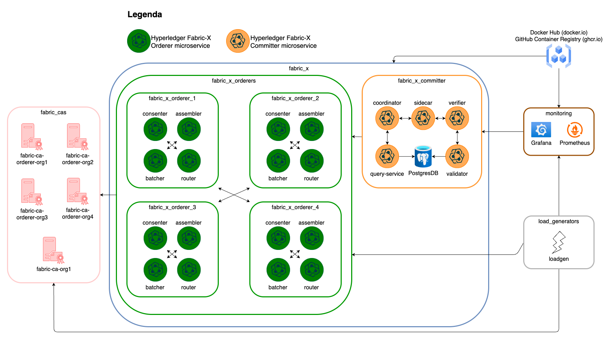

# Hyperledger Fabric-X Ansible Collection

Hyperledger Fabric-X is an open source project that builds on top of Hyperledger Fabric and tailored specifically for digital assets use-cases. Fabric-X builds on the core principles of Hyperledger Fabric (_sovereign_, _horizontally scalable smart contract execution_ and a _modular_, _agile_ architecture) making it well-suited to meet the governance and compliance needs of regulated digital assets.

This repository contains the `hyperledger.fabricx` Ansible collection, which can be used to deploy an Hyperledger Fabric-X network and distribute the components over multiple nodes.

## Table of Contents <!-- omit in toc -->

- [Installation](#installation)
  - [Option 1: Clone the repository under `COLLECTIONS_PATHS`](#option-1-clone-the-repository-under-collections_paths)
  - [Option 2: Install from source](#option-2-install-from-source)
- [Usage](#usage)
- [Prerequisites](#prerequisites)
  - [Setup the control node](#setup-the-control-node)
  - [Setup the remote nodes](#setup-the-remote-nodes)
- [Run a sample Fabric-X network](#run-a-sample-fabric-x-network)
  - [1. Generate the artifacts](#1-generate-the-artifacts)
  - [2. Start the network](#2-start-the-network)
  - [3. Teardown the network](#3-teardown-the-network)
  - [Run with Podman/Docker on MacOS](#run-with-podmandocker-on-macos)
- [Supported commands](#supported-commands)
  - [Restrict commands to a group of hosts](#restrict-commands-to-a-group-of-hosts)
- [Contributing](#contributing)
- [License](#license)

## Installation

### Option 1: Clone the repository under `COLLECTIONS_PATHS`

To install the `hyperledger.fabricx` collection on your control node, run:

```shell
git clone https://github.com/LF-Decentralized-Trust-labs/fabric-x-ansible-collection.git ~/.ansible/collections/ansible_collections/hyperledger/fabricx
cd ~/.ansible/collections/ansible_collections/hyperledger/fabricx
ansible-galaxy collection install -r requirements.yml
```

**NOTE**: This is the recommended way if you plan to develop and change the scripts, since it allows to test directly the modified scripts avoiding to reinstall the collection at every change.

### Option 2: Install from source

If you don't know where the `COLLECTIONS_PATHS` is located, or you don't plan to develop/change the Ansible scripts within the collection, you can install from source using the commands:

```shell
git clone https://github.com/LF-Decentralized-Trust-labs/fabric-x-ansible-collection.git
cd fabric-x-ansible-collection
make install
```

## Usage

The collection provides a set of Ansible roles that can be used to deploy an Hyperledger Fabric-X network in a distributed manner. Each role is devoted to a specific component.

Each role comes with tasks and each task performs a specific operation, like starting or stopping a component. The collection comes with a set of predefined playbooks that show how to use such roles. If you adapt your inventory to work with these playbooks, you can even directly use them without having to write your own playbooks.

For example, the playbook [playbooks/orderer/start.yaml](./playbooks/orderer/start.yaml) shows how to use the `hyperledger.fabricx.orderer` role to start a Fabric-X Orderer node:

```yaml
- name: Start Fabric-X Orderer components
  ansible.builtin.include_role:
    name: hyperledger.fabricx.orderer
    tasks_from: start
```

For more information, please look at the [Roles](./roles/README.md) documentation.

## Prerequisites

### Setup the control node

To run such Ansible collection, you need to have the following prerequisites installed on your control node:

- `python`;
- [`ansible`](https://docs.ansible.com/ansible/latest/installation_guide/intro_installation.html) >= **2.16**;
- [`podman`](https://podman.io/docs/installation) or [`docker`](https://docs.docker.com/engine/install/);
- [`go`](https://go.dev/doc/install).

After having cloned this repository, run:

```shell
pip install -r requirements.txt
```

### Setup the remote nodes

The collection comes with a playbook that can be used to automatically setup all the remote nodes at once. From your control node, run:

```shell
make install-prerequisites
```

**IMPORTANT**: the playbook install all the needed packages requiring the `sudo` permission. Make sure to have a passwordless `sudo` user in order to let the playbook succeed.

## Run a sample Fabric-X network

This repository comes with some Ansible inventories and playbooks examples that could be used to start a sample Fabric-X network on your local machine. Please look at the [examples README](./examples/README.md) to understand better which network you can run with each inventory and how to enhance them for your use case.

By default, the [fabric-x.yaml](./examples/inventory/fabric-x.yaml) is used:



To run it on your local machine, follow the steps hereafter indicated.

### 1. Generate the artifacts

The first step consists in generating the artifacts needed by the nodes to run, which means:

- generate the crypto material through the `cryptogen` CLI;
- generate the genesis block through `armageddon` and `configtxgen` CLIs;
- build the Fabric-X component binaries for all the hosts that have been marked to use the binary instead of the containerized solution (see more the [Roles](./roles/README.md) documentation);
- distribute the above-mentioned artifacts on the remote nodes.

To achieve this, run:

```shell
make setup
```

### 2. Start the network

Once the artifacts have been correctly generated and distributed, you can run them with:

```shell
make start
```

This command bootstraps all the components that have been indicated within the reference inventory. Once the command completes, a Fabric-X network should be running on your machine with a load of 1000 TPS (which can be incremented or decremented, see [Supported Commands](#supported-commands)).

You can access [Grafana dashboards](http://localhost:3000/dashboards) (user=_admin_, password=_adminPWD_) to see how the Fabric-X network is handling the transactions processing.

### 3. Teardown the network

To shut the network down, run:

```shell
make teardown
```

The command proceeds by stopping all the running instances and also cleaning any artifact that has been generated on disk by such instances.

### Run with Podman/Docker on MacOS

If you run the sample inventory on macOS, you can run in connectivity issues between containers. Indeed, on `macOS` Docker runs using a Linux VM, which points to a different `localhost` from the host (_aka_ `macOS`) one.

To overcome this problem, containers need to point to `host.docker.internal` in order to correctly resolve the other containers. Thus, run the following command in your shell:

```yaml
# add this to .bashrc or any other file sourced by your shell
export LOCAL_ANSIBLE_HOST="host.docker.internal"
```

Moreover, since now all configuration files will point to `host.docker.internal`, add it as an alternative resolution name for your macOS `localhost` (in order to let the binaries resolve also `host.docker.internal`) by modifying `/etc/hosts`:

```ini
sudo echo "127.0.0.1 host.docker.internal" >> /etc/hosts
```

## Supported commands

All the high-level commands are defined within the [Makefile](./Makefile). To get the list of all the possible commands, run:

```shell
make help
```

Here there is a list of the most used commands:

| Command               | Usage                                                          | Example                      |
| --------------------- | -------------------------------------------------------------- | ---------------------------- |
| install-prerequisites | Install the needed utilities on the remote hosts.              | `make install-prerequisites` |
| setup                 | Build all the artifacts and transfer them to the remote hosts. | `make setup`                 |
| start                 | Start the targeted hosts.                                      | `make start`                 |
| restart               | Restart the targeted hosts.                                    | `make restart`               |
| stop                  | Stop the targeted hosts.                                       | `make stop`                  |
| clean                 | Clean all the generated artifacts.                             | `make clean`                 |
| teardown              | Teardown the targeted hosts.                                   | `make teardown`              |
| node-exporter-start   | Start a Node Exporter container on the remote hosts.           | `make node-exporter-start`   |
| node-exporter-stop    | Stop the Node Exporter container on the remote hosts.          | `make node-exporter-stop`    |
| fetch-logs            | Fetch the logs from the targeted hosts.                        | `make fetch-logs`            |
| wipe                  | Wipe out the artifacts and the binaries on the remote hosts.   | `make wipe`                  |
| get-metrics           | Get the metrics from the targeted components.                  | `make get-metrics`           |
| limit-rate            | Set the TPS rate on the load generators.                       | `make limit-rate LIMIT=1000` |
| ping                  | Ping the ports of the components.                              | `make ping`                  |

### Restrict commands to a group of hosts

By default all the `Makefile` commands target all the hosts which are defined within the reference inventory. However, the playbooks have been tailored in such a way that the actions can be restricted to a sub-group (or even a single host) through the `target_hosts` Ansible variable, which is reflected as the `TARGET_HOSTS` variable in the [Makefile](./Makefile).

For example, running:

```shell
make fabric-x-orderers start
```

restricts the command to the host group `fabric-x-orderers` defined within the inventory. The `Makefile` comes with a set of predefined host groups that can be used to easily restrict commands:

| Group              | Target                                           | Example                         |
| ------------------ | ------------------------------------------------ | ------------------------------- |
| fabric-x           | The Fabric-X network nodes (orderers+committer). | `make fabric-x start`           |
| fabric-x-orderers  | All the Fabric-X orderers.                       | `make fabric-x-orderers start`  |
| fabric-x-committer | The Fabric-X committer components.               | `make fabric-x-committer start` |
| load-generators    | All the load-generators.                         | `make load-generators start`    |
| monitoring         | All the monitoring instances.                    | `make monitoring start`         |

All these groups are reflected in the [sample inventory](./examples/inventory/fabric-x.yaml). If you plan to use the playbooks provided with the collection, we recommend to keep the names identical in order to leverage all the playbooks capabilities.

## Contributing

Contributions to this project are welcomed and encouraged.

If you'd like to help improve this project, please follow these steps:

1. **Fork** the repository;

2. **Create a new branch** for your feature or bugfix:

```bash
git checkout -b your-feature-name
```

## License

This project is licensed under the Apache License 2.0.  
You are free to use, modify, and distribute this software in accordance with the terms of the license.

For more details, please refer to the [LICENSE](./LICENSE) file included in this repository.
