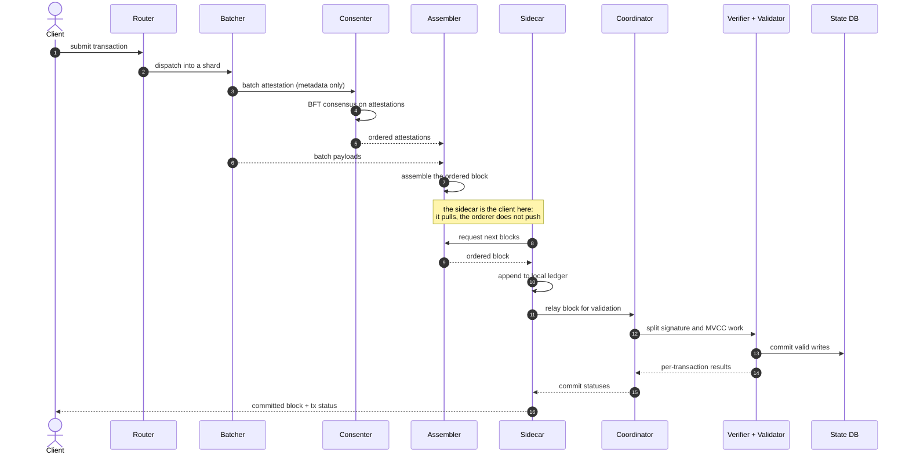
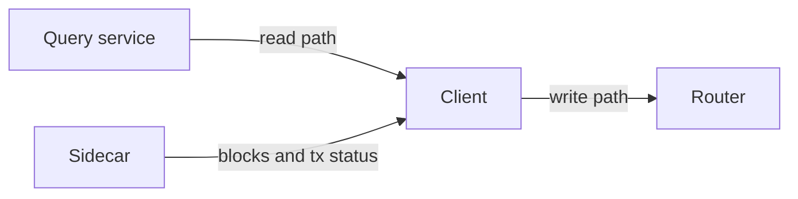
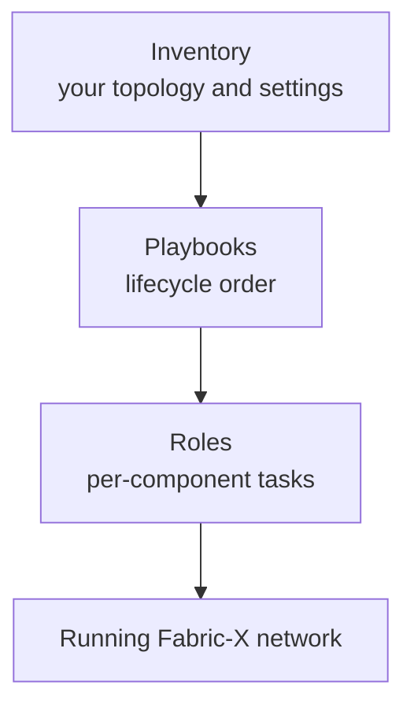

# 1. Fabric-X in 10 Minutes

Before you deploy anything, you need the vocabulary. This lesson has no commands — just the concepts you will meet in every inventory, every playbook, and every log line from here on.

> [!NOTE]
> Estimated time: 10 minutes. No prerequisites, nothing installed yet.

## Table of Contents <!-- omit in toc -->

- [What You Will Learn](#what-you-will-learn)
- [Where Fabric-X Comes From](#where-fabric-x-comes-from)
- [The Ordering Service Is Four Services](#the-ordering-service-is-four-services)
- [The Committer Is Five Services Plus a Database](#the-committer-is-five-services-plus-a-database)
- [The Full Transaction Path](#the-full-transaction-path)
  - [The sidecar pulls, it does not receive](#the-sidecar-pulls-it-does-not-receive)
- [One Channel, Many Namespaces](#one-channel-many-namespaces)
- [Where Ansible Fits](#where-ansible-fits)
- [Exercise](#exercise)
- [Next](#next)

## What You Will Learn

- Why Fabric-X splits the orderer and the peer into many small services.
- The name and the job of each Fabric-X component you will see in an inventory.
- What a namespace is, and why Fabric-X only has one channel.
- The three concepts this collection is organised around: roles, playbooks, and inventories.

## Where Fabric-X Comes From

Hyperledger Fabric-X builds on Hyperledger Fabric and targets **regulated digital asset** use cases. It keeps what Fabric got right — a sovereign network, an identity model based on organisations and certificate authorities, and endorsement policies — and changes what limited its throughput.

The change is architectural. In Fabric, an orderer node and a peer node are each **one process doing many jobs**. In Fabric-X, both are decomposed into small services that can be scaled independently.

That single idea explains almost every component name you are about to meet.

| Hyperledger Fabric     | Fabric-X                                                     |
| ---------------------- | ------------------------------------------------------------ |
| One orderer process    | Router, batcher, consenter, and assembler services           |
| One peer process       | Sidecar, coordinator, verifier, validator, and query service |
| Chaincode              | Namespace, with an endorsement policy                        |
| Many channels          | One channel, partitioned into namespaces                     |
| Peer-embedded state DB | An external PostgreSQL or YugabyteDB backend                 |

## The Ordering Service Is Four Services

The Fabric-X orderer is based on **Arma**, a Byzantine-fault-tolerant ordering service. Its key trick: consensus orders compact _metadata about batches_, not the full transaction payloads. Moving bytes around and agreeing on their order become separate problems, and only the small one has to go through consensus.

| Component | Inventory value                     | Job                                                                                               |
| --------- | ----------------------------------- | ------------------------------------------------------------------------------------------------- |
| Router    | `orderer_component_type: router`    | The client-facing entry point. Accepts transaction submissions and dispatches them to batchers.   |
| Batcher   | `orderer_component_type: batcher`   | Groups transactions into batches inside a _shard_ and sends batch attestations to the consenters. |
| Consenter | `orderer_component_type: consensus` | Runs BFT consensus over the batch attestations — the compact metadata, not the payloads.          |
| Assembler | `orderer_component_type: assembler` | Pulls the ordered attestations plus the batches, and assembles the actual ordered blocks.         |

> [!TIP]
> Note the mismatch worth remembering: the component is called a **consenter**, but the inventory value is `consensus`. It catches everybody once.

Adding **batcher shards** is the main scaling lever on the ordering side. In the samples in this repository there are four independent _orderer groups_, each owned by a different organisation, and each containing one router, one batcher, one consenter, and one assembler.

## The Committer Is Five Services Plus a Database

Everything that happens _after_ ordering — validation, commit, query, notification — is the job of the Fabric-X **committer**.

| Component     | Inventory value                           | Job                                                                                                                                                                                                     | Scaling                           |
| ------------- | ----------------------------------------- | ------------------------------------------------------------------------------------------------------------------------------------------------------------------------------------------------------- | --------------------------------- |
| Sidecar       | `committer_component_type: sidecar`       | **Pulls** ordered blocks from the assemblers, keeps a local ledger, relays work to the coordinator, delivers committed blocks to client applications, and exposes per-transaction status notifications. | Stateful; one per committer.      |
| Coordinator   | `committer_component_type: coordinator`   | Splits validation and commit work across the verifiers and validators.                                                                                                                                  | Stateless; one in the samples.    |
| Verifier      | `committer_component_type: verifier`      | Verifies transaction signatures against the namespace endorsement policies.                                                                                                                             | Stateless, horizontally scalable. |
| Validator     | `committer_component_type: validator`     | Performs MVCC validation and commits valid writes to the state database.                                                                                                                                | Stateless, horizontally scalable. |
| Query service | `committer_component_type: query-service` | Serves read-only state queries from committed state.                                                                                                                                                    | Stateless.                        |
| Database      | a PostgreSQL or YugabyteDB host           | Stores world state, transaction status, and namespace policy data.                                                                                                                                      | Stateful.                         |

Verifiers and validators are the components you replicate when the committer becomes the bottleneck. The database is the component you swap — PostgreSQL is compact and perfect for a laptop, YugabyteDB is what you reach for when you need horizontal scale.

## The Full Transaction Path

Put the two halves together and follow one transaction from submission to commit. Read this top to bottom — it is the single most useful diagram in the tutorial.

### The sidecar pulls, it does not receive

Step 8 is the one worth dwelling on, because "the sidecar receives ordered blocks" makes it sound passive, and it is not. The sidecar is a **client of the ordering service**: it opens the connection and fetches blocks.

Three consequences follow directly, and all three show up later in the tutorial:

- **It bootstraps from a config block.** The sidecar does not have orderer endpoints hardcoded — it reads the latest known config block (the genesis block on a new deployment) to learn the orderer parties' endpoints and TLS credentials.
- **It applies backpressure.** When too many transactions are awaiting status from the coordinator, the sidecar _pauses block fetching_ rather than buffering without limit. A puller can throttle itself; a receiver cannot.
- **It keeps its own ledger on disk.** This is why the sidecar is the one **stateful** committer service, and why `make teardown` — which deletes runtime data — resets your ledger.

Read the whole flow once more from the client's point of view: you **submit** to a router, and you **read** from a sidecar (blocks and transaction status) or from the query service (current state).

## One Channel, Many Namespaces

Fabric-X currently supports a **single channel**. That sounds like a limitation until you see what replaced multi-channel isolation: **namespaces**.

A namespace is the unit of state isolation, roughly analogous to a chaincode in Fabric. Each namespace carries an **endorsement policy** naming which organisations must endorse a transaction before it can touch that namespace's state.

Because there is one channel:

- All namespaces share the same ordered block stream and the same committer pipeline.
- Isolation is enforced at the endorsement-policy and state-key level, not at the channel level.

Namespaces are created **after** the network is running, by submitting configuration transactions with a tool called `fxconfig`. Nothing needs to exist for the network itself to start — which is exactly why the lifecycle you will use in [lesson 3](./03-run-your-first-network.md) has a separate `init` step after `start`.

## Where Ansible Fits

The `hyperledger.fabricx` collection is organised around three concepts. Keep them straight and the rest of the repository becomes navigable.

| Concept         | What it is                                                                                                             | Where it lives                                              |
| --------------- | ---------------------------------------------------------------------------------------------------------------------- | ----------------------------------------------------------- |
| **Roles**       | Low-level automation for one component. "Start a committer verifier as a container."                                   | [`roles/`](../../roles/README.md)                           |
| **Playbooks**   | Reusable lifecycle workflows that call the roles in the right order. "Start every committer service in the inventory." | [`playbooks/`](../../playbooks/README.md)                   |
| **Inventories** | The deployment model: which components exist, where they run, which ports they use, which security mode is on.         | [`examples/inventory/`](../../examples/inventory/README.md) |

The inventory is where **all** of your design decisions live. Roles and playbooks are fixed machinery; the inventory is the thing you write. That is why three of the twelve lessons in this tutorial are about reading and writing inventories.

## Exercise

> [!TIP]
> No terminal needed. Match each component to its job in the transaction path, from memory:
>
> 1. The service a client submits a transaction to.
> 2. The service that turns ordered metadata back into real blocks.
> 3. The service that checks signatures against endorsement policies.
> 4. The service that writes committed state to the database.
> 5. The service a client subscribes to for per-transaction status.
>
> Then answer one more: if your network is dropping transactions because signature checking cannot keep up, which component do you add more of?

Solution

1. **Router** (`orderer_component_type: router`) — the client-facing orderer entry point.
2. **Assembler** (`orderer_component_type: assembler`) — pulls ordered attestations plus batches and assembles blocks.
3. **Verifier** (`committer_component_type: verifier`).
4. **Validator** (`committer_component_type: validator`) — MVCC validation, then commit.
5. **Sidecar** (`committer_component_type: sidecar`) — it exposes the notification service.

Signature checking is the verifier's job, and verifiers are stateless and horizontally scalable — so you add more **verifier** hosts. You will do exactly this in [lesson 8](./08-change-the-topology.md).

## Next

| Previous                        | Next                                                              |
| ------------------------------- | ----------------------------------------------------------------- |
| [Tutorial Overview](./index.md) | [2. Prepare Your Control Node](./02-prepare-your-control-node.md) |
