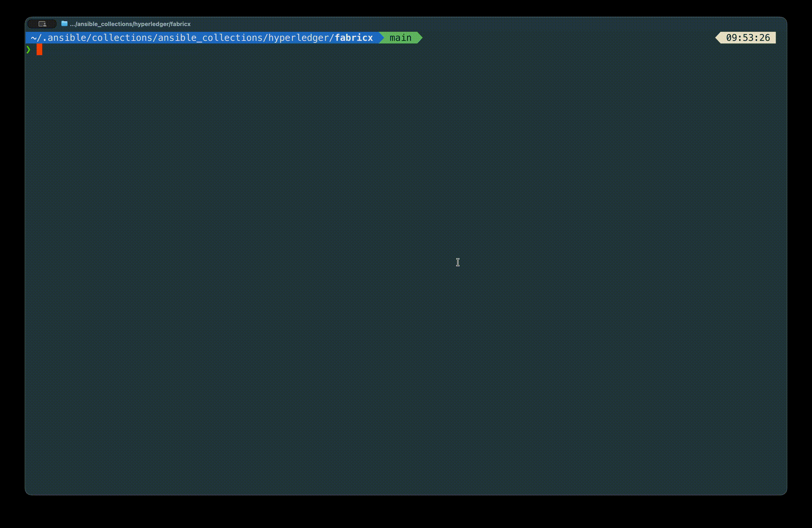

# 2. Prepare Your Control Node

Now you install things. This lesson gets the collection onto your machine, explains the one installation choice that actually matters, and teaches you the command you will use more than any other: `make help`.

> [!NOTE]
> Estimated time: 15 minutes. Builds on [1. Fabric-X in 10 Minutes](./01-fabric-x-in-10-minutes.md).

## Table of Contents <!-- omit in toc -->

- [What You Will Learn](#what-you-will-learn)
- [What a Control Node Is](#what-a-control-node-is)
- [Install the Prerequisites](#install-the-prerequisites)
- [Choose How to Install the Collection](#choose-how-to-install-the-collection)
  - [Option 1: Clone into the collections path](#option-1-clone-into-the-collections-path)
  - [Option 2: Install from source](#option-2-install-from-source)
  - [Option 3: Install from Ansible Galaxy](#option-3-install-from-ansible-galaxy)
- [Install the Dependencies](#install-the-dependencies)
- [macOS: One Extra Step](#macos-one-extra-step)
- [Meet `make help`](#meet-make-help)
- [Exercise](#exercise)
- [Next](#next)

## What You Will Learn

- The difference between the control node and the target nodes.
- Which of the three installation options to pick, and why it matters.
- The one command that will overwrite your checkout if you run it in the wrong place.
- Why macOS needs `LOCAL_ANSIBLE_HOST`.
- How to discover every command this repository offers.

## What a Control Node Is

Ansible has two sides:

- The **control node** is the machine you type commands on. It runs `ansible-playbook`, holds the inventory, generates configuration files, and builds artifacts such as the genesis block.
- The **target nodes** are the machines the services actually run on.

For the whole first half of this tutorial these are the **same machine**. The local sample inventories use `ansible_connection: local`, so Ansible talks to your own machine and starts the Fabric-X services as containers right there. You only need to think about the distinction again in [lesson 10](./10-go-beyond-local.md).

## Install the Prerequisites

On your control node you need:

- `python` >= 3.11
- `docker` or `podman`
- `git` and `make`
- `go` — **only** if you plan to run the binary-based inventory from [lesson 8](./08-change-the-topology.md). The collection's [`go` role](../../roles/go/README.md) can install a pinned version for you.
- `kubectl` — **only** if you plan to run the Kubernetes inventories from [lesson 10](./10-go-beyond-local.md)

Make sure your container engine is actually running (`docker info` or `podman info` should succeed) before you continue.

## Choose How to Install the Collection

There are three ways to install `hyperledger.fabricx`. They are not equivalent, and the choice affects the rest of this tutorial.

### Option 1: Clone into the collections path

This is the option to pick for this tutorial.

```shell
git clone https://github.com/LF-Decentralized-Trust-labs/fabric-x-ansible-collection.git \
  ~/.ansible/collections/ansible_collections/hyperledger/fabricx
cd ~/.ansible/collections/ansible_collections/hyperledger/fabricx
```

The checkout _is_ the installed collection. You get the `Makefile`, the sample inventories, and the example playbooks, and any change you make to a role takes effect immediately with no reinstall.

### Option 2: Install from source

```shell
git clone https://github.com/LF-Decentralized-Trust-labs/fabric-x-ansible-collection.git
cd fabric-x-ansible-collection
make install
```

Builds the collection and installs it into your Ansible collections path. Use this when you do not intend to modify the roles.

### Option 3: Install from Ansible Galaxy

```shell
ansible-galaxy collection install hyperledger.fabricx
ansible-galaxy collection install -r \
  ~/.ansible/collections/ansible_collections/hyperledger/fabricx/requirements.yml
```

The published release, for using the collection inside your own Ansible project. This tutorial assumes you have the repository checkout, so prefer option 1 or 2 while you are learning.

Every command from here on assumes you are inside the repository checkout.

> [!WARNING]
> If you used option 1, never run `make install`. Your checkout is already the live collection, and `make install` would overwrite it with a built artifact. The `Makefile` guards against this and aborts with a message, but it is worth knowing why. Use `make install-deps` instead.

## Install the Dependencies

From the repository root:

```shell
make install-deps
```

That single target is a wrapper around three steps, and it is useful to know what they are:

| Step                   | What it does                                                                                                     |
| ---------------------- | ---------------------------------------------------------------------------------------------------------------- |
| `install-venv`         | Creates a Python virtual environment in `.venv/`                                                                 |
| `install-python-deps`  | Installs [`requirements.txt`](../../requirements.txt) into that venv — Ansible itself, plus the MkDocs toolchain |
| `install-ansible-deps` | Installs the Ansible collections listed in [`requirements.yml`](../../requirements.yml)                          |

Because the dependencies live in `.venv/`, nothing is installed system-wide. The `Makefile` automatically uses `.venv/bin/ansible-playbook` and friends.

> [!TIP]
> If you would rather use a system-wide Ansible installation, every target accepts `USE_VENV=false`, for example `make USE_VENV=false start`.

## macOS: One Extra Step

Docker and Podman run Linux containers inside a virtual machine on macOS. That means `localhost` inside a container is **not** the same endpoint as `localhost` on your Mac — and the local inventories generate configuration full of addresses that containers must be able to resolve.

Set `LOCAL_ANSIBLE_HOST` so the generated configuration points at an address containers can reach:

```shell
# add this to ~/.zshrc, ~/.bashrc, or whatever your shell sources
export LOCAL_ANSIBLE_HOST="host.docker.internal"
```

If you also run the binary-based inventory, the processes on your Mac need to resolve the same name, so add it to `/etc/hosts` too:

```shell
echo "127.0.0.1 host.docker.internal" | sudo tee -a /etc/hosts
```

Linux users can skip this entirely: the default `localhost` works.

## Meet `make help`

Every high-level command in this repository is a `Makefile` target, and every target documents itself:

```shell
make help
```



You get a two-column list: the target name and a one-line description. This is the map. When you forget whether the command is `make artifacts` or `make generate-artifacts`, this is where you look — not the documentation.

The targets fall into four families, and you will meet all four:

| Family            | Examples                                                                        | Lesson                                                                       |
| ----------------- | ------------------------------------------------------------------------------- | ---------------------------------------------------------------------------- |
| Install and check | `install-deps`, `lint`, `check-license-header`                                  | this lesson                                                                  |
| Setup             | `setup`, `binaries`, `artifacts`, `generate-crypto`, `genesis-block`, `configs` | [3](./03-run-your-first-network.md)                                          |
| Lifecycle         | `start`, `init`, `stop`, `restart`, `teardown`, `wipe`                          | [3](./03-run-your-first-network.md), [6](./06-target-hosts-and-lifecycle.md) |
| Utilities         | `ping`, `get-metrics`, `fetch-logs`, `limit-rate`, `targets`, `run-command`     | [4](./04-observe-the-network.md), [6](./06-target-hosts-and-lifecycle.md)    |

Verify your setup works by asking Ansible to parse a sample inventory:

```shell
ANSIBLE_CONFIG=examples/ansible.cfg \
  .venv/bin/ansible-inventory --list --output /dev/null && echo "inventory OK"
```

That parses the sample inventory without deploying anything. If it succeeds, you are ready.

> [!WARNING]
> The `ANSIBLE_CONFIG=` prefix is not optional. The `Makefile` exports it for you, but when you run `ansible-inventory`, `ansible`, or `ansible-playbook` **by hand** from the repository root, Ansible finds no config file and no inventory. The symptom is a misleading success: `[WARNING]: No inventory was parsed, only implicit localhost is available`, followed by an almost-empty graph.
>
> From the next lesson onwards you will export `ANSIBLE_INVENTORY` instead, which serves the same purpose for these commands. Either variable works; having neither is what bites.

Which inventory that command parsed comes from the `inventory =` line in [`examples/ansible.cfg`](../../examples/ansible.cfg). That line changes over time as the samples evolve, so the next lesson sets the inventory explicitly rather than relying on the default, and [lesson 8](./08-change-the-topology.md) shows how to switch between them.

## Exercise

> [!TIP]
> Without reading the `Makefile` source, use `make help` to answer:
>
> 1. Which target builds the genesis block for the network?
> 2. Which target sets the transactions-per-second rate on the load generators, and which variable does it take?
> 3. Which target would you use to install prerequisites on **remote** machines rather than your own?

<details markdown="1">
<summary>Solution</summary>

```shell
make help | grep -i "genesis"
make help | grep -i "rate"
make help | grep -i "remote"
```

1. `make genesis-block` — "Build the genesis block for the network".
2. `make limit-rate`, which takes `LIMIT`, for example `make limit-rate LIMIT=1000`. You will use this in [lesson 4](./04-observe-the-network.md).
3. `make install-remote-node-deps` — it runs the `install_prerequisites` playbook over SSH against the hosts in your inventory. You do not need it for local inventories, but you will in [lesson 10](./10-go-beyond-local.md).

Note that `make genesis-block` is one half of `make artifacts`, which is itself one third of `make setup`. The `Makefile` is layered like that throughout, which is what makes the next lesson short.

</details>

## Next

| Previous                                                    | Next                                                        |
| ----------------------------------------------------------- | ----------------------------------------------------------- |
| [1. Fabric-X in 10 Minutes](./01-fabric-x-in-10-minutes.md) | [3. Run Your First Network](./03-run-your-first-network.md) |
