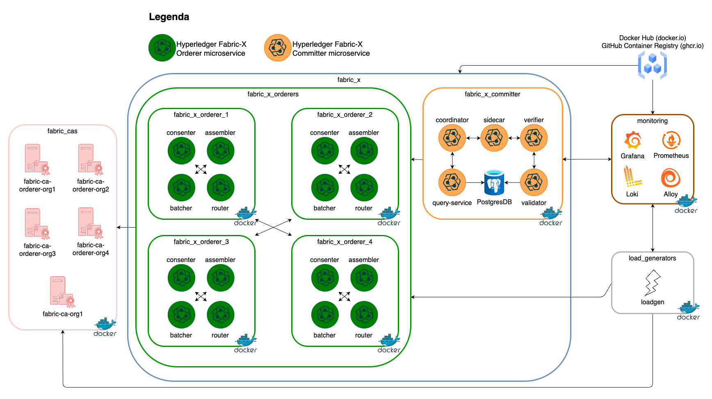
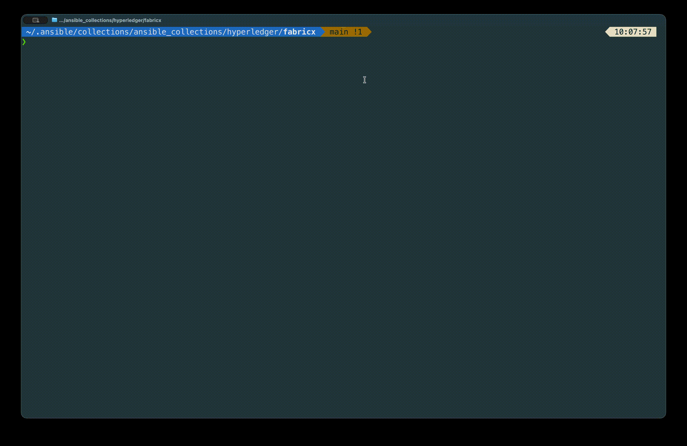
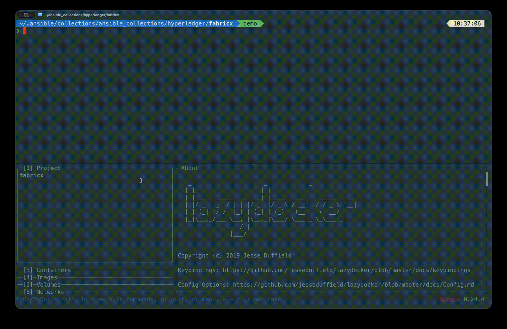

# 3. Run Your First Network

Three commands and you have a Fabric-X network. This lesson runs them, then explains what each one actually produced — because understanding the difference between `setup`, `start`, and `init` is what makes everything afterwards make sense.

> [!NOTE]
> Estimated time: 30 minutes, most of it waiting for images to pull and binaries to build. Builds on [2. Prepare Your Control Node](./02-prepare-your-control-node.md).

## Table of Contents <!-- omit in toc -->

- [What You Will Learn](#what-you-will-learn)
- [What You Are About to Deploy](#what-you-are-about-to-deploy)
- [The Three-Command Lifecycle](#the-three-command-lifecycle)
- [Step 1: `make setup`](#step-1-make-setup)
  - [`make binaries`](#make-binaries)
  - [`make artifacts`](#make-artifacts)
  - [`make configs`](#make-configs)
- [Step 2: `make start`](#step-2-make-start)
- [Step 3: `make init`](#step-3-make-init)
- [Confirm It Works](#confirm-it-works)
- [Where Everything Landed](#where-everything-landed)
- [Stopping and Tearing Down](#stopping-and-tearing-down)
- [Exercise](#exercise)
- [Next](#next)

## What You Will Learn

- The three-phase lifecycle every deployment in this collection follows.
- What artifacts `setup` produces, and why they must exist before anything starts.
- Why namespace creation is a separate step _after_ the network is up.
- How to check that the network is actually healthy.
- Where generated files, configuration, and data live on disk.

## What You Are About to Deploy

This lesson uses [`examples/inventory/local/fabric-x.yaml`](../../examples/inventory/local/fabric-x.yaml) — the most representative single-machine deployment. Everything runs as containers on your own machine.

Which inventory is loaded by default comes from the `inventory =` line in [`examples/ansible.cfg`](../../examples/ansible.cfg), and it changes over time as the samples evolve. So do not assume — check, and set it explicitly:

```shell
grep '^inventory' examples/ansible.cfg
export ANSIBLE_INVENTORY=examples/inventory/local/fabric-x.yaml
```

`ANSIBLE_INVENTORY` overrides the config file without editing it. Getting into the habit of setting it explicitly is worth it: from [lesson 8](./08-change-the-topology.md) onwards you will switch inventories constantly, and "which inventory am I actually running?" is the most common source of confusion with this collection.



Concretely, that is:

- **5 Fabric CA servers** and 5 PostgreSQL databases for their state — one CA per organisation (four orderer organisations plus `Org1`).
- **4 orderer groups**, each with 1 router, 1 consenter, 1 assembler, and 1 batcher — 16 orderer services in total.
- **1 committer**: validator, verifier, coordinator, sidecar, query service, and a PostgreSQL database.
- **1 Block Explorer** server and UI with its own PostgreSQL database.
- **1 load generator** submitting transactions.
- **Monitoring**: node exporter, PostgreSQL exporter, cAdvisor, Prometheus, Grafana, Loki, and Alloy.

TLS and mTLS are on. Identities are issued by Fabric CA, which is the realistic path — private keys are generated on the node that owns them rather than centrally.

> [!TIP]
> That is around forty containers. If your container engine has a memory limit configured (common on Docker Desktop), give it at least 8 GB before continuing.

## The Three-Command Lifecycle


Each phase has a distinct job, and the ordering is not arbitrary:

| Phase   | Question it answers                                                   |
| ------- | --------------------------------------------------------------------- |
| `setup` | Do the binaries, certificates, genesis block, and config files exist? |
| `start` | Are the services running?                                             |
| `init`  | Is the network configured to accept application transactions?         |

Run them in order. Read the sections below while they execute.

## Step 1: `make setup`

```shell
make setup
```



`setup` is a wrapper around three sub-phases, and you can run any of them on its own:

```shell
make binaries    # 1
make artifacts   # 2  (= generate-crypto + genesis-block)
make configs     # 3
```

### `make binaries`

Prepares the CLI tools the control node needs: the Fabric CA client, `cryptogen`, `fxconfig`, and any component that a binary-mode inventory asks for. With the default container inventory almost nothing runs as a binary, but the **control-plane tools still have to exist** — you cannot create a namespace without `fxconfig`.

### `make artifacts`

Two steps that produce the network's cryptographic foundation:

1. **`make generate-crypto`** — creates the container network, builds the shared crypto material, then starts the Fabric CA servers, enrols their admins, and **registers and enrols an identity for every component** in the inventory. Each orderer, committer service, and load generator gets its own certificate from its organisation's CA.
2. **`make genesis-block`** — builds the Fabric-X genesis block, which encodes the channel configuration: which organisations exist, which orderer groups and shards there are, and the consensus parameters.

> [!NOTE]
> Notice that the Fabric CA servers are started _during setup_, not during `start`. They have to be running to issue certificates. This is why `make setup` takes the longest of the three commands the first time you run it.

### `make configs`

Renders a configuration file for every single service from Jinja2 templates, using the inventory as the data source, and ships it to where the service will read it. This is the step that turns "orderer group 2's router listens on 7150" from an inventory line into an actual YAML file on disk.

It also renders the `fxconfig` configuration, which needs to know where the orderer routers, the query service, and the sidecar are.

## Step 2: `make start`

```shell
make start
```



Now the services come up, in dependency order. The playbook behind it starts each family in turn:


Databases first because the committer needs one. Orderers before the committer because the sidecar connects out to the assemblers. The load generator last, because there is no point submitting transactions to a network that is not yet listening.

When it finishes, look at your containers:

```shell
docker ps --format '{{.Names}}' | sort
```

You should see names that match your inventory hostnames exactly: `orderer-router-1`, `committer-sidecar`, `committer-db`, `grafana`, and so on. That one-to-one mapping between inventory hostname and container name is deliberate, and it is what makes debugging tractable.

## Step 3: `make init`

The network is running, but it cannot accept application transactions yet — there is no **namespace** to write state into.

```shell
make init
```


This runs the `fxconfig.create_namespaces` playbook, which:

1. Lists the namespaces already committed to the network, with their on-chain version.
2. Reads the namespaces declared in the inventory under `organization.namespaces`.
3. Builds an unsigned configuration transaction for each namespace that is missing or whose policy changed.
4. Asks the relevant organisations to endorse it, merges the endorsements, and submits it.

In the default inventory the load generator declares one namespace, `0`, with a `threshold` policy. That is the namespace its transactions will target.

> [!WARNING]
> `make init` must run _after_ `make start`. Namespace transactions have to be endorsed and submitted through live Fabric-X endpoints, so running it too early fails by design.

`make init` is **idempotent**. Run it twice and the second run reports no changes, because it compares each declared policy against a fingerprint recorded from the previous run. Change a namespace's `policy` in the inventory and re-run it, and it submits an update instead.

## Confirm It Works

Two health checks, in increasing strength.

**Are the ports open?**

```shell
make ping
```

This walks every host in the inventory and checks that the ports it declared are actually accepting connections. It is fast and it catches the most common failure — a service that exited on startup.

**Are transactions flowing?**

```shell
make get-metrics
```

This scrapes the metrics endpoints of the components that expose them and prints the result. The load generator's metrics are the interesting ones: they tell you whether transactions are being submitted and committed.

> [!TIP]
> Add `ASSERT_METRICS=true` to turn `get-metrics` into a hard assertion that fails when a component looks unhealthy: `make get-metrics ASSERT_METRICS=true`. That is the form to use in scripts.

If both succeed, you have a working Fabric-X network processing transactions. [Lesson 4](./04-observe-the-network.md) is about actually watching it.

## Where Everything Landed

Nothing was installed outside the repository. Everything generated lives under `out/`:

```text
out/
├── ansible_fact_cache/          # Ansible's fact cache
├── control-node/
│   ├── cli/                     # binaries built for the control node (fxconfig, cryptogen, ...)
│   ├── config/                  # rendered configs, cryptogen and genesis artifacts
│   └── fetched/                 # material collected back from hosts
└── local-deployment/
    └── <inventory-hostname>/
        ├── config/              # that service's configuration
        └── data/                # that service's runtime data
```

The `local-deployment/<hostname>/` layout comes straight from the inventory's environment file, [`local/group_vars/all/env.yaml`](../../examples/inventory/local/group_vars/all/env.yaml), which defines `remote_deploy_dir`, `remote_node_dir`, `remote_config_dir`, and `remote_data_dir`. In [lesson 10](./10-go-beyond-local.md) those same variables point at directories on remote machines instead.

Want to see what a service was actually told to do? Read its rendered config:

```shell
cat out/local-deployment/committer-coordinator/config/*.yaml
```

> [!TIP]
> `out/` is gitignored, and you can move it entirely by setting `OUT_DIR`, for example `export OUT_DIR=/tmp/fabricx-out`.

## Stopping and Tearing Down

Two different things, and the difference matters:

```shell
make stop        # stop the services, keep all data and configuration
make teardown    # stop the services and delete their runtime data
```

Use `stop` when you want to come back to the same ledger later — `make start` will resume it. Use `teardown` when you want a clean slate; the next `make start` begins from the genesis block again.

There is a third level, covered in [lesson 6](./06-target-hosts-and-lifecycle.md), that also removes the generated configuration and binaries.

> [!TIP]
> Leave the network running for [lesson 4](./04-observe-the-network.md) — you are about to watch it work.

## Exercise

> [!TIP]
> `make ping` checked every host in the inventory, which is a lot of output. Restrict it to just the committer services, and read the result carefully.
>
> Then answer: how many hosts did it check, and why is one of them not a Fabric-X service at all?

<details markdown="1">
<summary>Solution</summary>

```shell
make fabric_x_committers ping
```

`fabric_x_committers` is one of the predefined host groups, so it can be chained in front of any lifecycle target. It checks **six** hosts:

| Host                      | Port | Why                                             |
| ------------------------- | ---- | ----------------------------------------------- |
| `committer-validator`     | 5100 | validator RPC                                   |
| `committer-verifier`      | 5110 | verifier RPC                                    |
| `committer-coordinator`   | 5120 | coordinator RPC                                 |
| `committer-sidecar`       | 5130 | sidecar RPC                                     |
| `committer-query-service` | 5140 | query service RPC                               |
| `committer-db`            | 5150 | **PostgreSQL** — the committer's state database |

`committer-db` is the odd one out: it is a database, not a Fabric-X service. It sits in the committer group because it belongs to that committer deployment, and the validator and query service reference it through `postgres_db_host: committer-db`. Grouping the database with the services that use it is what lets `make fabric_x_committers teardown` clean up the whole committer, storage included.

You will meet the rest of the predefined groups in [lesson 6](./06-target-hosts-and-lifecycle.md).

</details>

## Next

| Previous                                                          | Next                                                  |
| ----------------------------------------------------------------- | ----------------------------------------------------- |
| [2. Prepare Your Control Node](./02-prepare-your-control-node.md) | [4. Observe the Network](./04-observe-the-network.md) |
