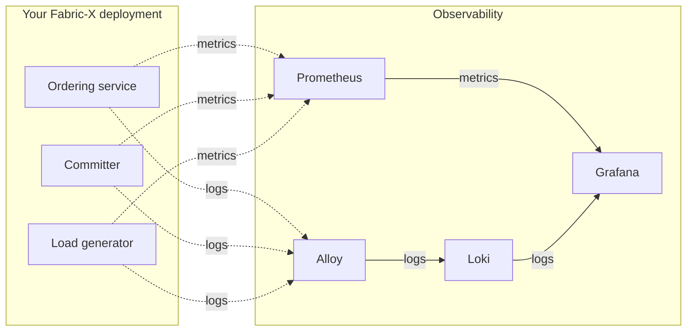
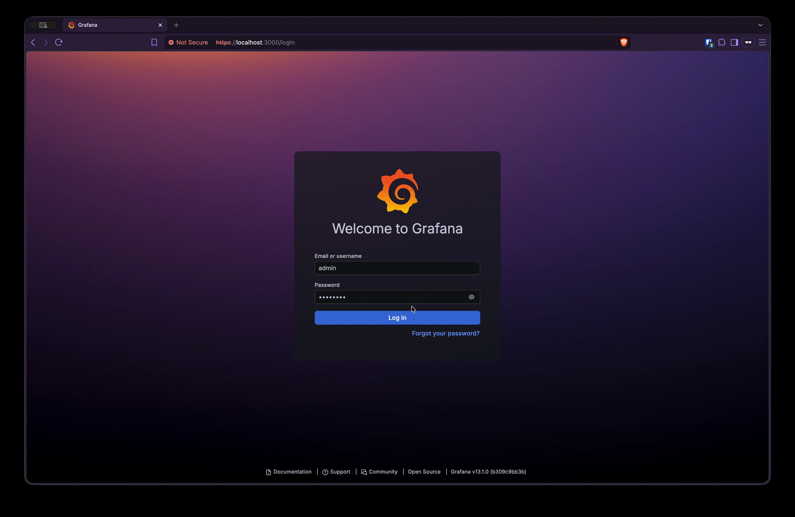
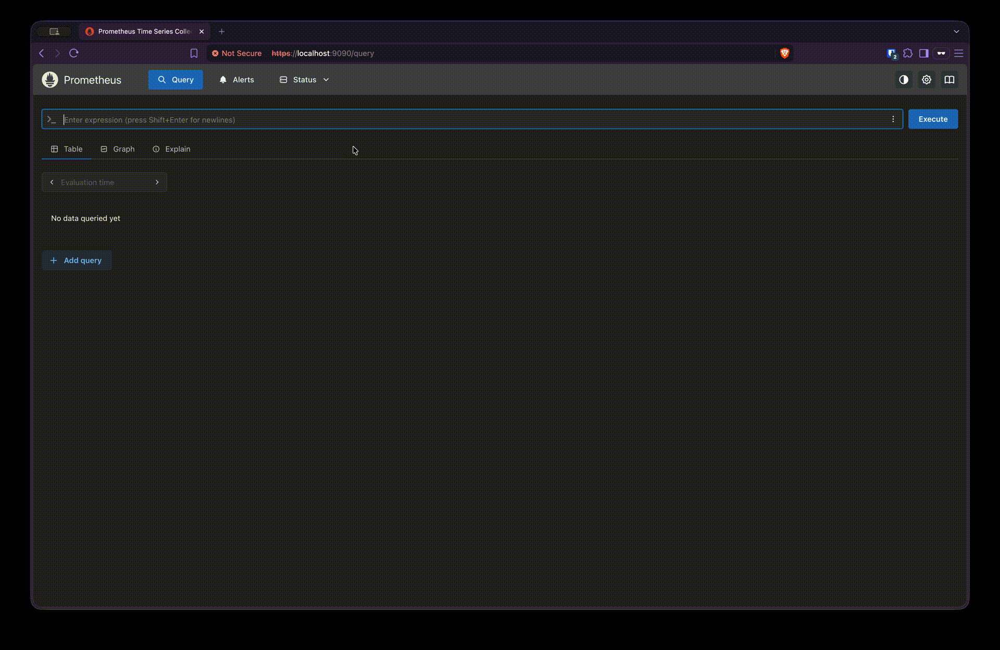
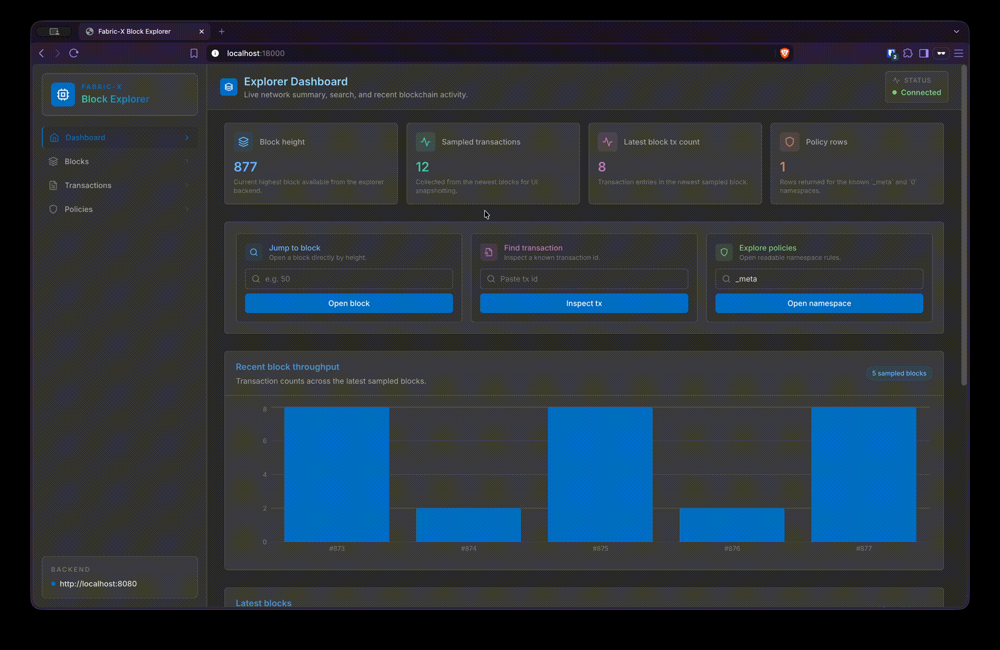
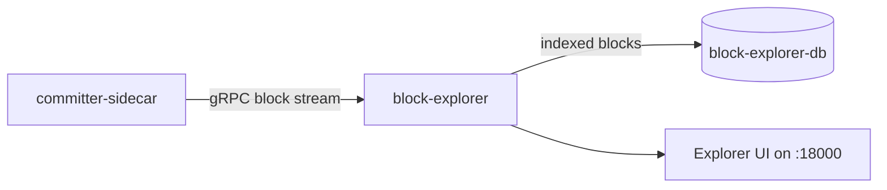
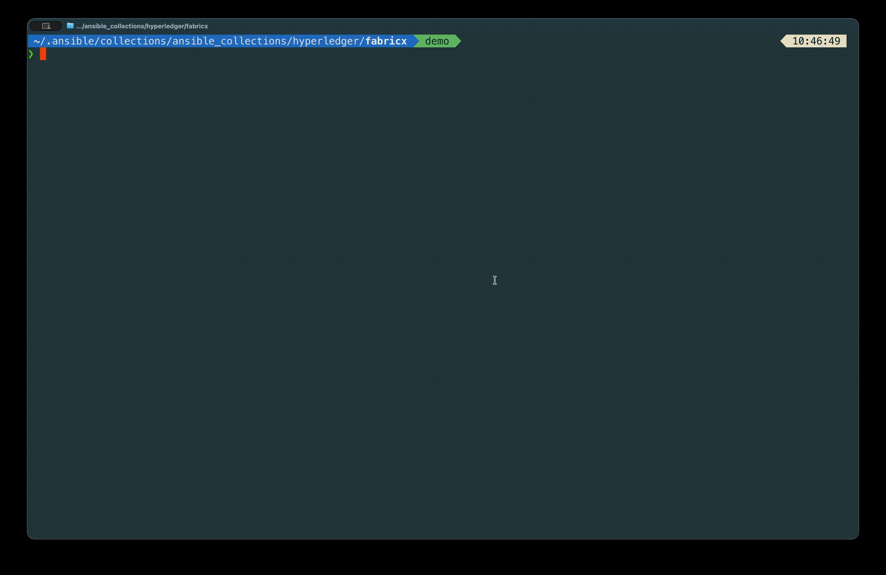
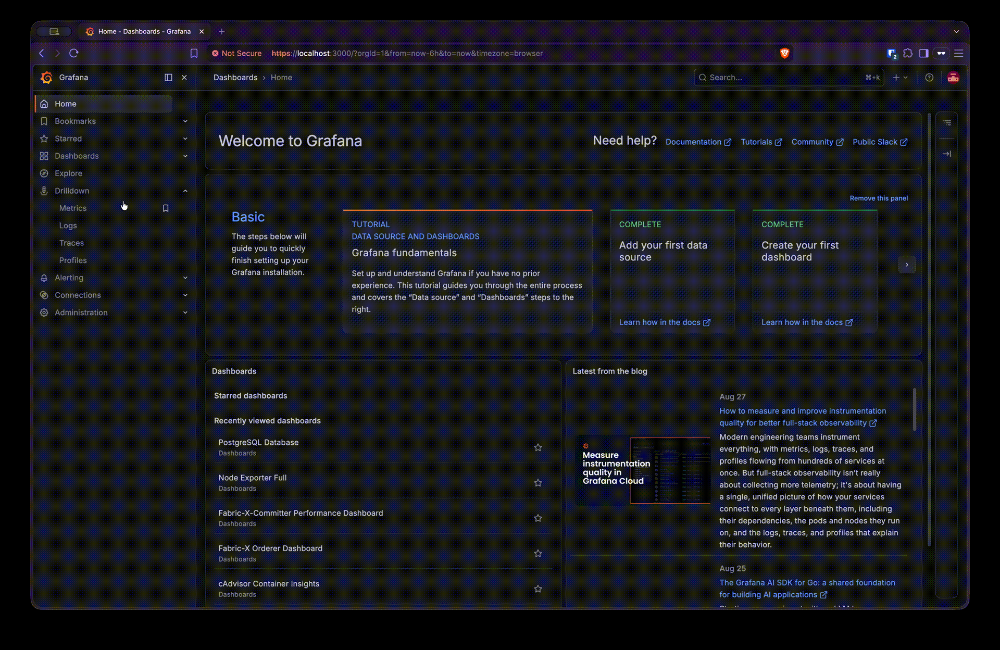

# 4. Observe the Network

You have a Fabric-X network processing transactions. Now look at it. This lesson opens the dashboards, browses your own blocks, pulls metrics and logs from the command line, and then changes the load so you can watch the network react.

> [!NOTE]
> Estimated time: 20 minutes. Requires a running network from [3. Run Your First Network](./03-run-your-first-network.md).

## Table of Contents <!-- omit in toc -->

- [What You Will Learn](#what-you-will-learn)
- [The Observability Stack](#the-observability-stack)
- [Grafana: The Dashboards](#grafana-the-dashboards)
- [Prometheus: The Raw Metrics](#prometheus-the-raw-metrics)
- [Block Explorer: Your Own Blocks](#block-explorer-your-own-blocks)
- [Metrics from the Command Line](#metrics-from-the-command-line)
- [Logs from the Command Line](#logs-from-the-command-line)
- [Change the Load](#change-the-load)
- [Exercise](#exercise)
- [Next](#next)

## What You Will Learn

- Which observability component does what, and which of them are Fabric-X specific.
- How to reach Grafana, Prometheus, and the Block Explorer, and why the scheme is `https` for some and `http` for others.
- How to pull metrics and logs without opening a browser at all.
- How to change the transaction rate on a running network.

## The Observability Stack

The default local inventory deploys seven observability components. None of them participate in the transaction path — they only watch it.

| Component           | Inventory host          | Port | Job                                                      |
| ------------------- | ----------------------- | ---- | -------------------------------------------------------- |
| Prometheus          | `prometheus`            | 9090 | Scrapes and stores metrics from every component          |
| Grafana             | `grafana`               | 3000 | Dashboards over Prometheus and Loki                      |
| Loki                | `loki`                  | 9200 | Stores logs                                              |
| Alloy               | `alloy`                 | 9300 | Collects logs from the containers and ships them to Loki |
| Node exporter       | `node-exporter`         | 9111 | Host-level metrics: CPU, memory, disk, network           |
| PostgreSQL exporter | `committer-db-exporter` | 2110 | Metrics from the committer's database                    |
| cAdvisor            | `cadvisor`              | 9400 | Per-container resource metrics                           |



Note where the metrics come from: the orderer components expose them on their `orderer_operations_port`, the committer services on their `committer_metrics_port`, and the load generator on its `loadgen_metrics_port`. Those are inventory values, which you will read for yourself in [lesson 5](./05-read-the-inventory.md).

## Grafana: The Dashboards

Open <https://localhost:3000> and log in with `admin` / `adminPWD`.



> [!WARNING]
> Note the **`https`**. The default local inventory sets `grafana_use_tls: true`, so Grafana serves TLS with a self-signed certificate. Your browser will warn you; accept the certificate and continue. If you use `http://` you will get an empty response and wonder what broke.
>
> Also note that `admin` / `adminPWD` are sample defaults baked into the example inventory. Change `grafana_username` and `grafana_password` before using an adapted inventory anywhere shared.

Five dashboards are provisioned automatically. Go to **Dashboards** and you will find:

| Dashboard                                | What to look at                                                                                                                            |
| ---------------------------------------- | ------------------------------------------------------------------------------------------------------------------------------------------ |
| Fabric-X Orderer Dashboard               | Throughput through the routers, batching behaviour, consensus and assembly rates                                                           |
| Fabric-X-Committer Performance Dashboard | Validation and commit throughput, transaction status breakdown — this is where you see whether transactions are actually being _committed_ |
| Node Exporter Full                       | Your machine's CPU, memory, disk, and network                                                                                              |
| cAdvisor Container Insights              | Per-container CPU and memory — useful for spotting which service is saturating                                                             |
| PostgreSQL Database                      | Committer database connections, transactions, and cache behaviour                                                                          |

Start with the **Committer Performance Dashboard**. A healthy network shows a steady non-zero commit rate. If ordering throughput is non-zero but the commit rate is flat, the problem is on the committer side — exactly the situation that scaling verifiers in [lesson 8](./08-change-the-topology.md) addresses.

> [!TIP]
> Grafana is also wired to Loki as a data source, so you can correlate a metric spike with log lines from the same moment without leaving the dashboard. Use **Explore** and pick the Loki data source.

## Prometheus: The Raw Metrics

When a Grafana panel looks wrong, go one level down and query Prometheus directly at <https://localhost:9090> — again `https`, because the inventory sets `prometheus_use_tls: true`.

The **Status → Targets** page is the single most useful page in this whole stack. It lists every scrape target and whether it is `UP`. A component that failed to start, or whose metrics port is misconfigured, or whose mTLS client certificate was not accepted, shows up here as `DOWN` with the reason.



> [!TIP]
> Prometheus scrapes the Fabric-X components over mTLS. That is what the `orderer_operations_mtls_clients: [prometheus]` and `committer_monitoring_mtls_clients: [prometheus]` lines in the inventory are for — they tell each component to trust `prometheus` as an mTLS client. Remove them and every Fabric-X target goes `DOWN`.

## Block Explorer: Your Own Blocks

Open <http://localhost:18000> — this one is plain `http`.



The Block Explorer streams blocks over gRPC from the committer sidecar, indexes them into its own PostgreSQL database, and gives you a browsable view: blocks, their transactions, and each transaction's status.

Its topology is worth understanding, because it is a good example of how the inventory wires services together:



Three inventory lines on the `block-explorer` host make that happen:

| Variable                 | Value               | Meaning                          |
| ------------------------ | ------------------- | -------------------------------- |
| `sidecar_host`           | `committer-sidecar` | Which host to stream blocks from |
| `postgres_db_host`       | `block-explorer-db` | Which database to index into     |
| `block_explorer_ui_port` | `18000`             | Where the UI listens             |

There is a subtlety here that catches people: the Block Explorer's TLS/mTLS mode is **not** a local flag. It is derived from the `committer_use_tls` and `committer_use_mtls` settings of the host named by `sidecar_host`. And the committer must be told to trust it, which is what `committer_mtls_clients: [block-explorer]` does in the committer group variables.

Use the Explorer to confirm the network is doing real work: pick a recent block, open it, and look at the transactions the load generator submitted into namespace `0`.

## Metrics from the Command Line

You do not need a browser. From the repository root:

```shell
make get-metrics
```



This scrapes every component that exposes metrics and prints the result. Restrict it to the component you care about:

```shell
make load_generators get-metrics
make fabric_x_committers get-metrics
```

For scripting and CI, turn it into an assertion that fails on an unhealthy component:

```shell
make get-metrics ASSERT_METRICS=true
```

And the cheapest check of all, when you only want to know whether things are listening:

```shell
make ping
```

## Logs from the Command Line

Alloy is already shipping every container's logs into Loki, so Grafana's **Explore** view is the richest way to read them.



But when you want log files on disk — to attach to a bug report, or to grep offline — collect them:

```shell
make fetch-logs
```

Logs land under `out/control-node/fetched/`. As with everything else, you can narrow the scope:

```shell
make fabric_x_orderers fetch-logs
make committer-sidecar fetch-logs
```

> [!NOTE]
> That second form — targeting a single host by name — only works after you have run `make targets` once. [Lesson 6](./06-target-hosts-and-lifecycle.md) explains why.

For a quick look at one container without collecting anything, the container engine is still the fastest route:

```shell
docker logs -f committer-coordinator
```

## Change the Load

Here is the fun part. The load generator's submission rate can be changed on a **running** network, without regenerating any configuration:

```shell
make limit-rate LIMIT=100
```

Watch the Committer Performance Dashboard in Grafana. Within a scrape interval or two, the commit rate follows.

Then push it up:

```shell
make limit-rate LIMIT=5000
```

Now watch what saturates first. Depending on your machine, you will see the orderer keep up while the committer's commit rate plateaus below the submission rate, or you will see cAdvisor showing one container pinned at its CPU limit. Either way, you have just found your local bottleneck — and you now know which component to scale.

> [!NOTE]
> `make limit-rate` defaults `LIMIT` to `1000` if you omit it. If an inventory never sets `loadgen_limit_rate` at all, the load generator starts at the role default of 10 transactions per second.

## Exercise

> [!TIP]
> Two parts.
>
> 1. Drop the transaction rate to 50 TPS, confirm in Grafana that the committer's commit rate follows it down, then raise it back to 1000.
> 2. Without opening a browser, find out whether the committer sidecar is currently healthy — and if Prometheus has any scrape target that is `DOWN`, work out which one and why.

<details markdown="1">
<summary>Solution</summary>

Part 1:

```shell
make limit-rate LIMIT=50
# watch https://localhost:3000 → Fabric-X-Committer Performance Dashboard
make limit-rate LIMIT=1000
```

Part 2 — health of the sidecar, from the command line:

```shell
make fabric_x_committers ping          # is the port open at all?
make fabric_x_committers get-metrics   # is it reporting sane numbers?
docker logs --tail 50 committer-sidecar
```

For the Prometheus targets, the browser page is at **Status → Targets**, but you can also ask Prometheus over its API. Because the endpoint is TLS with a self-signed certificate, you need `-k`:

```shell
curl -sk https://localhost:9090/api/v1/targets \
  | python3 -c "import json,sys; [print(t['health'], t['labels'].get('instance')) for t in json.load(sys.stdin)['data']['activeTargets']]"
```

The two usual causes of a `DOWN` Fabric-X target:

- The component is not running — `make ping` will also fail for it.
- The component does not trust `prometheus` as an mTLS client. Prometheus scrapes Fabric-X components over mTLS, so a component whose group variables are missing `orderer_operations_mtls_clients: [prometheus]` or `committer_monitoring_mtls_clients: [prometheus]` will refuse the connection even though it is perfectly healthy.

That second case is a good illustration of the theme of the next lesson: almost everything that looks like a runtime bug is really an inventory statement.

</details>

## Next

| Previous                                                    | Next                                                |
| ----------------------------------------------------------- | --------------------------------------------------- |
| [3. Run Your First Network](./03-run-your-first-network.md) | [5. Read the Inventory](./05-read-the-inventory.md) |
