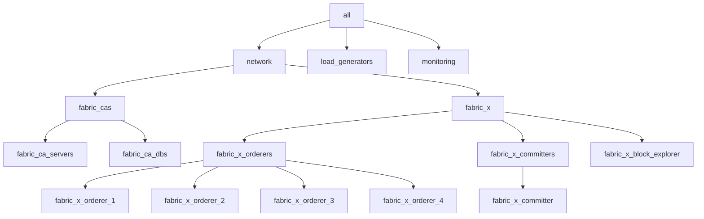

# 5. Read the Inventory

The inventory is where all your design decisions live. Roles and playbooks are fixed machinery; the inventory is the thing you write. This lesson teaches you to read [`examples/inventory/local/fabric-x.yaml`](../../examples/inventory/local/fabric-x.yaml) line by line — after which every other inventory in the repository becomes readable too.

> [!NOTE]
> Estimated time: 25 minutes. Builds on [4. Observe the Network](./04-observe-the-network.md). Keep the inventory file open beside this page.

## Table of Contents <!-- omit in toc -->

- [What You Will Learn](#what-you-will-learn)
- [An Inventory Host Is a Service, Not a Machine](#an-inventory-host-is-a-service-not-a-machine)
- [Layer 1: `all.vars` and the Organizations](#layer-1-allvars-and-the-organizations)
- [Layer 2: The Group Tree](#layer-2-the-group-tree)
- [Layer 3: Group Variables Are Policy](#layer-3-group-variables-are-policy)
- [Layer 4: Host Variables Are Facts](#layer-4-host-variables-are-facts)
- [The Dispatcher Variables](#the-dispatcher-variables)
- [The Two Files That Are Not the Inventory](#the-two-files-that-are-not-the-inventory)
  - [`examples/inventory/vars.yaml` — control-node paths](#examplesinventoryvarsyaml--control-node-paths)
  - [`local/group_vars/all/env.yaml` — the environment file](#localgroup_varsallenvyaml--the-environment-file)
- [Cross-References: How Services Find Each Other](#cross-references-how-services-find-each-other)
- [Query the Inventory Instead of Reading It](#query-the-inventory-instead-of-reading-it)
- [Exercise](#exercise)
- [Next](#next)

## What You Will Learn

- The four layers of variable precedence the sample inventories use, and what belongs in each.
- What YAML anchors are doing in the `organizations` block, and why it matters.
- Why `orderer_component_type` and `committer_component_type` are the two most important variables in the file.
- How services reference each other by inventory hostname rather than by address.
- How to query the inventory with `ansible-inventory` instead of scrolling through YAML.

## An Inventory Host Is a Service, Not a Machine

Start with the mental shift that makes everything else click.

In most Ansible projects, an inventory host is a machine. **Here it is a logical service instance.** `orderer-router-1`, `committer-sidecar`, and `grafana` are all separate inventory hosts, and in the local sample all three run on the same physical machine — yours.

What decides where the work actually happens is the _connection_ variables, not the host list. Change `ansible_connection` and `ansible_host` and the same forty logical services spread across ten machines, with no change to the topology itself. That is what [lesson 10](./10-go-beyond-local.md) does.

This is also why hostnames matter so much. An inventory hostname becomes:

- The container name
- The certificate common name
- The output directory under `out/local-deployment/`
- The generated `Makefile` target
- The key other services use to reference this one

So keep them stable and unique.

## Layer 1: `all.vars` and the Organizations

The file opens with network-wide data — things that are true for the whole deployment:

```yaml
all:
  vars:
    organizations:
      orderer_org_1: &OrdererOrg1
        name: OrdererOrg1
        domain: ordererorg1.example.com
      # ... orderer_org_2 through orderer_org_4 ...
      org1: &Org1
        name: Org1
        domain: org1.example.com
```

Five organisations: four that own an orderer group each, and `Org1` that owns the committer, the load generator, and the Block Explorer.

The `&OrdererOrg1` and `&Org1` bits are **YAML anchors**. They define a reusable block that is referenced later with `<<: *Org1`, a YAML _merge key_. Here is the pattern in the committer group:

```yaml
organization:
  <<: *Org1                    # pull in name and domain
  fabric_ca_host: fca-org1     # then add deployment-specific fields
  role: peer
  peer:
    name: "{{ inventory_hostname }}"
    secret: "{{ inventory_hostname }}PWD"
```

Read that as: _"this is Org1, its certificates come from the CA on host `fca-org1`, and this component enrols as a `peer` identity whose name is the inventory hostname."_

The anchor keeps organisation identity defined once and referenced everywhere. When you write your own inventory in [lesson 11](./11-write-your-own-inventory.md), do the same — duplicating `name` and `domain` across twenty hosts is how inventories drift out of consistency.

> [!TIP]
> `"{{ inventory_hostname }}"` is standard Ansible: it evaluates to the current host's name. So every component automatically gets an enrollment identity named after itself, with no per-host duplication.

## Layer 2: The Group Tree

Groups give the deployment its shape. The default local inventory builds this tree:



These group names are **a public contract**, not a stylistic choice. The collection playbooks target them by name: the orderer lifecycle playbooks target `fabric_x_orderers`, the committer playbooks target `fabric_x_committers`, the load generator playbooks target `load_generators`, and so on.

| Group                       | Purpose                                             |
| --------------------------- | --------------------------------------------------- |
| `network`                   | Parent for the deployable Fabric-X network          |
| `fabric_cas`                | Fabric CA servers and their databases               |
| `fabric_x`                  | Parent for the orderer and committer components     |
| `fabric_x_orderers`         | Every orderer component host                        |
| `fabric_x_orderer_1` … `_4` | One orderer group each, owned by one organisation   |
| `fabric_x_committers`       | Parent for one or more committer deployments        |
| `fabric_x_committer`        | The default committer deployment plus its database  |
| `fabric_x_block_explorer`   | Block Explorer server, UI, and database             |
| `load_generators`           | Load generator instances                            |
| `monitoring`                | Prometheus, Grafana, Loki, Alloy, and the exporters |

> [!WARNING]
> If you rename these groups, the roles still work but the provided playbooks and the `Makefile` shortcuts no longer know which hosts to operate on. Keep the names unless you are also replacing the playbook layer.

Notice that `fabric_x_orderer_1` through `_4` exist for a reason: an orderer group is the unit that an organisation owns, so the organisation identity is set once at the group level and inherited by the four services inside it.

## Layer 3: Group Variables Are Policy

Group variables answer _"how should this whole family of services behave?"_. They are policy decisions.

```yaml
fabric_x_orderers:
  vars:
    orderer_use_tls: true
    orderer_use_mtls: true
    orderer_operations_mtls_clients:
      - prometheus
```

Three statements about the entire ordering service: encrypt traffic, require client certificates, and trust `prometheus` as an mTLS client on the operations (metrics) port. That last one is the line you met in [lesson 4](./04-observe-the-network.md) — remove it and every orderer target in Prometheus goes `DOWN`.

The committer group makes the equivalent statements:

```yaml
fabric_x_committer:
  vars:
    committer_use_tls: true
    committer_use_mtls: true
    committer_monitoring_mtls_clients:
      - prometheus
    committer_mtls_clients:
      - block-explorer
```

Two different mTLS client lists, for two different purposes: `committer_monitoring_mtls_clients` guards the metrics ports, `committer_mtls_clients` guards the service RPC ports. The Block Explorer needs the second one because it opens a gRPC block stream against the sidecar.

## Layer 4: Host Variables Are Facts

Host variables answer _"what is true about this one instance?"_. Ports, component types, database references, shard IDs.

```yaml
fabric_x_orderer_1:
  vars:
    organization:
      <<: *OrdererOrg1
      fabric_ca_host: fca-orderer-org1
      role: orderer
      orderer:
        name: "{{ inventory_hostname }}"
        secret: "{{ inventory_hostname }}PWD"
    orderer_group: 1
  hosts:
    orderer-router-1:
      orderer_component_type: router
      orderer_rpc_port: 7050
      orderer_operations_port: 7060
    orderer-consenter-1:
      orderer_component_type: consensus
      orderer_rpc_port: 7051
      orderer_operations_port: 7061
    orderer-assembler-1:
      orderer_component_type: assembler
      orderer_rpc_port: 7052
      orderer_operations_port: 7062
    orderer-batcher-1:
      orderer_component_type: batcher
      orderer_shard_id: 1
      orderer_rpc_port: 7053
      orderer_operations_port: 7063
```

Everything shared by the group — the organisation, the group number — sits in `vars`. Everything specific to one service — its type and its two ports — sits on the host. That split is the whole discipline.

The port scheme is worth noticing, because it is what makes forty services coexist on one machine:

| Orderer group        | RPC ports | Operations ports |
| -------------------- | --------- | ---------------- |
| `fabric_x_orderer_1` | 7050–7053 | 7060–7063        |
| `fabric_x_orderer_2` | 7150–7153 | 7160–7163        |
| `fabric_x_orderer_3` | 7250–7253 | 7260–7263        |
| `fabric_x_orderer_4` | 7350–7353 | 7360–7363        |

One hundred apart per group, one apart per component. When you add a component in [lesson 8](./08-change-the-topology.md), pick a port that follows the pattern and does not collide.

## The Dispatcher Variables

`orderer_component_type` and `committer_component_type` deserve their own section, because they are not ordinary settings — they are **dispatchers**. Miss one on a host and the role silently does nothing for it, because the top-level tasks are guarded by `when: <role>_component_type is defined`.

The accepted values, gathered in one place:

| Role        | Variable                   | Values                                                             |
| ----------- | -------------------------- | ------------------------------------------------------------------ |
| `orderer`   | `orderer_component_type`   | `router`, `batcher`, `consensus`, `assembler`                      |
| `committer` | `committer_component_type` | `validator`, `verifier`, `coordinator`, `sidecar`, `query-service` |

> [!TIP]
> Remember from [lesson 1](./01-fabric-x-in-10-minutes.md): the component is a _consenter_, but the value is `consensus`. And the query service value is hyphenated, `query-service`, while the others are single words.

There is a second dispatcher axis that is easy to miss, because it is usually implicit. Every deployable role resolves a **deployment mode** from its `*_use_bin`, `*_use_k8s`, and `*_use_openshift` flags, defaulting to `container`:

```yaml
# roles/orderer/defaults/main.yaml, simplified
orderer_deployment_mode: >-
  bin
  openshift
  k8s
  container
```

The two axes are used at different points:

| Axis                     | Selects                                                                                                                                                                                                               |
| ------------------------ | --------------------------------------------------------------------------------------------------------------------------------------------------------------------------------------------------------------------- |
| `<role>_deployment_mode` | _How_ to run it. `roles/committer/tasks/start.yaml` includes `{{ committer_deployment_mode }}/start`, so `container`, `bin`, `k8s`, or `openshift`                                                                    |
| `<role>_component_type`  | _What_ to run. It picks the per-component configuration tasks (`roles/committer/tasks/config/transfer.yaml` includes `{{ committer_component_type }}/config/transfer`) and the subcommand the process is started with |

You can see the second one very concretely in the committer's container task, which maps the inventory value to the binary's subcommand:

```yaml
committer_subcommands:
  validator: vc
  verifier: verifier
  coordinator: coordinator
  sidecar: sidecar
  query-service: query
```

So `committer_component_type: validator` ends up as `committer start vc --config=...` inside the container. Two inventory variables, and between them they decide both the runtime and the identity of every Fabric-X process in your deployment.

> [!NOTE]
> The local sample sets no `*_use_bin` or `*_use_k8s` flags at all, which is why everything defaults to `container`. In [lesson 8](./08-change-the-topology.md) you switch that axis, and in [lesson 10](./10-go-beyond-local.md) you switch it again.

## The Two Files That Are Not the Inventory

The inventory YAML is not the whole story. Two more files feed variables in, and knowing which is which saves a lot of confusion.

### `examples/inventory/vars.yaml` — control-node paths

[`vars.yaml`](../../examples/inventory/vars.yaml) describes where things live on **your** machine, the control node:

| Variable                  | Meaning                                                                       |
| ------------------------- | ----------------------------------------------------------------------------- |
| `project_dir`             | The repository or installed collection path                                   |
| `out_dir`                 | Root output directory, `$PROJECT_DIR/out` by default. Override with `OUT_DIR` |
| `control_node_dir`        | Control-node output directory under `out_dir`                                 |
| `cryptogen_artifacts_dir` | Where centrally generated `cryptogen` material goes                           |
| `channel_id`              | The channel name in the generated configuration — `arma` by default           |

### `local/group_vars/all/env.yaml` — the environment file

Each inventory _family_ has an environment file describing how Ansible reaches the targets and where files are written on them. For the local family, [`local/group_vars/all/env.yaml`](../../examples/inventory/local/group_vars/all/env.yaml) is short enough to quote in full:

```yaml
ansible_connection: local
ansible_user: "{{ lookup('env', 'USER') }}"
ansible_host: "{{ lookup('env', 'LOCAL_ANSIBLE_HOST') or 'localhost' }}"
actual_host: "{{ ansible_host }}"

remote_deploy_dir: "{{ out_dir }}/local-deployment"
remote_node_dir: "{{ remote_deploy_dir }}/{{ inventory_hostname }}"
remote_config_dir: "{{ remote_node_dir }}/config"
remote_data_dir: "{{ remote_node_dir }}/data"
```

Four lines of connection model, four lines of paths. That is the entire difference between "local" and "remote" as far as the topology is concerned — and it is why `out/local-deployment/<hostname>/config/` looked the way it did in [lesson 3](./03-run-your-first-network.md).

This is also where the macOS `LOCAL_ANSIBLE_HOST` variable from [lesson 2](./02-prepare-your-control-node.md) is consumed.

> [!NOTE]
> The distinction to hold on to: `vars.yaml` holds **control-node** paths for artifacts you generate and collect. The environment file holds **target-node** paths for files the services read and write.

## Cross-References: How Services Find Each Other

Nowhere in this inventory will you find a hard-coded `localhost:5150`. Services reference each other by **inventory hostname**, and the roles resolve the hostname to an address and port at render time.

| Reference                       | Example              | Meaning                                                   |
| ------------------------------- | -------------------- | --------------------------------------------------------- |
| `postgres_db_host`              | `committer-db`       | This service's database is that host                      |
| `fabric_ca_host`                | `fca-org1`           | This organisation enrols against that CA                  |
| `sidecar_host`                  | `committer-sidecar`  | Stream blocks from that host                              |
| `prometheus_host` / `loki_host` | `prometheus`, `loki` | Grafana's data sources                                    |
| Group membership                | `fabric_x_orderers`  | The committer's coordinator discovers assemblers this way |

The last row is the interesting one: some wiring is not written down at all, it is _discovered from groups_. The committer coordinator receives the assembler host list at startup because the assemblers are in `fabric_x_orderers` with `orderer_component_type: assembler`. The EVM gateway finds every router the same way. That is why group membership is structural rather than cosmetic.

The practical test for any inventory, yours included: pick any host and you should be able to say what service it runs, where it runs, which organisation owns it, how other services reach it, and where its files will be written.

## Query the Inventory Instead of Reading It

Scrolling YAML is not the only option. Ansible can answer questions about the inventory directly.

First, tell Ansible which inventory to use — these commands are not run through the `Makefile`, so nothing sets it for you:

```shell
export ANSIBLE_INVENTORY=examples/inventory/local/fabric-x.yaml
```

Then, list the whole tree:

```shell
.venv/bin/ansible-inventory --graph
```

List the hosts in one group:

```shell
.venv/bin/ansible-inventory --graph fabric_x_committers
```

Dump every variable that applies to one host, after all four layers of precedence — group tree, `vars.yaml`, and the environment file:

```shell
.venv/bin/ansible-inventory --host committer-validator
```

That last command is the one to reach for when a service behaves unexpectedly. It answers "which variables does this host actually see, and what do they say?", which is not always what the inventory file appears to say.

One thing to know about its output, because it surprises people: `ansible-inventory` prints variables **as written**, not evaluated. Templates come back as templates:

```json
"remote_config_dir": "{{ remote_node_dir }}/config",
"out_dir": "{{ lookup('env', 'OUT_DIR') or (project_dir + '/out') }}",
```

That is exactly what you want when you are checking _whether_ a variable is defined and which file it came from. When you need the **value** — the actual path a service will use — evaluate it against the host instead:

```shell
.venv/bin/ansible committer-validator -m ansible.builtin.debug -a "var=remote_config_dir"
```

which prints the real path, `.../out/local-deployment/committer-validator/config`. Two commands, two different questions:

| Question                                  | Command                                                   |
| ----------------------------------------- | --------------------------------------------------------- |
| Is this variable defined, and where from? | `ansible-inventory --host <host>`                         |
| What does it actually evaluate to?        | `ansible <host> -m ansible.builtin.debug -a "var=<name>"` |

## Exercise

> [!TIP]
> Answer these from the inventory, then verify each with `ansible-inventory`:
>
> 1. Which RPC port does the **Org2** orderer group's router listen on?
> 2. Which PostgreSQL host does the committer **query service** use — and which other committer service uses the same one?
> 3. The committer **verifier** and **coordinator** have no `postgres_db_host` at all. Why not?
> 4. Which organisation owns the load generator, and which namespace does it declare?

<details markdown="1">
<summary>Solution</summary>

```shell
.venv/bin/ansible-inventory --graph fabric_x_orderer_2
.venv/bin/ansible-inventory --host orderer-router-2
.venv/bin/ansible-inventory --host committer-query-service
.venv/bin/ansible-inventory --host orderer-loadgen
```

1. **7150.** The Org2 group uses the 7150–7153 RPC range, and the router is always the first of the four. Its operations port is 7160.

2. **`committer-db`.** The **validator** uses the same one. That is not a coincidence: the validator writes committed state to the database and the query service reads committed state from it, so they must point at the same backend.

3. Because they never touch the state database. The verifier only checks signatures against endorsement policies, and the coordinator only distributes work. Only the validator (which commits writes) and the query service (which serves reads) need a database reference. This is a good example of the inventory encoding real architecture rather than boilerplate.

4. **`Org1`**, via `<<: *Org1` with `fabric_ca_host: fca-org1` and `role: peer`. It declares namespace `id: 0` with a `threshold` policy:

   ```yaml
   namespaces:
     - id: 0
       policy: threshold
   ```

   That declaration is what `make init` acted on in [lesson 3](./03-run-your-first-network.md) — `fxconfig` read it from the inventory and submitted the namespace-creation transaction. Change the `policy` and re-run `make init`, and it submits an update.

</details>

## Next

| Previous                                              | Next                                                                    |
| ----------------------------------------------------- | ----------------------------------------------------------------------- |
| [4. Observe the Network](./04-observe-the-network.md) | [6. Target Hosts and the Lifecycle](./06-target-hosts-and-lifecycle.md) |
