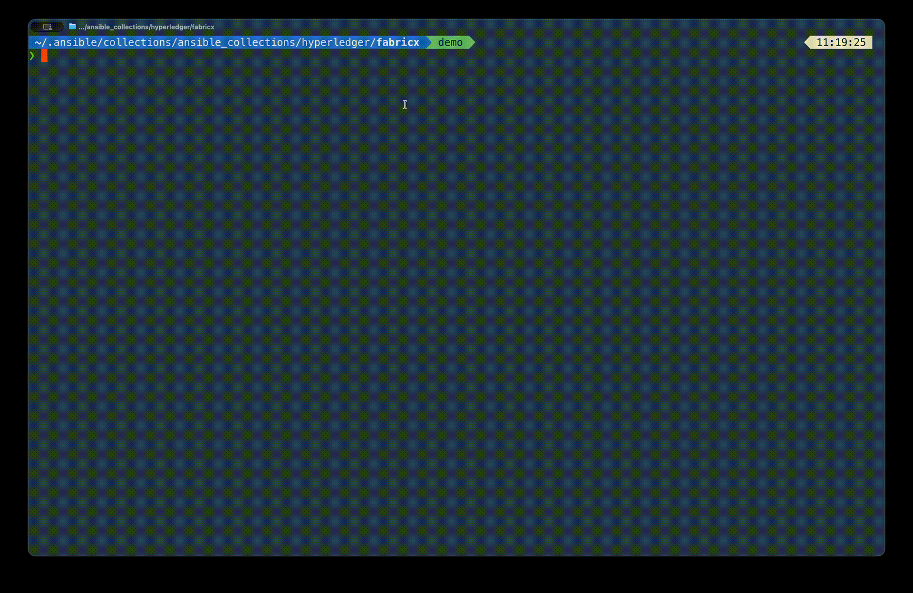
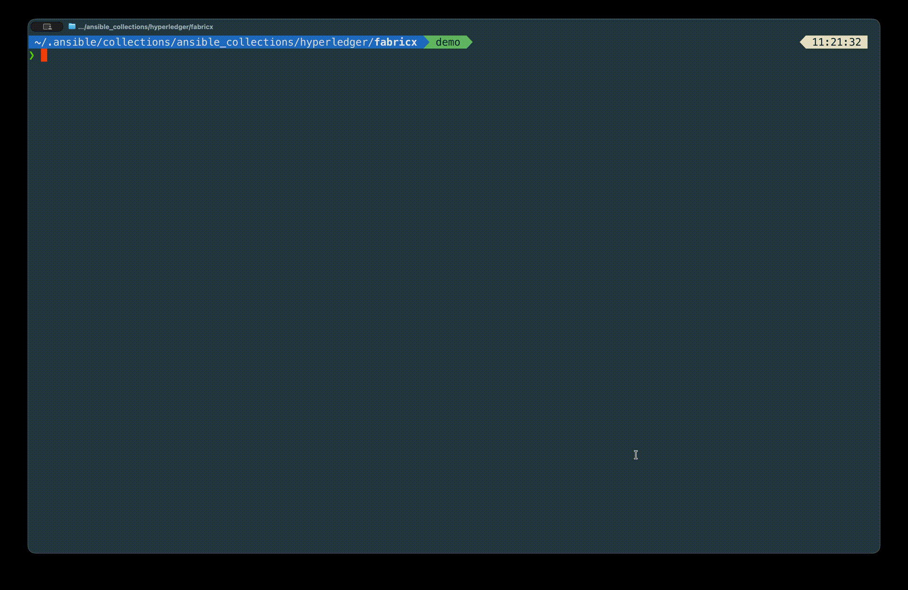
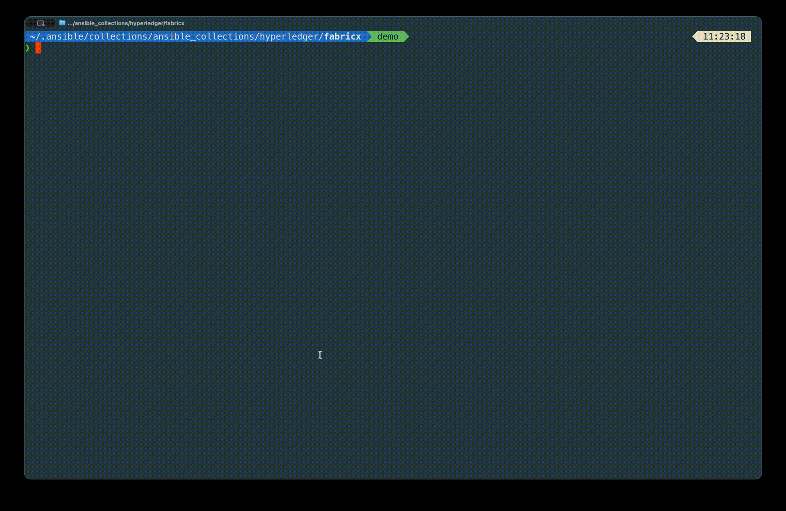
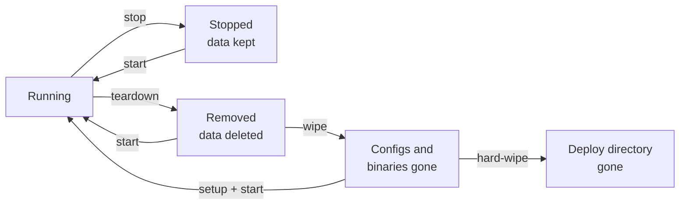

# 6. Target Hosts and the Lifecycle

So far every command has operated on the whole network. That is fine for forty containers on a laptop and useless everywhere else. This lesson teaches you to aim: one group, several groups, or a single host — and then walks the full set of lifecycle verbs, including the two that are easy to confuse and one that will delete more than you expect.

> [!NOTE]
> Estimated time: 20 minutes. Builds on [5. Read the Inventory](./05-read-the-inventory.md).

## Table of Contents <!-- omit in toc -->

- [What You Will Learn](#what-you-will-learn)
- [`TARGET_HOSTS` Is the Whole Mechanism](#target_hosts-is-the-whole-mechanism)
- [The Predefined Groups](#the-predefined-groups)
- [Chaining Groups](#chaining-groups)
- [Targeting a Single Host](#targeting-a-single-host)
- [The Lifecycle Verbs](#the-lifecycle-verbs)
- [The Four Levels of Destruction](#the-four-levels-of-destruction)
- [The Composite Verbs](#the-composite-verbs)
- [Running an Arbitrary Command](#running-an-arbitrary-command)
- [Exercise](#exercise)
- [Next](#next)

## What You Will Learn

- How every `Makefile` target restricts its scope, and how to do the same from `ansible-playbook`.
- The predefined host groups, and how to combine them on one command line.
- How to generate a target per inventory host with `make targets`.
- The difference between `stop`, `teardown`, `wipe`, and `hard-wipe` — before you need it.

## `TARGET_HOSTS` Is the Whole Mechanism

Every lifecycle playbook in this collection accepts one Ansible variable, `target_hosts`, and every `Makefile` target passes it through from a make variable called `TARGET_HOSTS`. That is the entire targeting system.

```shell
make start                          # TARGET_HOSTS defaults to "all"
make TARGET_HOSTS=fabric_x_orderers start
make fabric_x_orderers start        # the readable form, same result
```

Underneath, the `Makefile` is doing this:

```shell
ansible-playbook examples/playbooks/40-start.yaml \
  --extra-vars '{"target_hosts": "fabric_x_orderers"}'
```

So anything the `Makefile` can do, you can do directly with `ansible-playbook` — and the value is an ordinary [Ansible host pattern](https://docs.ansible.com/ansible/latest/inventory_guide/intro_patterns.html), not just a group name. Patterns compose with `:` for union, `:&` for intersection, and `:!` for exclusion.

## The Predefined Groups

Typing `TARGET_HOSTS=` every time is tedious, so [`target_groups.mk`](../../target_groups.mk) defines a make target per common group. Put it _before_ the verb:

| Group target              | Targets                                              |
| ------------------------- | ---------------------------------------------------- |
| `network`                 | The whole deployable Fabric-X network                |
| `fabric_cas`              | Fabric CA servers and their databases                |
| `fabric_ca_servers`       | Just the CA servers                                  |
| `fabric_ca_dbs`           | Just the CA databases                                |
| `fabric_x`                | Orderers plus committer plus Block Explorer          |
| `fabric_x_orderers`       | All orderer components                               |
| `fabric_x_committers`     | All committer components and their database          |
| `fabric_x_block_explorer` | Block Explorer server, UI, and database              |
| `fabric_x_evm`            | The EVM gateway ([lesson 9](./09-add-the-extras.md)) |
| `load_generators`         | All load generators                                  |
| `monitoring`              | Prometheus, Grafana, Loki, Alloy, exporters          |

```shell
make fabric_x_orderers ping
make monitoring stop
make load_generators get-metrics
```



These are exactly the group names from the inventory you read in [lesson 5](./05-read-the-inventory.md). That is the point: the group contract runs all the way from the inventory YAML to your command line.

## Chaining Groups

Group targets can be chained on a single command line, and their hosts are **unioned**:

```shell
make fabric_x_orderers fabric_x_committers start
```



That starts the orderers and the committer, leaving monitoring, the load generator, and the CAs alone.

The mechanism is worth a glance, because it explains why the order matters. Each group target appends to `TARGET_HOSTS` rather than overwriting it, building up an Ansible union pattern:

```makefile
define add_target_hosts
$(eval TARGET_HOSTS := $(if $(_target_hosts_chained),$(TARGET_HOSTS):$(1),$(1)))$(eval _target_hosts_chained := 1)
endef
```

So the chained command above ends up as `target_hosts: fabric_x_orderers:fabric_x_committers`. Put the group targets **first** and the verb last; a verb in the middle would run with only the groups seen so far.

## Targeting a Single Host

Sometimes you want one service. Generate a make target for every host in the current inventory:

```shell
make targets
```



This runs the `generate_target_hosts` playbook, which reads `groups['all']` and writes [`target_hosts.mk`](../../target_hosts.mk) — one target per inventory host. The file is gitignored, and the `Makefile` includes it if it exists. After that:

```shell
make committer-sidecar restart
make orderer-batcher-1 fetch-logs
make grafana stop
```

> [!WARNING]
> Re-run `make targets` after adding, removing, or renaming hosts, and after switching to a different inventory. The generated file describes the inventory that was loaded when you ran it, so a stale `target_hosts.mk` will offer you targets that no longer exist.

Without `make targets`, the same thing works via the variable, which is always available:

```shell
make TARGET_HOSTS=committer-sidecar restart
```

## The Lifecycle Verbs

Now the verbs. Each maps to a numbered playbook in [`examples/playbooks/`](../../examples/playbooks/), and each accepts targeting.

| Verb              | What it does                                                         |
| ----------------- | -------------------------------------------------------------------- |
| `binaries`        | Builds or installs the binaries the targeted hosts need              |
| `generate-crypto` | Generates or enrols the targeted hosts' crypto material              |
| `genesis-block`   | Builds the network genesis block                                     |
| `configs`         | Renders and ships configuration to the targeted hosts                |
| `start`           | Starts the targeted services                                         |
| `init`            | Runs post-start initialization — namespace creation                  |
| `stop`            | Stops the targeted services, keeping data and configuration          |
| `teardown`        | Stops them **and deletes their runtime data**                        |
| `wipe`            | Removes generated configuration and binaries from the targeted hosts |
| `hard-wipe`       | Removes the entire deploy directory from the targeted hosts          |
| `ping`            | Checks that the targeted hosts' declared ports are open              |
| `get-metrics`     | Scrapes metrics from the targeted hosts                              |
| `fetch-logs`      | Collects logs to `out/control-node/fetched/`                         |
| `fetch-crypto`    | Collects crypto material to the control node                         |

## The Four Levels of Destruction

This is the table to internalise before you need it.



| Command          | Services | Runtime data | Configuration and binaries   | To get back                              |
| ---------------- | -------- | ------------ | ---------------------------- | ---------------------------------------- |
| `make stop`      | stopped  | kept         | kept                         | `make start` — resumes the same ledger   |
| `make teardown`  | removed  | **deleted**  | kept                         | `make start` — starts again from genesis |
| `make wipe`      | —        | —            | **deleted**                  | `make setup start`                       |
| `make hard-wipe` | —        | —            | **deploy directory deleted** | `make setup start`                       |

And one more, separate from all of these because it acts on the **control node** rather than the targets:

```shell
make clean         # deletes out/ entirely, plus the Ansible cache and generated MkDocs
make clean-cache   # deletes just the Ansible fact cache
```

> [!WARNING]
> `make clean` removes the whole `out/` directory, which includes your generated crypto material and genesis block. On a local deployment that is also where the services' data lives. It is the "start completely over" button, not a tidy-up.

The practical rule of thumb:

- Iterating on a config template? `make configs restart`.
- Want a fresh ledger but the same identities? `make teardown start`, or its alias `make hard-restart`.
- Changed the inventory's topology or organisations? `make teardown wipe`, then `make setup start init`.
- Something is inexplicably broken? `make teardown wipe clean`, then start from `make setup`.

## The Composite Verbs

Three targets exist purely to save you typing, and they are worth knowing by name because they appear in other people's scripts:

| Composite           | Equivalent to                 |
| ------------------- | ----------------------------- |
| `make update`       | `stop` + `binaries` + `start` |
| `make restart`      | `stop` + `start`              |
| `make hard-restart` | `teardown` + `start`          |

All three accept targeting, so `make fabric_x_orderers update` rebuilds and restarts only the ordering service.

`make setup` and `make artifacts` are composites too, as you saw in [lesson 3](./03-run-your-first-network.md):

```text
setup     = binaries + artifacts + configs
artifacts = generate-crypto + genesis-block
```

## Running an Arbitrary Command

Finally, an escape hatch. When you need to run something on the targeted hosts that no role covers:

```shell
make run-command COMMAND="echo hello-world"
make fabric_x_committers run-command COMMAND="df -h"
```

On a local inventory this runs on your own machine, which makes it a novelty. On the distributed inventories from [lesson 10](./10-go-beyond-local.md) it becomes genuinely useful — one command across every machine in the deployment.

## Exercise

> [!TIP]
> Four parts, each building on the last.
>
> 1. Restart only the ordering service, leaving the committer and monitoring untouched.
> 2. Restart only the single host `committer-verifier`.
> 3. Stop the load generator and monitoring in **one** command.
> 4. Then a question with no command: you changed a port in the inventory for `orderer-router-1`. Which sequence brings that change into effect with the least disruption to the rest of the network — and why is `make restart` on its own not enough?

<details markdown="1">
<summary>Solution</summary>

Part 1:

```shell
make fabric_x_orderers restart
```

Part 2 — generate the per-host targets first if you have not already:

```shell
make targets
make committer-verifier restart
```

or without generating anything:

```shell
make TARGET_HOSTS=committer-verifier restart
```

Part 3 — chain the two groups, verb last:

```shell
make load_generators monitoring stop
```

Part 4:

```shell
make orderer-router-1 configs restart
```

`make restart` is only `stop` + `start`. It restarts the process with the configuration file that is **already on disk**, and that file was rendered by `make configs` from the inventory as it stood at the time. An inventory edit changes nothing until `configs` re-renders it.

There is a second-order effect worth noticing, and it is the reason a port change is rarely as local as it looks: other components hold that port in _their_ configuration too. The consenters and assemblers in the same orderer group, the committer coordinator that discovers assemblers, the load generator that submits to routers, and Prometheus which scrapes the operations port — all of them were rendered with the old value. For a port change on a router, the safe sequence is:

```shell
make configs
make fabric_x restart
```

Re-render everything, then restart the services that consume it. This is the same lesson as part 4 of the previous exercise: the inventory is the source of truth, and `configs` is the step that propagates it.

</details>

## Next

| Previous                                            | Next                                              |
| --------------------------------------------------- | ------------------------------------------------- |
| [5. Read the Inventory](./05-read-the-inventory.md) | [7. Behind the Scenes](./07-behind-the-scenes.md) |
