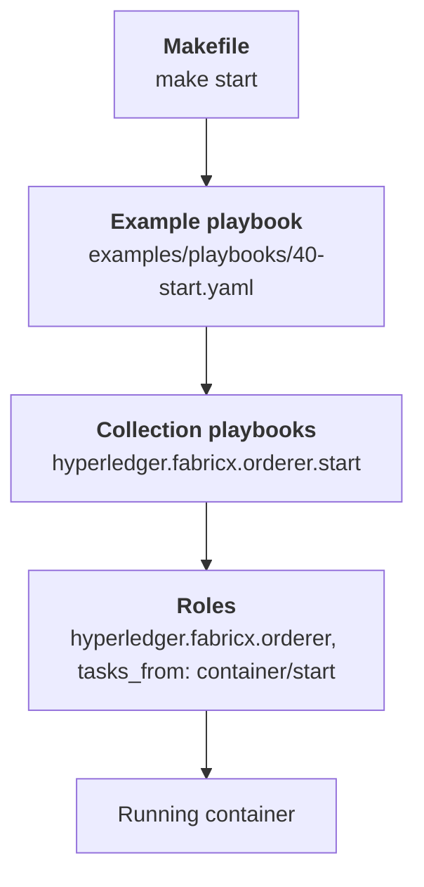

# 7. Behind the Scenes

`make start` is a two-line shell command wrapping a playbook that imports other playbooks that include roles that dispatch on two variables. This lesson unwraps all of it, so that when something fails you know which layer to look at — and so that you can use the collection without the `Makefile` at all.

> [!NOTE]
> Estimated time: 25 minutes. Builds on [6. Target Hosts and the Lifecycle](./06-target-hosts-and-lifecycle.md).

## Table of Contents <!-- omit in toc -->

- [What You Will Learn](#what-you-will-learn)
- [The Four Layers](#the-four-layers)
- [Layer 1: The Makefile](#layer-1-the-makefile)
- [Layer 2: The Example Playbooks](#layer-2-the-example-playbooks)
- [Layer 3: The Collection Playbooks](#layer-3-the-collection-playbooks)
- [Layer 4: The Roles](#layer-4-the-roles)
- [`argument_specs.yaml` Is the Source of Truth](#argument_specsyaml-is-the-source-of-truth)
- [Reading a Generated Config](#reading-a-generated-config)
- [Using the Collection Without the Makefile](#using-the-collection-without-the-makefile)
- [Exercise](#exercise)
- [Next](#next)

## What You Will Learn

- The four layers between your `make` command and a running container.
- Why the example playbooks are numbered, and what the numbers mean.
- How to call any collection playbook directly by its fully-qualified name.
- Where a role's real documentation lives, and why you must never edit its README.
- How to trace a value from the inventory to the generated config file.

## The Four Layers



Each layer has exactly one job:

| Layer                 | Job                                                                         | Yours to edit?                                |
| --------------------- | --------------------------------------------------------------------------- | --------------------------------------------- |
| `Makefile`            | Turn a short verb into an `ansible-playbook` invocation with `target_hosts` | No — it is the repository's interface         |
| `examples/playbooks/` | Order the collection playbooks for the _sample_ topologies                  | Yes — this is example code, copy and adapt it |
| `playbooks/`          | Order the roles for one component family. The collection's public API       | No — part of the collection                   |
| `roles/`              | Do the work for one component                                               | No, unless you are contributing               |

The important consequence: **layer 2 is the seam**. If you build your own Ansible project on this collection, you replace `examples/playbooks/` with your own orchestration and keep layers 3 and 4 as-is.

## Layer 1: The Makefile

Every lifecycle target does the same two things: print a status line, then run one playbook with `target_hosts` as an extra variable. Look at the `start` target in the [`Makefile`](../../Makefile) and you will find it expands to this:

```shell
.venv/bin/ansible-playbook examples/playbooks/40-start.yaml \
  --extra-vars '{"target_hosts": "all"}'
```

Every piece of that command comes from a make variable, and all of them are overridable:

| Variable           | Default                      | Override with                            |
| ------------------ | ---------------------------- | ---------------------------------------- |
| `ANSIBLE_PLAYBOOK` | `.venv/bin/ansible-playbook` | `USE_VENV=false` to use a system Ansible |
| `PLAYBOOK_PATH`    | `examples/playbooks`         | —                                        |
| `ANSIBLE_CONFIG`   | `examples/ansible.cfg`       | export your own                          |
| `TARGET_HOSTS`     | `all`                        | a group target, or `TARGET_HOSTS=`       |
| `OUT_DIR`          | `$(PROJECT_DIR)/out`         | export to move all generated material    |

> [!TIP]
> The `Makefile` also honours a `.env` file at the repository root, via `-include $(PROJECT_DIR)/.env`. That is the tidiest place to keep your own `LOCAL_ANSIBLE_HOST`, `OUT_DIR`, or `ANSIBLE_INVENTORY` without exporting them in every shell.

## Layer 2: The Example Playbooks

Look at the directory listing of [`examples/playbooks/`](../../examples/playbooks/) and the design becomes obvious:

```text
10-binaries.yaml            20-generate-crypto.yaml     21-build-genesis-block.yaml
30-configs.yaml             40-start.yaml               41-init.yaml
50-stop.yaml                60-teardown.yaml            70-ping.yaml
93-get-metrics.yaml         95-fetch-crypto.yaml        96-fetch-logs.yaml
100-wipe.yaml               110-hard-wipe.yaml          999-run-command.yaml
```

The numbers are the **lifecycle order**. Setup in the tens, run in the forties, stop in the fifties and sixties, inspection in the seventies and nineties, destruction in the hundreds. Read them in numeric order and you have read the entire deployment story.

Each file is nothing but a list of imports. Here is `40-start.yaml`, complete:

```yaml
- name: Start PostgreSQL databases
  ansible.builtin.import_playbook: hyperledger.fabricx.postgres.start

- name: Start YugabyteDB clusters
  ansible.builtin.import_playbook: hyperledger.fabricx.yugabyte.start

- name: Start Fabric CA servers
  ansible.builtin.import_playbook: hyperledger.fabricx.fabric_ca_server.start

- name: Start Fabric-X Orderer
  ansible.builtin.import_playbook: hyperledger.fabricx.orderer.start

- name: Start Hyperledger Fabric-X Committer
  ansible.builtin.import_playbook: hyperledger.fabricx.committer.start
# ... block_explorer, evm, monitoring, loadgen, semaphore_ui
```

Two things to take from that.

First, **the order is the dependency graph** — databases before the committer that needs one, orderers before the committer sidecar that connects out to the assemblers, the load generator last.

Second, **every family is always imported**, whether or not your inventory has hosts for it. The default local inventory has no YugabyteDB hosts and no EVM gateway, so `hyperledger.fabricx.yugabyte.start` and `hyperledger.fabricx.evm.start` run against an empty host list and skip. That is why you see plays reporting `skipping: no hosts matched` and why nothing breaks when you switch to an inventory that _does_ have those hosts. Understanding that also explains something you saw in [lesson 3](./03-run-your-first-network.md): the run output covers more component families than your inventory actually deploys.

The other lifecycle files are worth skimming for the same reason. `20-generate-crypto.yaml` in particular explains why `make setup` starts containers:

```yaml
- hyperledger.fabricx.create_container_networks
- hyperledger.fabricx.artifacts.build_crypto_material
- hyperledger.fabricx.fabric_ca_server.generate_crypto
- hyperledger.fabricx.fabric_ca_server.configs
- hyperledger.fabricx.fabric_ca_server.start # <-- the CAs come up here
- hyperledger.fabricx.fabric_ca_server.init
- hyperledger.fabricx.fabric_ca_server.register_identities
- hyperledger.fabricx.orderer.generate_crypto # <-- now every component can enrol
- hyperledger.fabricx.committer.generate_crypto
# ... and so on for every family
```

A Fabric CA has to be running before it can issue anything, so the CA lifecycle is embedded inside the crypto-generation phase. Note also that `50-stop.yaml` and `60-teardown.yaml` list the families in **reverse** order — load generator first, databases last — for the same dependency reason.

## Layer 3: The Collection Playbooks

`hyperledger.fabricx.orderer.start` is a **fully-qualified collection name**: namespace `hyperledger`, collection `fabricx`, namespace-within-the-collection `orderer`, playbook `start`. It maps to [`playbooks/orderer/start.yaml`](../../playbooks/orderer/README.md) in this repository.

You can run any of them directly:

```shell
.venv/bin/ansible-playbook hyperledger.fabricx.orderer.start
.venv/bin/ansible-playbook hyperledger.fabricx.committer.stop \
  --extra-vars '{"target_hosts": "committer-verifier"}'
```

These are the collection's public API. Each namespace covers one component family, and each defines which inventory group it targets by default:

| Namespace                                                        | Default group             | Covers                                            |
| ---------------------------------------------------------------- | ------------------------- | ------------------------------------------------- |
| [`artifacts`](../../playbooks/artifacts/README.md)               | control node              | Crypto material and genesis block                 |
| [`fabric_ca_server`](../../playbooks/fabric_ca_server/README.md) | `fabric_ca_servers`       | CA start, enrol, register, stop                   |
| [`fabric_ca_client`](../../playbooks/fabric_ca_client/README.md) | —                         | The CA client binary                              |
| [`postgres`](../../playbooks/postgres/README.md)                 | every PostgreSQL host     | CA, committer, and Explorer databases in one pass |
| [`yugabyte`](../../playbooks/yugabyte/README.md)                 | every YugabyteDB host     | YugabyteDB clusters                               |
| [`orderer`](../../playbooks/orderer/README.md)                   | `fabric_x_orderers`       | Routers, batchers, consenters, assemblers         |
| [`committer`](../../playbooks/committer/README.md)               | `fabric_x_committers`     | All five committer services                       |
| [`block_explorer`](../../playbooks/block_explorer/README.md)     | `fabric_x_block_explorer` | Explorer server and UI                            |
| [`evm`](../../playbooks/evm/README.md)                           | `fabric_x_evm`            | EVM gateway and embedded endorser                 |
| [`fxconfig`](../../playbooks/fxconfig/README.md)                 | `all`                     | Configuration transactions, namespace creation    |
| [`loadgen`](../../playbooks/loadgen/README.md)                   | `load_generators`         | Load generators, rate limiting, metrics           |
| [`monitoring`](../../playbooks/monitoring/README.md)             | `monitoring`              | Prometheus, Grafana, Loki, Alloy, exporters       |
| [`semaphore_ui`](../../playbooks/semaphore_ui/README.md)         | `semaphore_ui`            | Semaphore UI automation controller                |

There are also a handful of top-level playbooks that operate on shared host resources rather than a component family:

| Playbook                                        | Purpose                                                 |
| ----------------------------------------------- | ------------------------------------------------------- |
| `hyperledger.fabricx.install_prerequisites`     | Install OS packages and runtimes on the target machines |
| `hyperledger.fabricx.log_in_container_registry` | Authenticate against a private registry                 |
| `hyperledger.fabricx.create_container_networks` | Create the container networks the inventory declares    |
| `hyperledger.fabricx.remove_container_networks` | Remove them again                                       |
| `hyperledger.fabricx.generate_target_hosts`     | Write `target_hosts.mk` — this is `make targets`        |

These deduplicate work per _physical machine_ rather than per inventory host, which matters when twenty logical services share one `ansible_host`. `install_prerequisites`, for example, picks one representative host per machine so packages are not installed twenty times.

## Layer 4: The Roles

A collection playbook does almost nothing except include a role with a specific task file:

```yaml
- name: Start Fabric-X Orderer components
  ansible.builtin.include_role:
    name: hyperledger.fabricx.orderer
    tasks_from: start
```

And the role's `start.yaml` dispatches on the two axes you met in [lesson 5](./05-read-the-inventory.md):

```yaml
- name: Start Fabric-X Orderer nodes
  ansible.builtin.include_role:
    name: hyperledger.fabricx.orderer
    tasks_from: "{{ orderer_deployment_mode }}/start"
  when: orderer_component_type is defined
```

So the layout under `roles/<role>/tasks/` mirrors those axes directly:

```text
roles/committer/tasks/
├── start.yaml           # dispatch on deployment mode
├── stop.yaml
├── container/           # deployment mode: container
├── bin/                 # deployment mode: binary
├── k8s/                 # deployment mode: Kubernetes
├── openshift/           # deployment mode: OpenShift
├── config/              # dispatch on component type
├── crypto/
├── validator/           # per-component config and k8s manifests
├── verifier/
├── coordinator/
├── sidecar/
└── query_service/
```

> [!TIP]
> When a component fails to start, this tree tells you exactly which file to read. A committer verifier that will not come up in container mode was started by `roles/committer/tasks/container/start.yaml` using a config rendered by `roles/committer/tasks/verifier/config/transfer.yaml`. Two files, not a haystack.

## `argument_specs.yaml` Is the Source of Truth

Every role has a `meta/argument_specs.yaml`, and it is the **authoritative** reference for that role: every variable, its type, its default, its documentation, and which task entry points accept it.

Two files are generated from it and must never be edited by hand:

- `roles/<role>/defaults/main.yaml`
- `roles/<role>/README.md`

```shell
make generate-roles-docs    # regenerate both, for every role
make check-argument-specs   # verify entry points match the tasks/ files
make check-docs             # verify the generated files are in sync
```

CI runs the last two, so a hand-edited README will fail the build.

When you want to know what a role can do, read its `argument_specs.yaml` — or the [generated role documentation](../../roles/README.md), which is the same content rendered. Deployment-mode support **varies per role**: not every role supports binary or Kubernetes mode, and the argument specs are where that is stated.

## Reading a Generated Config

Here is the whole chain, end to end, for a single value.

The inventory says:

```yaml
committer-validator:
  committer_component_type: validator
  committer_rpc_port: 5100
  postgres_db_host: committer-db
```

`make configs` runs `hyperledger.fabricx.committer.configs`, which includes the `committer` role's `config/transfer` task, which dispatches to `validator/config/transfer` because of the component type, which renders a Jinja2 template from `roles/committer/templates/` with the inventory as its data, and writes the result to the path the environment file defines.

So you can read the outcome:

```shell
ls out/local-deployment/committer-validator/config/
cat out/local-deployment/committer-validator/config/*.yaml
```

Inside you will find `5100` as a listen address and the resolved address and credentials of `committer-db`, because the role looked up `hostvars['committer-db']` to get its port, user, and password.

That lookup is the thing to remember: `postgres_db_host: committer-db` is not a string that gets copied into a config file. It is a **reference into the inventory**, resolved at render time. Which is why changing `committer-db`'s port requires re-rendering the _validator's_ config too, exactly as the exercise in [lesson 6](./06-target-hosts-and-lifecycle.md) concluded.

## Using the Collection Without the Makefile

Put it all together and you can drive the collection directly. Set the config and inventory, then call collection playbooks:

```shell
export ANSIBLE_CONFIG=examples/ansible.cfg

.venv/bin/ansible-playbook hyperledger.fabricx.orderer.configs
.venv/bin/ansible-playbook hyperledger.fabricx.orderer.start
.venv/bin/ansible-playbook hyperledger.fabricx.orderer.ping
```

This is what building your own Ansible project on this collection looks like: your own playbooks importing `hyperledger.fabricx.*`, your own inventory, and no `Makefile` at all. The `Makefile` and `examples/playbooks/` are a convenient sample harness, not the product.

## Exercise

> [!TIP]
> Three parts.
>
> 1. Restart the ordering service **without using the `Makefile`**. Call the collection playbooks directly, and restrict the operation to `fabric_x_orderers`.
> 2. Find out which variable controls the container image tag used for the committer — without reading any role task file.
> 3. Then a reading exercise: open [`examples/playbooks/60-teardown.yaml`](../../examples/playbooks/60-teardown.yaml) and explain why `remove_container_networks` is second-to-last rather than first.

<details markdown="1">
<summary>Solution</summary>

Part 1 — stop then start, with `target_hosts` passed as an extra variable:

```shell
export ANSIBLE_CONFIG=examples/ansible.cfg

.venv/bin/ansible-playbook hyperledger.fabricx.orderer.stop \
  --extra-vars '{"target_hosts": "fabric_x_orderers"}'
.venv/bin/ansible-playbook hyperledger.fabricx.orderer.start \
  --extra-vars '{"target_hosts": "fabric_x_orderers"}'
```

`fabric_x_orderers` is already the `orderer` playbooks' default group, so you can omit `--extra-vars` entirely here. Passing it explicitly is what the `Makefile` does, and it is what you need when you want a narrower scope.

Part 2 — the authoritative place is the role's argument specs, or the generated documentation which says the same thing:

```shell
grep -n "committer_image" roles/committer/defaults/main.yaml
```

The tag is `committer_image_tag`, and `committer_image` is composed from `committer_registry_endpoint`, `committer_image_name`, and `committer_image_tag`. The same pattern holds for every containerised role, which is how you pin or bump a component's version from the inventory. The [committer role documentation](../../roles/committer/README.md) documents all four.

Part 3 — a container network cannot be removed while containers are still attached to it. `60-teardown.yaml` removes the component families first, in reverse dependency order, and only then removes the networks they were using. Putting `remove_container_networks` first would fail on every network that still has a running container.

The same reasoning explains the ordering of the whole file, and it is the mirror image of `40-start.yaml`: start bottom-up, tear down top-down.

</details>

## Next

| Previous                                                                | Next                                                  |
| ----------------------------------------------------------------------- | ----------------------------------------------------- |
| [6. Target Hosts and the Lifecycle](./06-target-hosts-and-lifecycle.md) | [8. Change the Topology](./08-change-the-topology.md) |
