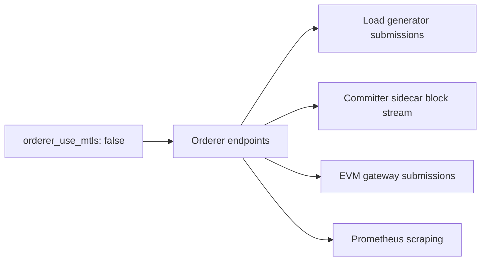

# 8. Change the Topology

You can read an inventory. Now change one. This lesson covers the four dimensions you can vary independently — scale, database, crypto source, and security posture — plus the runtime axis, and it starts with the single most important piece of advice in the whole tutorial.

> [!NOTE]
> Estimated time: 40 minutes. Builds on [7. Behind the Scenes](./07-behind-the-scenes.md).

## Table of Contents <!-- omit in toc -->

- [What You Will Learn](#what-you-will-learn)
- [Change One Dimension at a Time](#change-one-dimension-at-a-time)
- [Work on a Copy](#work-on-a-copy)
- [Dimension 1: Scale](#dimension-1-scale)
  - [The batcher exception](#the-batcher-exception)
- [Dimension 2: The Database](#dimension-2-the-database)
- [Dimension 3: The Crypto Source](#dimension-3-the-crypto-source)
- [Dimension 4: The Security Posture](#dimension-4-the-security-posture)
- [The Runtime Axis: Binaries](#the-runtime-axis-binaries)
- [Applying an Inventory Change](#applying-an-inventory-change)
- [Exercise](#exercise)
- [Next](#next)

## What You Will Learn

- Why the sample inventories differ along exactly one axis each, and how to use that.
- How to scale a stateless committer service, and what extra rule applies to batchers.
- How to swap PostgreSQL for YugabyteDB, and what the committer needs to reference instead.
- What `cryptogen` gives up compared to Fabric CA.
- The correct command sequence to apply a topology change.

## Change One Dimension at a Time

Look at the local inventory family again with fresh eyes:

| Inventory                                                                              | Differs from `fabric-x.yaml` by |
| -------------------------------------------------------------------------------------- | ------------------------------- |
| [`fabric-x.yaml`](../../examples/inventory/docs/local/fabric-x.md)                     | — the baseline                  |
| [`fabric-x-yugabyte.yaml`](../../examples/inventory/docs/local/fabric-x-yugabyte.md)   | the committer database          |
| [`fabric-x-cryptogen.yaml`](../../examples/inventory/docs/local/fabric-x-cryptogen.md) | the crypto source               |
| [`fabric-x-no-mtls.yaml`](../../examples/inventory/docs/local/fabric-x-no-mtls.md)     | mTLS off                        |
| [`fabric-x-no-tls.yaml`](../../examples/inventory/docs/local/fabric-x-no-tls.md)       | TLS and mTLS off                |
| [`fabric-x-bin.yaml`](../../examples/inventory/docs/local/fabric-x-bin.md)             | the runtime                     |
| [`fabric-x-evm.yaml`](../../examples/inventory/docs/local/fabric-x-evm.md)             | one extra component             |

Every one of them is the baseline plus **one** change. That is not tidiness for its own sake — it is the debugging strategy. When a deployment misbehaves, you want to be able to diff your inventory against a working one and see a small, comprehensible change.

Do the same in your own work. Start from the closest sample, change one dimension, verify it works, and only then change the next.

> [!TIP]
> `diff` is a legitimate documentation tool here. `diff examples/inventory/local/fabric-x.yaml examples/inventory/local/fabric-x-yugabyte.yaml` teaches you exactly what switching the database involves, faster than any prose.

## Work on a Copy

Do not edit the shipped samples. Copy one and point Ansible at your copy:

```shell
cp examples/inventory/local/fabric-x.yaml examples/inventory/local/my-fabric-x.yaml
export ANSIBLE_INVENTORY=examples/inventory/local/my-fabric-x.yaml
```

`ANSIBLE_INVENTORY` overrides the `inventory =` line in [`examples/ansible.cfg`](../../examples/ansible.cfg), so every `make` command now uses your copy. Confirm it took effect before you change anything:

```shell
.venv/bin/ansible-inventory --graph | head -20
```

> [!TIP]
> Put the export in a `.env` file at the repository root instead and the `Makefile` will pick it up in every shell — no more forgetting to export it and wondering why your change had no effect.

Tear the baseline network down before reshaping it:

```shell
make teardown
```

## Dimension 1: Scale

Verifiers and validators are stateless and horizontally scalable. Adding one is genuinely just a new host with unique ports.

In your copy, find the `fabric_x_committer` hosts block and add a second verifier next to the first:

```yaml
committer-verifier:
  committer_component_type: verifier
  committer_rpc_port: 5110
  committer_metrics_port: 5210
committer-verifier-2:
  committer_component_type: verifier
  committer_rpc_port: 5111
  committer_metrics_port: 5211
```

That is the whole change. Note what you did _not_ have to write:

- No organisation block — it is inherited from the `fabric_x_committer` group variables, so the new host enrols with `Org1` against `fca-org1` automatically.
- No TLS settings — also inherited.
- No reference from the coordinator to the new verifier. The coordinator discovers verifiers from group membership at startup, which is why group structure is architectural rather than cosmetic.

The same pattern scales validators, with one addition — a validator commits state, so it needs a database reference:

```yaml
committer-validator-2:
  committer_component_type: validator
  committer_rpc_port: 5101
  committer_metrics_port: 5201
  postgres_db_host: committer-db
```

### The batcher exception

Orderer batchers scale too, but they carry one extra rule: each batcher in an orderer group needs a unique **shard ID**.

```yaml
fabric_x_orderer_1:
  hosts:
    orderer-batcher-1:
      orderer_component_type: batcher
      orderer_shard_id: 1
      orderer_rpc_port: 7053
      orderer_operations_port: 7063
    orderer-batcher-2:
      orderer_component_type: batcher
      orderer_shard_id: 2
      orderer_rpc_port: 7054
      orderer_operations_port: 7064
```

Adding batcher shards is the main scaling lever on the ordering side, and the [distributed sample](../../examples/inventory/docs/distributed/fabric-x.md) uses two batchers per orderer group for exactly this reason.

> [!WARNING]
> Batcher shard IDs and the orderer group layout are encoded in the **genesis block**. Changing them is not a restart — it needs `make artifacts` to rebuild the genesis block, and the network starts from a fresh ledger. This is unlike adding a verifier, which is a pure runtime change.

## Dimension 2: The Database

The committer stores world state, transaction status, and namespace policies in an external database. PostgreSQL is compact and ideal for a laptop; YugabyteDB is what you use when you need horizontal scale.

Rather than editing, read the diff — this is the case where the sample teaches faster than prose:

```shell
diff examples/inventory/local/fabric-x.yaml \
     examples/inventory/local/fabric-x-yugabyte.yaml
```

The structural difference is that the single `committer-db` PostgreSQL host is replaced by a `committer_dbs` child group holding a YugabyteDB cluster:

```yaml
fabric_x_committer:
  children:
    committer_dbs:
      vars:
        yugabyte_user: yugabyte
        yugabyte_password: yugabyte
        yugabyte_db: yugabyte
        yugabyte_cluster_id: 1
        yugabyte_use_tls: true
      hosts:
        yugabytedb-master-1:
          yugabyte_component_type: master
          yugabyte_master_rpc_bind_port: 5300
          yugabyte_master_webserver_port: 5310
        yugabytedb-tablet-1:
          yugabyte_component_type: tablet
          yugabyte_tablet_pgsql_bind_port: 5320
          # ... five more ports
```

And the two committer services that touch the database reference the **cluster**, not a host:

```yaml
committer-validator:
  yugabyte_cluster_ref_id: 1 # instead of postgres_db_host
  committer_component_type: validator
committer-query-service:
  yugabyte_cluster_ref_id: 1
  committer_component_type: query-service
```

Three things to take from this:

- YugabyteDB has its own dispatcher variable, `yugabyte_component_type`, with values `master` and `tablet` — the same pattern as the orderer and committer.
- A cluster is referenced by `yugabyte_cluster_ref_id` matching a `yugabyte_cluster_id`, not by hostname. A cluster is many hosts, so a single-host reference would not work.
- The Fabric CA databases stay on PostgreSQL. Only the committer's state backend changed — one dimension.

Scale it by adding more master and tablet hosts. The [distributed sample](../../examples/inventory/docs/distributed/fabric-x.md) runs 3 masters and 7 tablets.

## Dimension 3: The Crypto Source

There are two ways to get certificates into the network, and the choice is about _where private keys are generated_.

|                          | Fabric CA                                             | `cryptogen`                                                |
| ------------------------ | ----------------------------------------------------- | ---------------------------------------------------------- |
| Where keys are generated | On the node that owns the key                         | Centrally, on the control node                             |
| Inventory                | `fabric_cas` group, `fabric_ca_host` per organisation | No CA hosts; `cryptogen_artifacts_dir` on the control node |
| Extra containers         | 5 CA servers + 5 databases                            | none                                                       |
| Setup time               | slower — CAs start and enrol every identity           | fast                                                       |
| Repeatability            | fresh identities each run                             | deterministic material                                     |
| Realistic?               | yes, this is the production-shaped path               | no                                                         |

The trade is genuine. Fabric CA is the safer pattern because a private key never leaves the node that will use it. `cryptogen` is a test tool: it generates everything centrally, which is convenient for repeatable performance runs and ten containers lighter, but it is not a certificate lifecycle.

```shell
diff examples/inventory/local/fabric-x.yaml \
     examples/inventory/local/fabric-x-cryptogen.yaml
```

You will see the whole `fabric_cas` group disappear along with every `fabric_ca_host` and enrollment secret, while the organisation `name` and `domain` stay — those are still needed to generate certificate material and channel configuration.

> [!WARNING]
> Use `cryptogen` inventories for debugging and repeatable tests. For anything production-shaped, start from the Fabric CA based baseline.

## Dimension 4: The Security Posture

Three postures ship as samples, and the ordering is deliberate:

| Inventory               | TLS | mTLS | Use it for                                         |
| ----------------------- | --- | ---- | -------------------------------------------------- |
| `fabric-x.yaml`         | yes | yes  | the default; encrypted and client-authenticated    |
| `fabric-x-no-mtls.yaml` | yes | no   | debugging certificate or interoperability problems |
| `fabric-x-no-tls.yaml`  | no  | no   | debugging protocol or connectivity problems        |

The variables are per-role: `orderer_use_tls`, `orderer_use_mtls`, `committer_use_tls`, `committer_use_mtls`, and equivalents for `loadgen`, `postgres`, `fabric_ca`, `grafana`, `prometheus`, and the rest.

The trap is that a security change is **never local**. Turning off mTLS on the orderer affects everything that connects to it:



So when you change a security flag, check the orderer, committer, load generator, monitoring, and database variables **together** so the generated endpoints and certificate references stay consistent. This is precisely why the samples change one posture at a time and why you should copy one rather than hand-editing flags.

> [!WARNING]
> The no-TLS inventory produces plaintext endpoints everywhere. It is a local debugging tool and never a starting point for anything real.

## The Runtime Axis: Binaries

Separate from the four dimensions above is _how_ each service runs. You met the mechanism in [lesson 5](./05-read-the-inventory.md): each role resolves a deployment mode from its `*_use_bin`, `*_use_k8s`, and `*_use_openshift` flags, defaulting to `container`.

[`fabric-x-bin.yaml`](../../examples/inventory/docs/local/fabric-x-bin.md) flips the binary flag on the Fabric-X services and the CLI tools:

```yaml
# all.vars — the control-node CLIs
armageddon_use_bin: true
configtxgen_use_bin: true
cryptogen_use_bin: true
fxconfig_use_bin: true
fabric_ca_client_use_bin: true

# per group
fabric_ca_server_use_bin: true # in fabric_ca_servers
orderer_use_bin: true # in fabric_x_orderers
committer_use_bin: true # in fabric_x_committer
loadgen_use_bin: true # in load_generators
```

Binary-mode services are built with Go and managed through **`tmux`**, which makes them convenient to attach a debugger to or read directly. Two caveats:

- Binary mode is supported by the **Fabric-X services only**. The PostgreSQL databases still run as containers, as do the Block Explorer and the whole monitoring stack. Check each role's `argument_specs.yaml` before assuming support.
- Building the binaries needs `go` on the machine doing the build. On macOS this is also the case where the `/etc/hosts` entry from [lesson 2](./02-prepare-your-control-node.md) matters, because host processes must resolve the same name the containers use.

## Applying an Inventory Change

The sequence depends on what you changed, and this table is the one to keep:

| You changed                                   | Sequence                                                         | Why                                                                 |
| --------------------------------------------- | ---------------------------------------------------------------- | ------------------------------------------------------------------- |
| A port, a log level, a tuning value           | `make configs` then `make restart`                               | Only rendered configuration changed                                 |
| Added a stateless host (verifier, validator)  | `make targets`, `make setup`, `make fabric_x_committers restart` | The new host needs crypto and a config; consumers need re-rendering |
| Batcher shards, orderer groups, organisations | `make teardown wipe`, `make setup`, `make start`, `make init`    | It is in the genesis block — fresh ledger required                  |
| A security flag                               | `make teardown wipe`, `make setup`, `make start`, `make init`    | Certificates and every endpoint reference change                    |
| The database backend                          | `make teardown wipe`, `make setup`, `make start`, `make init`    | Different backend, no state migration                               |
| The runtime (container to binary)             | `make teardown wipe`, `make setup`, `make start`, `make init`    | Different artifacts entirely                                        |

Always `make targets` after adding, removing, or renaming a host, so the per-host `Makefile` targets match reality.

> [!WARNING]
> Notice how many rows say `teardown wipe`. Most interesting inventory changes mean a fresh ledger, because they change either the genesis block or the identities. Only the first two rows are live-network changes. Budget for this: iterate on a small inventory, not on one you care about the state of.

## Exercise

> [!TIP]
> Scale the committer's signature-checking capacity, and prove to yourself that it worked.
>
> 1. Copy the default local inventory and point `ANSIBLE_INVENTORY` at your copy.
> 2. Add a **second verifier** with unique RPC and metrics ports.
> 3. Bring the change into effect and confirm the new host is running.
> 4. Confirm Prometheus is scraping it — and if it is not, work out from [lesson 5](./05-read-the-inventory.md) what you would have had to add if the verifier had been in a group of its own rather than inside `fabric_x_committer`.
>
> Then, for extra credit: which of the four dimensions did you just change, and would this have needed a fresh ledger if you had added a batcher instead?

<details markdown="1">
<summary>Solution</summary>

Steps 1 and 2:

```shell
cp examples/inventory/local/fabric-x.yaml examples/inventory/local/my-fabric-x.yaml
export ANSIBLE_INVENTORY=examples/inventory/local/my-fabric-x.yaml
```

In the `fabric_x_committer` hosts block, next to `committer-verifier`:

```yaml
committer-verifier-2:
  committer_component_type: verifier
  committer_rpc_port: 5111
  committer_metrics_port: 5211
```

Ports `5111` and `5211` follow the existing scheme — RPC in the 51xx range, metrics in the 52xx range — and neither collides with the validator (5100/5200), the coordinator (5120/5220), the sidecar (5130/5230), or the query service (5140/5240).

Step 3:

```shell
make targets                              # regenerate per-host targets
.venv/bin/ansible-inventory --graph fabric_x_committer   # confirm it is there
make setup                                # enrol the new host, re-render every config
make fabric_x_committers restart          # coordinator picks up the new verifier
make fabric_x_committers ping
```

The coordinator restart is the part people miss. It discovers verifiers from group membership **at startup**, so a coordinator that is already running knows nothing about your new host. Restarting the whole committer group is the simple way to be sure.

Step 4 — Prometheus:

```shell
make monitoring restart
# then check Status → Targets at https://localhost:9090
```

Prometheus's scrape configuration is generated from the inventory, so it also needs re-rendering and a restart to learn about the new target. `make setup` re-rendered it; the restart applies it.

If the new verifier had lived in a group of its own, it would not have inherited `committer_monitoring_mtls_clients: [prometheus]` from `fabric_x_committer`, and the target would show as `DOWN` — Prometheus scrapes Fabric-X components over mTLS, and a component that does not trust `prometheus` as a client refuses the connection. It would look like a broken service and actually be a missing inventory line.

Extra credit: you changed the **scale** dimension, and only that one. No fresh ledger was needed, because a verifier is stateless and is not described in the genesis block.

A batcher would have been different. Batcher shard IDs and the orderer group layout **are** encoded in the genesis block, so adding one means `make teardown wipe`, then `make setup start init`, and the ledger starts from block 0 again. That asymmetry — runtime scaling on the committer side, genesis-level scaling on the ordering side — is worth remembering before you plan a capacity change on a network whose state you care about.

</details>

## Next

| Previous                                          | Next                                        |
| ------------------------------------------------- | ------------------------------------------- |
| [7. Behind the Scenes](./07-behind-the-scenes.md) | [9. Add the Extras](./09-add-the-extras.md) |
