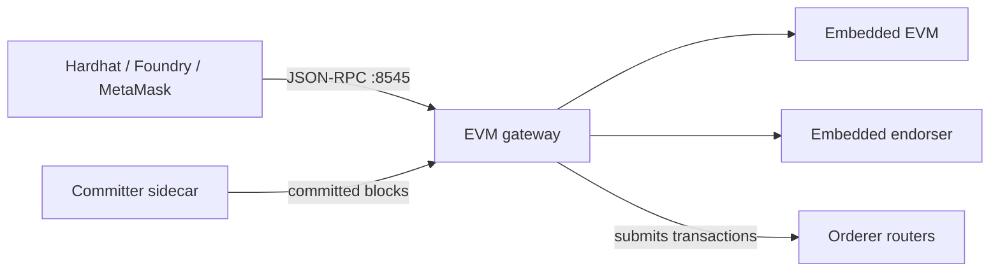

# 9. Add the Extras

Fabric-X is not only the orderer and the committer. This lesson covers the optional components that make a deployment usable: the EVM gateway that turns Fabric-X into an Ethereum JSON-RPC endpoint, the Block Explorer, the monitoring stack, and Semaphore UI. The EVM gateway gets most of the space, because it is the one that lets you point an unmodified Solidity tutorial at your own network.

> [!NOTE]
> Estimated time: 30 minutes. Builds on [8. Change the Topology](./08-change-the-topology.md).

## Table of Contents <!-- omit in toc -->

- [What You Will Learn](#what-you-will-learn)
- [The EVM Gateway](#the-evm-gateway)
- [Deploying It](#deploying-it)
- [Talking to It](#talking-to-it)
- [Using Foundry, Hardhat, or MetaMask](#using-foundry-hardhat-or-metamask)
- [The Block Explorer](#the-block-explorer)
- [The Monitoring Stack](#the-monitoring-stack)
- [Semaphore UI](#semaphore-ui)
- [Exercise](#exercise)
- [Next](#next)

## What You Will Learn

- What the EVM gateway is, and why it needs an endorser of its own.
- How to bring up a Fabric-X network with an Ethereum JSON-RPC endpoint and submit a transaction to it.
- How a component declares the namespace it needs, and how that reaches the chain.
- How the Block Explorer derives its security settings from another host.
- Which observability component to add for which question.

## The EVM Gateway

[`fabric-x-evm`](https://github.com/hyperledger/fabric-x-evm) is a gateway container that speaks **Ethereum JSON-RPC** on the outside and Fabric-X on the inside. It embeds an EVM and its own endorser, submits ordered transactions to the Fabric-X routers, and synchronizes committed state from the committer sidecar.

The practical consequence is unusual and worth stating plainly: any Solidity tutorial works unchanged against it, gas is free, and any signing key is accepted.



The gateway is a single inventory host. In [`local/fabric-x-evm.yaml`](../../examples/inventory/docs/local/fabric-x-evm.md) it is the whole addition to the baseline:

```yaml
fabric_x_evm:
  hosts:
    fabric-x-evm:
      evm_port: 8545
      evm_use_tls: true
      organization:
        <<: *Org1
        fabric_ca_host: fca-org1
        role: peer
        peer:
          name: "{{ inventory_hostname }}"
          secret: "{{ inventory_hostname }}PWD"
        users:
          - name: fabric-x-evm
            secret: "{{ inventory_hostname }}PWD"
        namespaces:
          - id: basic
            policy: threshold
```

Four things in that block are worth reading closely, because each one teaches something general.

**`role: peer` with a `peer:` block.** The gateway embeds an _endorser_, so it needs a peer identity — not a client identity. That is what backs the endorsement it produces for its own transactions.

**A `users:` list.** The first entry becomes the gateway's transaction-signing identity. Without at least one user the gateway has nothing to sign with, and `generate_crypto` fails by design.

**A `namespaces:` list.** The gateway declares that it needs a namespace called `basic` with a `threshold` policy. This is the same mechanism the load generator uses for namespace `0`, and it is what `make init` acts on: `fxconfig` reads the declaration from the inventory and creates the namespace from this user's signing certificate. Declare the namespace your application needs on the host that will use it.

**It is enrolled in `Org1`.** That is not incidental — it is the trick that keeps this inventory a one-host change. `Org1` is already trusted by the committer and the orderers, so no extra mTLS trust configuration is needed. Put the gateway in a _new_ organisation and you would also have to add it to `committer_mtls_clients` and the orderer's `orderer_mtls_clients`/`orderer_mtls_orgs`. Reusing an already-trusted organisation is the cheapest way to add a client component.

State is persisted: the gateway's block, transaction, and log index and the embedded endorser's ledger are written as SQLite files under the host's data directory, so a restart resumes where it left off instead of re-syncing from block `0`. `make fabric_x_evm wipe` is what removes that state.

## Deploying It

The EVM gateway is already wired into every lifecycle playbook — `40-start.yaml` imports `hyperledger.fabricx.evm.start`, which simply skips when the inventory has no `fabric_x_evm` hosts. So switching inventories is all it takes:

```shell
make teardown                                            # tear down what you have
export ANSIBLE_INVENTORY=examples/inventory/local/fabric-x-evm.yaml
make targets                                             # refresh per-host targets
make setup
make start
make init                                                # creates the "basic" namespace
```

Confirm the gateway host came up:

```shell
make fabric_x_evm ping
```

> [!NOTE]
> `make init` is the step that matters here. The gateway can start without the `basic` namespace existing, but contract deployments will fail until `fxconfig` has created it. If a transaction is rejected with a namespace error, `make init` is the first thing to check.

## Talking to It

The gateway serves Ethereum JSON-RPC — and WebSocket, on the same port — at `http://localhost:8545`, with chain ID **4011** (`0xfab`).

```shell
curl -s -X POST -H 'Content-Type: application/json' \
  --data '{"jsonrpc":"2.0","id":1,"method":"eth_chainId","params":[]}' \
  http://localhost:8545
```

You should get back `{"jsonrpc":"2.0","id":1,"result":"0xfab"}`.

A couple more calls worth trying, because they prove the gateway is genuinely tracking your Fabric-X ledger rather than pretending:

```shell
# current block height — should advance as the load generator submits
curl -s -X POST -H 'Content-Type: application/json' \
  --data '{"jsonrpc":"2.0","id":1,"method":"eth_blockNumber","params":[]}' \
  http://localhost:8545

# balance of an arbitrary address
curl -s -X POST -H 'Content-Type: application/json' \
  --data '{"jsonrpc":"2.0","id":1,"method":"eth_getBalance","params":["0x0000000000000000000000000000000000000001","latest"]}' \
  http://localhost:8545
```

## Using Foundry, Hardhat, or MetaMask

Point any Ethereum tool at the URL and chain ID and it works.

With [Foundry](https://book.getfoundry.sh/):

```shell
cast chain-id --rpc-url http://localhost:8545
cast block-number --rpc-url http://localhost:8545
```

With [Hardhat](https://hardhat.org/tutorial), add a network to `hardhat.config.js`:

```javascript
networks: {
  fabricx: {
    url: "http://localhost:8545",
    chainId: 4011,
  },
}
```

With [MetaMask](https://support.metamask.io/configure/networks/how-to-add-a-custom-network-rpc/), add a custom network with RPC URL `http://localhost:8545` and chain ID `4011`.

> [!NOTE]
> Gas is free and any signing key is accepted, so you do not need a funded account to deploy a contract. See [hyperledger/fabric-x-evm](https://github.com/hyperledger/fabric-x-evm#build-your-own-contracts) for the caveats — this is an EVM on top of Fabric-X, not an Ethereum client, and some semantics differ.

## The Block Explorer

You already used the Block Explorer in [lesson 4](./04-observe-the-network.md). Now look at how it is wired, because it is the clearest example in the whole repository of a component whose behaviour is defined by _another host's_ settings.

```yaml
fabric_x_block_explorer:
  hosts:
    block-explorer-db:
      postgres_user: block_explorer_user
      postgres_password: block_explorer_pwd
      postgres_db: explorer
      postgres_port: 18432
      postgres_use_tls: true
    block-explorer:
      block_explorer_port: 18080
      block_explorer_ui_port: 18000
      sidecar_host: committer-sidecar
      postgres_db_host: block-explorer-db
```

Two hosts: the Explorer (server and UI in one container) and its own PostgreSQL database, separate from the committer's.

There is no `block_explorer_use_tls` variable. The Explorer's TLS and mTLS mode is **derived** from the `committer_use_tls` and `committer_use_mtls` settings of the host named by `sidecar_host`. That is the right design — it streams blocks from the sidecar, so it must speak whatever the sidecar speaks — but it means a security change on the committer silently changes the Explorer too.

And the trust has to be granted from the other side. Back in the committer's group variables:

```yaml
committer_mtls_clients:
  - block-explorer
```

Without that line the sidecar refuses the Explorer's gRPC connection, and the Explorer looks broken while being perfectly configured. This is the same class of failure as the Prometheus `DOWN` target from [lesson 4](./04-observe-the-network.md), and it is the general rule for mTLS in this collection: **the client declares who it connects to, and the server declares who it trusts.** Both halves are inventory lines.

## The Monitoring Stack

The monitoring components are independent of each other, so you can deploy any subset. Which one you add depends on the question you are trying to answer.

| Question                                  | Component                      | Inventory host          |
| ----------------------------------------- | ------------------------------ | ----------------------- |
| How is Fabric-X performing?               | Prometheus                     | `prometheus`            |
| Show me that on a chart                   | Grafana                        | `grafana`               |
| What did the components log?              | Loki plus Alloy                | `loki`, `alloy`         |
| Is the machine itself saturated?          | Node exporter                  | `node-exporter`         |
| Which container is using the CPU?         | cAdvisor                       | `cadvisor`              |
| Is the committer database the bottleneck? | PostgreSQL exporter            | `committer-db-exporter` |
| Is YugabyteDB healthy?                    | Prometheus scrapes it directly | —                       |
| Where did this request spend its time?    | Jaeger                         | —                       |
| I need full-text search over logs         | Elasticsearch                  | —                       |

The last two are supported by the collection — [`jaeger`](../../roles/jaeger/README.md) for tracing and [`elasticsearch`](../../roles/elasticsearch/README.md) for log storage — but no sample inventory deploys them. They are there for when you need them.

Note the dependency direction: Grafana is a _consumer_. It references its data sources by inventory hostname, exactly like everything else:

```yaml
grafana:
  grafana_username: admin
  grafana_password: adminPWD
  grafana_web_port: 3000
  grafana_use_tls: true
  prometheus_host: prometheus
  loki_host: loki
```

Deploy Grafana without Prometheus and you get a Grafana with a broken data source, not an error at deploy time. The same is true for `alloy` and `loki_host`.

> [!TIP]
> Monitoring is the cheapest group to drop when you are iterating and want a faster `make start`. `make network start` brings up the Fabric-X network without monitoring, the load generator, or anything else outside the `network` group.

## Semaphore UI

[Semaphore UI](../../examples/inventory/docs/local/semaphore-ui.md) is the odd one out: it is not a Fabric-X component at all. It is a web-based Ansible automation controller that runs _this collection's_ playbooks for you, so a team can drive deployments from a UI instead of a terminal.

It lives in its own dedicated inventory, [`local/semaphore-ui.yaml`](../../examples/inventory/local/semaphore-ui.yaml), and that separation is deliberate: Semaphore UI should be able to drive many inventories, and it must never be a host that a network `teardown` or `wipe` could stop.

```shell
.venv/bin/ansible-playbook -i examples/inventory/local/semaphore-ui.yaml \
  hyperledger.fabricx.semaphore_ui.start
```

Because it is in its own inventory, the `Makefile` lifecycle verbs also drive it — but only when the loaded inventory defines a `semaphore_ui` group, which no network inventory does. See the [`semaphore_ui` playbooks](../../playbooks/semaphore_ui/README.md) for the full lifecycle.

## Exercise

> [!TIP]
> Deploy the EVM inventory and prove the gateway is really connected to your Fabric-X network.
>
> 1. Switch to `local/fabric-x-evm.yaml` and bring the network up, including `make init`.
> 2. Confirm the chain ID over JSON-RPC.
> 3. Call `eth_blockNumber` twice, a few seconds apart, and explain why the number changed even though _you_ submitted nothing.
> 4. Then, a design question with no command: you want to add a **second** EVM gateway owned by a new organisation, `Org2`. Which inventory lines would you have to add beyond the gateway host itself?

<details markdown="1">
<summary>Solution</summary>

Steps 1 and 2:

```shell
make teardown
export ANSIBLE_INVENTORY=examples/inventory/local/fabric-x-evm.yaml
make targets
make setup
make start
make init

curl -s -X POST -H 'Content-Type: application/json' \
  --data '{"jsonrpc":"2.0","id":1,"method":"eth_chainId","params":[]}' \
  http://localhost:8545
```

Expected: `{"jsonrpc":"2.0","id":1,"result":"0xfab"}` — `0xfab` is 4011.

Step 3:

```shell
for i in 1 2; do
  curl -s -X POST -H 'Content-Type: application/json' \
    --data '{"jsonrpc":"2.0","id":1,"method":"eth_blockNumber","params":[]}' \
    http://localhost:8545
  echo; sleep 5
done
```

The block number advances because the **load generator** is still running and submitting transactions into namespace `0`. Those transactions are ordered and committed exactly like any other, and the gateway synchronizes committed blocks from the committer sidecar — so it sees the whole ledger, not only the transactions that arrived through JSON-RPC.

That is the important insight: the gateway is a _view onto_ your Fabric-X ledger, not a separate chain running alongside it. You can confirm the same blocks from the other side by opening the Block Explorer at <http://localhost:18000>.

Step 4 — a second gateway in a new organisation needs considerably more than one host:

1. **An `Org2` definition** in `all.vars.organizations`, with a YAML anchor.
2. **A Fabric CA for `Org2`** — a `fca-org2` server host and its database in `fabric_cas` — unless you switch the whole inventory to `cryptogen`.
3. **`Org2` in the channel configuration**, which means the genesis block changes, which means `make teardown wipe` and a fresh ledger.
4. **The committer must trust it**: add the new gateway host to `committer_mtls_clients`.
5. **The orderers must trust it**: add it to `orderer_mtls_clients`, or the organisation to `orderer_mtls_orgs`.
6. **Unique ports** — the second gateway cannot also use 8545.
7. Its own `users:` entry and, if it needs isolated state, its own `namespaces:` entry.

Which is exactly why the shipped sample puts the gateway in `Org1`: reusing an organisation the network already trusts turns a genesis-level change into a one-host change. When you are adding a client component, always ask first whether an existing organisation can own it.

</details>

## Next

| Previous                                              | Next                                           |
| ----------------------------------------------------- | ---------------------------------------------- |
| [8. Change the Topology](./08-change-the-topology.md) | [10. Go Beyond Local](./10-go-beyond-local.md) |
