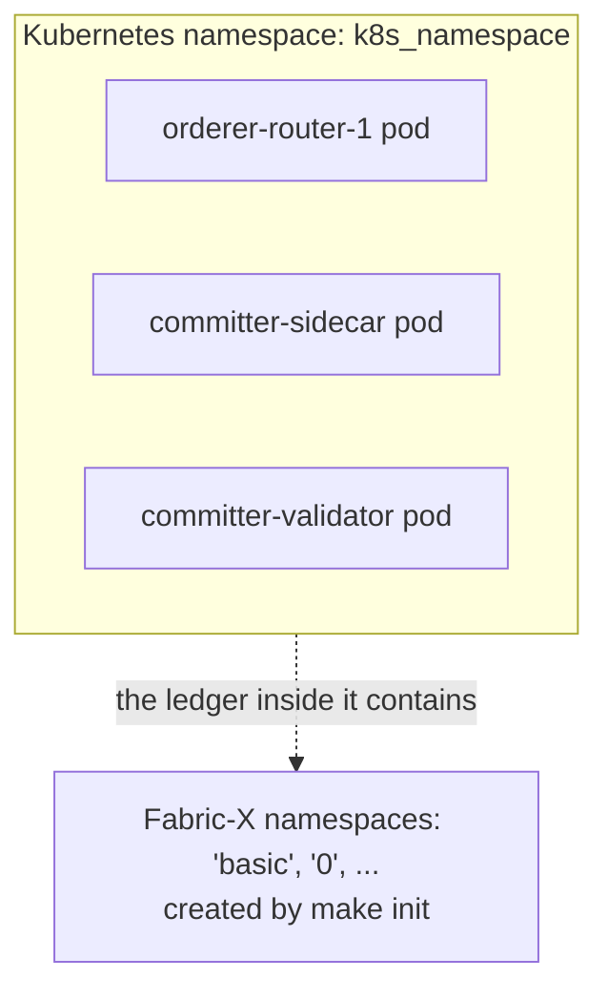

# 10. Go Beyond Local

Everything so far ran on one machine. This lesson leaves it. The remarkable part is how little changes: the topology, the group names, and the lifecycle verbs are all identical. What changes is the **environment file** — how Ansible reaches the targets and where files land on them.

> [!NOTE]
> Estimated time: 30 minutes reading. Actually running the Kubernetes inventory needs a cluster; the distributed one needs machines. Builds on [9. Add the Extras](./09-add-the-extras.md).

## Table of Contents <!-- omit in toc -->

- [What You Will Learn](#what-you-will-learn)
- [The Environment File Is the Only Difference](#the-environment-file-is-the-only-difference)
- [Switching Inventory Families](#switching-inventory-families)
- [Kubernetes](#kubernetes)
- [Two Kinds of Namespace](#two-kinds-of-namespace)
- [OpenShift](#openshift)
- [Distributed over SSH](#distributed-over-ssh)
- [Choosing a Family](#choosing-a-family)
- [Exercise](#exercise)
- [Next](#next)

## What You Will Learn

- Why the same topology deploys to a laptop, a cluster, or sixteen machines with no structural change.
- The four inventory families and what each environment file sets.
- The two completely different things the word "namespace" means in a Kubernetes Fabric-X deployment.
- What you must do before a distributed inventory will run at all.

## The Environment File Is the Only Difference

Put the four environment files side by side and the design is unmistakable.

| Family      | `ansible_connection` | `ansible_host`                             | `remote_deploy_dir`                  |
| ----------- | -------------------- | ------------------------------------------ | ------------------------------------ |
| Local       | `local`              | `LOCAL_ANSIBLE_HOST` or `localhost`        | `{{ out_dir }}/local-deployment`     |
| Kubernetes  | `local`              | `<host>.<k8s_namespace>.svc.cluster.local` | `{{ out_dir }}/k8s-deployment`       |
| OpenShift   | `local`              | `<host>.<k8s_namespace>.svc.cluster.local` | `{{ out_dir }}/openshift-deployment` |
| Distributed | `ssh`                | a real machine hostname                    | `/root/perf-deployment`              |

Notice that Kubernetes and OpenShift both use `ansible_connection: local`. Ansible is not connecting _into_ the cluster — it runs `kubectl` from your control node against the cluster API. The inventory hosts represent Kubernetes resources, and `ansible_host` is the in-cluster DNS name that other workloads use to reach the service.

There is a second address variable that carries the difference, and it is the one that trips people up:

| Variable       | Means                                                       |
| -------------- | ----------------------------------------------------------- |
| `ansible_host` | How **other services in the deployment** reach this service |
| `actual_host`  | How **you, from outside**, reach this service               |

Locally they are the same. On Kubernetes, `ansible_host` is a cluster-internal DNS name while `actual_host` is the node address a NodePort is exposed on. Over SSH they collapse back together, because the machine hostname is reachable from both sides.

## Switching Inventory Families

The mechanism is the same one you used in [lesson 8](./08-change-the-topology.md):

```shell
export ANSIBLE_INVENTORY=examples/inventory/k8s/fabric-x.yaml
make targets
```

Always `make targets` after switching, so the per-host `Makefile` targets describe the inventory you actually loaded. And tear down the previous deployment first — otherwise you leave orphaned containers behind that the new inventory knows nothing about.

> [!TIP]
> Put `ANSIBLE_INVENTORY` in a `.env` file at the repository root. The `Makefile` includes it automatically, which removes an entire class of "why did that command do nothing" confusion.

## Kubernetes

The [Kubernetes family](../../examples/inventory/docs/k8s/fabric-x.md) deploys the same logical Fabric-X services as Kubernetes workloads and services.

What you need:

- A reachable cluster and a working `kubectl` context
- The collection dependencies from `make install-deps`, which include `kubernetes.core`

The extra variables the environment file adds:

| Variable           | Default                      | Purpose                                            |
| ------------------ | ---------------------------- | -------------------------------------------------- |
| `k8s_namespace`    | `default`                    | The Kubernetes namespace everything is created in  |
| `k8s_storage_size` | `500Mi`                      | PersistentVolumeClaim size for stateful components |
| `actual_host`      | `K8S_NODE_IP` or `localhost` | Where NodePort services are reachable from outside |

For a remote cluster, tell the inventory where the nodes are:

```shell
export K8S_NODE_IP=<node-ip>
```

Without it, `actual_host` falls back to `localhost`, which is correct for a local cluster (kind, minikube, Docker Desktop) and wrong for anything else. The symptom is a deployment that comes up cleanly and is unreachable — `make ping` fails against NodePort services while the pods are `Running`.

The lifecycle is unchanged:

```shell
make setup
make start
make init
```

Each role's Kubernetes task path ensures the Kubernetes namespace exists before it creates anything, so you do not have to create it yourself. Selected services are exposed with NodePort so they are usable from outside the cluster — the Block Explorer among them.

> [!TIP]
> Debugging a Kubernetes deployment splits cleanly in two. Is the _workload_ healthy? That is `kubectl get pods -n <namespace>` and `kubectl logs`. Is the _configuration_ right? That is `out/k8s-deployment/<host>/config/` on your control node, rendered from the inventory exactly as in [lesson 7](./07-behind-the-scenes.md). The generated config is on your machine even though the process runs in the cluster.

## Two Kinds of Namespace

This deserves its own section, because the word is badly overloaded and the two meanings have nothing to do with each other.

| "Namespace"              | What it is                                                     | Set by                                  | Created by                                                                          |
| ------------------------ | -------------------------------------------------------------- | --------------------------------------- | ----------------------------------------------------------------------------------- |
| **Kubernetes namespace** | A Kubernetes API grouping for pods, services, and PVCs         | `k8s_namespace` in the environment file | each role's `k8s` task path, via the shared [`k8s`](../../roles/k8s/README.md) role |
| **Fabric-X namespace**   | The unit of ledger state isolation, with an endorsement policy | `organization.namespaces` on a host     | `fxconfig`, during `make init`                                                      |



One is infrastructure, the other is ledger semantics. A Kubernetes deployment has both, and the fact that `make init` "creates namespaces" refers only to the second kind. If `make init` fails, look at `fxconfig` and the committer endpoints — not at `kubectl`.

## OpenShift

The [OpenShift family](../../examples/inventory/docs/openshift/fabric-x.md) is Kubernetes with a different exposure model: HTTP and HTTP2-capable ports are published through **OpenShift Routes** instead of NodePort or LoadBalancer services.

```shell
make login-oc                    # log in with a personal token
export OPENSHIFT_APPS_DOMAIN=apps.example.com
```

The environment file will try to discover the ingress domain itself with `kubectl get ingresses.config/cluster`, falling back to `apps-crc.testing` for a local CodeReady Containers cluster, so the export is only needed when discovery does not apply.

There is one local-cluster wrinkle worth knowing before you hit it. If OpenShift routes resolve to `127.0.0.1`, binary CLIs on your machine work fine but _containerized_ clients fail, because `127.0.0.1` inside a container is the container itself. The collection ships a playbook that writes the route hostnames into `/etc/hosts` pointing at your control node's real address:

```shell
make oc-config-hosts             # needs sudo
```

Run it before starting Fabric-X. It is the same class of problem as the macOS `host.docker.internal` setup from [lesson 2](./02-prepare-your-control-node.md) — a container's idea of `localhost` is not yours.

## Distributed over SSH

The [distributed family](../../examples/inventory/docs/distributed/fabric-x.md) is where the collection earns its keep: a performance-oriented topology spread over sixteen machines.

It is deliberately larger than the local samples:

- No Fabric CA — crypto is generated centrally with `cryptogen` for repeatability
- 4 orderer groups with **2 batchers each**
- **7 validators** and **7 verifiers**, 1 coordinator, 1 sidecar, 1 query service
- **3 YugabyteDB masters** and **7 tablets**
- 2 load generators
- 16 node exporters and 16 cAdvisors

> [!WARNING]
> This inventory does not run as shipped. [`distributed/group_vars/all/env.yaml`](../../examples/inventory/distributed/group_vars/all/env.yaml) contains sixteen placeholder machine names, `host_machine_1` through `host_machine_16`, all pointing at `linuxNamd64.cloud.com`. Replace every one of them before doing anything else.

The checklist before your first run:

1. **Replace the placeholders.** Set `host_machine_1` … `host_machine_16` to real hostnames.
2. **Confirm SSH access.** The environment file uses `ansible_connection: ssh` with `ansible_user: root`. Key-based access must already work.
3. **Check `ansible_python_interpreter`.** It is pinned to `/usr/bin/python3`; adjust it if your machines differ.
4. **Point `remote_deploy_dir` at fast storage.** It defaults to `/root/perf-deployment`, and the comment in the file says to point it at your SSD mount. For a performance run this matters more than almost anything else in the inventory.
5. **Install the prerequisites remotely.** One command from your control node:

   ```shell
   make install-remote-node-deps
   ```

   This runs `install_prerequisites`, which installs the container engine, `tmux`, OpenSSL, Git, Go, `rsync`, and `chrony` — and it picks **one representative host per physical machine**, so packages are not installed once per logical service.

6. **Review every port.** Sixteen machines still means several logical services per machine, so the same uniqueness rules from [lesson 5](./05-read-the-inventory.md) apply.

> [!WARNING]
> `make install-remote-node-deps` needs `sudo`. Use a passwordless `sudo` user, or the playbook cannot complete.

There is a bonus target that is genuinely useful here and pointless locally:

```shell
make benchmark-volume            # verify the volumes meet the sequential-write threshold
make run-command COMMAND="df -h" # one command across every machine
```

`benchmark-volume` checks the deployment volumes against a 1 GB/s sequential write threshold. If you are chasing throughput and the committer is slower than expected, storage is a good first suspect, and this tells you before you spend a day on it.

## Choosing a Family

| Family          | Use it when                                                        |
| --------------- | ------------------------------------------------------------------ |
| **Local**       | Learning, development, functional testing, reproducing a bug       |
| **Kubernetes**  | Validating manifests, service exposure, storage, cluster behaviour |
| **OpenShift**   | The same, on an OpenShift cluster with Route-based exposure        |
| **Distributed** | Performance evaluation and high-throughput work on real hardware   |

The advice from [lesson 8](./08-change-the-topology.md) still holds, and it holds harder here: change one dimension at a time. Do not debug a new topology _and_ a new environment simultaneously. Get the topology working locally, then move it.

## Exercise

> [!TIP]
> This one is mostly reading — no cluster required.
>
> 1. Switch `ANSIBLE_INVENTORY` to `examples/inventory/k8s/fabric-x.yaml` and use `ansible-inventory` to compare it against the local inventory. Which hosts changed, and which did not?
> 2. For the host `committer-sidecar`, find both `ansible_host` and `actual_host` in the Kubernetes inventory and explain what each is for.
> 3. Then, without running anything: you have a remote Kubernetes cluster, you deploy successfully, every pod is `Running`, and `make ping` fails on every NodePort service. What is the single most likely cause?

<details markdown="1">
<summary>Solution</summary>

Part 1:

```shell
export ANSIBLE_INVENTORY=examples/inventory/k8s/fabric-x.yaml
.venv/bin/ansible-inventory --graph

# and compare against the local one
ANSIBLE_INVENTORY=examples/inventory/local/fabric-x.yaml \
  .venv/bin/ansible-inventory --graph
```

The answer is the point of the lesson: **the host list and the group tree are essentially the same.** The same five Fabric CA servers, the same four orderer groups, the same committer services, the same Block Explorer, the same monitoring components. What changed is not the topology but the environment: the connection model, the addresses, the deploy directory, and the added Kubernetes settings.

Part 2:

```shell
.venv/bin/ansible-inventory --host committer-sidecar
```

Remember from [lesson 5](./05-read-the-inventory.md#query-the-inventory-instead-of-reading-it) that this prints the definitions, not the values, so you will see the templates from the environment file:

```json
"ansible_host": "{{ inventory_hostname }}.{{ k8s_namespace | default('default') }}.svc.cluster.local",
"actual_host": "{{ lookup('env', 'K8S_NODE_IP') or 'localhost' }}",
```

- `ansible_host` becomes `committer-sidecar.default.svc.cluster.local` — the in-cluster DNS name. This is what the _other_ services put in their configuration to reach the sidecar: the coordinator, the Block Explorer, the EVM gateway.
- `actual_host` becomes `K8S_NODE_IP` if you exported it, otherwise `localhost` — the address **you** use from outside the cluster, through a NodePort.

Both are needed, because a service has two addresses in a Kubernetes deployment and the generated configuration has to use the right one in each place.

Part 3: **`K8S_NODE_IP` is not set.** `actual_host` fell back to `localhost`, so every externally-facing endpoint was rendered as `localhost:<nodePort>` and every external check is testing your own machine rather than the cluster node.

```shell
export K8S_NODE_IP=<node-ip>
make configs
make restart
```

Note that fixing the variable is not enough on its own — the wrong value is baked into the rendered configuration, so `configs` has to re-render before a restart will help. That is the same lesson as the exercise in [lesson 6](./06-target-hosts-and-lifecycle.md), and it is the single most common way to lose an hour with this collection.

</details>

## Next

| Previous                                    | Next                                                             |
| ------------------------------------------- | ---------------------------------------------------------------- |
| [9. Add the Extras](./09-add-the-extras.md) | [11. Write Your Own Inventory](./11-write-your-own-inventory.md) |
