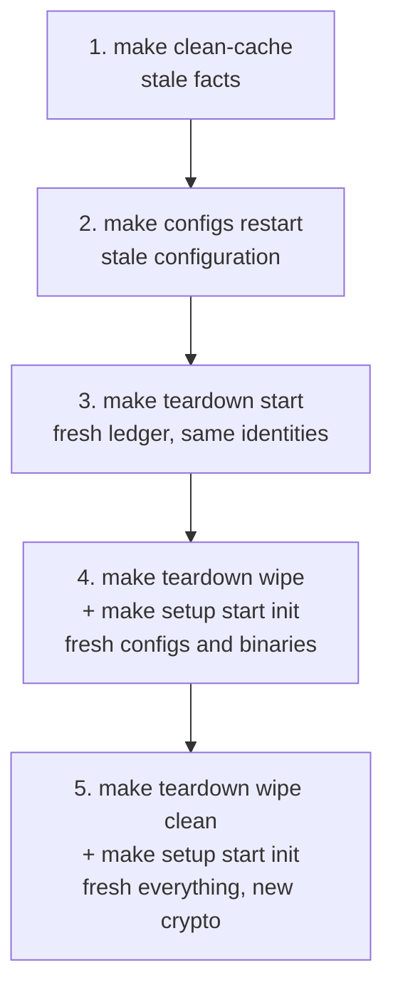

# 12. Troubleshooting

The reference lesson. Unlike the others this one is not meant to be read straight through — come back to it when something breaks. It is organised by symptom, and every entry tells you which layer from [lesson 7](./07-behind-the-scenes.md) to look at.

> [!NOTE]
> Estimated time: reference. Assumes the whole tutorial, but each section stands alone.

## Table of Contents <!-- omit in toc -->

- [What You Will Learn](#what-you-will-learn)
- [The First Four Commands](#the-first-four-commands)
- [Which Layer Is Broken?](#which-layer-is-broken)
- [Symptom: A Service Will Not Start](#symptom-a-service-will-not-start)
- [Symptom: An Inventory Change Had No Effect](#symptom-an-inventory-change-had-no-effect)
- [Symptom: Port Already in Use](#symptom-port-already-in-use)
- [Symptom: Connection Refused Between Services](#symptom-connection-refused-between-services)
- [Symptom: A Prometheus Target Is DOWN](#symptom-a-prometheus-target-is-down)
- [Symptom: `make init` Fails](#symptom-make-init-fails)
- [Symptom: Undefined Variable](#symptom-undefined-variable)
- [Symptom: It Worked Yesterday](#symptom-it-worked-yesterday)
  - [macOS: containers and `localhost`](#macos-containers-and-localhost)
- [Where Things Live](#where-things-live)
- [The Escalating Reset](#the-escalating-reset)
- [Exercise](#exercise)
- [Next](#next)

## What You Will Learn

- A fixed opening sequence that identifies most problems in under a minute.
- How to tell an inventory problem from a runtime problem.
- The specific failure modes that come from TLS, ports, and stale artifacts.
- How far to reset, and in what order.

## The First Four Commands

Whatever the symptom, start here. In order, cheapest first:

```shell
# 0. Point the bare ansible commands at the right inventory
echo $ANSIBLE_INVENTORY
export ANSIBLE_INVENTORY=examples/inventory/local/fabric-x.yaml   # or whichever you meant

# 1. Which inventory am I actually running?
.venv/bin/ansible-inventory --graph | head -5

# 2. Are the declared ports open?
make ping

# 3. What variables does the failing host see?
.venv/bin/ansible-inventory --host <hostname>

# 4. What did it say before it died?
docker logs --tail 100 <hostname>
```

Step 0 catches a surprising share of problems on its own. If you have been switching inventories — and from [lesson 8](./08-change-the-topology.md) onwards you have — the single most likely explanation for baffling behaviour is that `ANSIBLE_INVENTORY` is not what you think it is.

> [!WARNING]
> If `ANSIBLE_INVENTORY` is empty and you run `ansible-inventory` by hand, you get `[WARNING]: No inventory was parsed, only implicit localhost is available` and a nearly empty graph — **exit code 0**. It looks like a broken inventory and is really a missing environment variable. Every `ansible-inventory` and `ansible` command in this lesson assumes it is set.

Remember also that `ansible-inventory --host` prints variables as written, not evaluated. To see what a value actually becomes, ask the host: `.venv/bin/ansible <hostname> -m ansible.builtin.debug -a "var=<name>"`. See [lesson 5](./05-read-the-inventory.md#query-the-inventory-instead-of-reading-it).

## Which Layer Is Broken?

Map the symptom onto the four layers before you start reading files:

| Symptom                                                     | Layer                   | Look at                                              |
| ----------------------------------------------------------- | ----------------------- | ---------------------------------------------------- |
| Ansible task fails with a Jinja or undefined-variable error | inventory               | `ansible-inventory --host <host>`                    |
| Playbook runs green, nothing is running                     | inventory               | group names and `*_component_type`                   |
| Container exits immediately                                 | generated config        | `out/<family>-deployment/<host>/config/`             |
| Container runs, peers cannot reach it                       | ports or TLS            | the inventory's ports and `*_use_tls` / `*_use_mtls` |
| Only one component is unhappy                               | that component          | `docker logs <host>`                                 |
| Everything is unhappy                                       | crypto or genesis block | `make teardown wipe`, then `make setup`              |

The general principle: **a green Ansible run means the automation did what the inventory said, not that the deployment is correct.** Most failures in this collection are inventory statements, not bugs.

## Symptom: A Service Will Not Start

The container is created and exits, or `make ping` fails against it.

```shell
docker logs --tail 100 <hostname>
cat out/local-deployment/<hostname>/config/*.yaml
```

Work down this list:

| Check                                                 | How                                                      |
| ----------------------------------------------------- | -------------------------------------------------------- |
| Is `*_component_type` set on the host?                | `ansible-inventory --host <host> \| grep component_type` |
| Was a config actually rendered?                       | `ls out/local-deployment/<hostname>/config/`             |
| Does the config reference a host that does not exist? | look for a `postgres_db_host` or `sidecar_host` typo     |
| Is its database up?                                   | `make ping` on the database host                         |
| Did it start before its dependency?                   | check the order in `40-start.yaml`                       |

An empty or missing config directory means `make configs` never ran for that host — usually because the host was added after the last `setup`, or because it is not in a group any playbook targets.

## Symptom: An Inventory Change Had No Effect

This is the most common confusion with this collection, and it has exactly one cause: **the inventory is not what the services read.** They read rendered configuration files, and those are produced by `make configs`.

```shell
make configs
make restart
```

The full decision table is in [lesson 8](./08-change-the-topology.md#applying-an-inventory-change). The short version:

| Changed                                                                  | Needed                                          |
| ------------------------------------------------------------------------ | ----------------------------------------------- |
| A port, a tuning value                                                   | `make configs restart`                          |
| Added a stateless host                                                   | `make targets`, `make setup`, restart the group |
| Shards, orderer groups, organisations, security flags, database, runtime | `make teardown wipe`, `make setup start init`   |

And check the obvious first:

```shell
echo $ANSIBLE_INVENTORY
.venv/bin/ansible-inventory --host <host>    # is the new value actually there?
```

If the new value is not in `ansible-inventory --host` output, the change is in a file Ansible is not loading — wrong inventory, wrong group, or a `group_vars` directory that is not beside the inventory file.

## Symptom: Port Already in Use

The local samples run forty-odd services on one machine, so every port is declared explicitly and collisions are entirely possible once you start editing.

```shell
# what is holding it?
lsof -nP -iTCP:5110 -sTCP:LISTEN

# is any port number claimed twice anywhere in the inventory?
.venv/bin/ansible-inventory --list \
  | grep -oE '"[a-z_]*_port": [0-9]+' \
  | grep -oE '[0-9]+$' | sort -n | uniq -d
```

On the shipped local sample that prints nothing: all 71 declared ports are distinct. Any output is a collision worth investigating.

> [!NOTE]
> This check compares port _numbers_ regardless of which variable declared them, so it also catches the awkward case of a `postgres_port` colliding with a `committer_rpc_port`. On a distributed inventory it will produce false positives, since services on different machines can legitimately reuse a port — there, scope the check to one `ansible_host` at a time.

Two different causes with the same symptom:

- **A real collision in your inventory** — two hosts declaring the same port. Rule 4 from [lesson 11](./11-write-your-own-inventory.md). Follow the existing port scheme when adding hosts.
- **A leftover container from a previous deployment.** Switching inventories without tearing down leaves orphans that the new inventory knows nothing about, so `make teardown` cannot clean them up:

  ```shell
  docker ps -a --format '{{.Names}}\t{{.Status}}'
  ```

  Tear down the _old_ inventory, or remove the orphans by hand. This is why [lesson 10](./10-go-beyond-local.md) insists on tearing down before switching families.

## Symptom: Connection Refused Between Services

The service is running, `make ping` passes, and another component cannot talk to it. This is almost always TLS or mTLS.

The rule to hold on to, from [lesson 9](./09-add-the-extras.md): **the client declares who it connects to, and the server declares who it trusts.** Both halves are inventory lines, and omitting the server half produces a component that looks broken while being perfectly configured.

| The server variable                          | Grants                           | Needed by                    |
| -------------------------------------------- | -------------------------------- | ---------------------------- |
| `committer_mtls_clients`                     | RPC access to committer services | Block Explorer, EVM gateway  |
| `committer_monitoring_mtls_clients`          | Metrics port access              | Prometheus                   |
| `orderer_operations_mtls_clients`            | Operations/metrics port access   | Prometheus                   |
| `orderer_mtls_clients` / `orderer_mtls_orgs` | Router submission access         | load generators, EVM gateway |

Check both ends:

```shell
.venv/bin/ansible-inventory --host <server-host> | grep -i mtls
.venv/bin/ansible-inventory --host <client-host> | grep -i "tls\|host"
```

Also check that TLS is **consistently** on or off. A client with TLS enabled talking to a server with TLS disabled fails, and so does the reverse. Security flags are never local — see [lesson 8](./08-change-the-topology.md#dimension-4-the-security-posture).

## Symptom: A Prometheus Target Is DOWN

Go to **Status → Targets** at <https://localhost:9090> — note the `https`, since the sample enables `prometheus_use_tls`.

Three causes, in order of likelihood:

1. **The component is not running.** `make ping` fails for it too.
2. **The component does not trust `prometheus` as an mTLS client.** Missing `orderer_operations_mtls_clients: [prometheus]` or `committer_monitoring_mtls_clients: [prometheus]`. This is the one that produces a healthy service with a `DOWN` target.
3. **Prometheus has not been re-rendered.** Its scrape config is generated from the inventory, so a host added after the last `make configs` is not in it:

   ```shell
   make configs
   make monitoring restart
   ```

## Symptom: `make init` Fails

`make init` creates **Fabric-X namespaces** by submitting configuration transactions through live endpoints. It fails by design if the network is not ready.

| Check                              | Why                                                                                   |
| ---------------------------------- | ------------------------------------------------------------------------------------- |
| Is the network started?            | Namespace transactions need live endpoints. `make init` must follow `make start`      |
| Is the committer reachable?        | `make fabric_x_committers ping` — `fxconfig` needs the query service and sidecar      |
| Are the routers reachable?         | `make fabric_x_orderers ping` — the transaction is submitted through a router         |
| Does any host declare a namespace? | `organization.namespaces` on the load generator, EVM gateway, or your own client host |
| Is the `fxconfig` CLI built?       | `ls out/control-node/cli/` — `make binaries` produces it                              |

> [!WARNING]
> On a Kubernetes deployment, do not confuse this with a Kubernetes namespace problem. `make init` has nothing to do with `kubectl`. See [lesson 10](./10-go-beyond-local.md#two-kinds-of-namespace).

`make init` is idempotent, so re-running it after fixing the cause is safe. It compares each declared policy against a fingerprint from the previous run and skips what has not changed.

## Symptom: Undefined Variable

Two flavours, with different causes.

**`out_dir` is undefined** — the `group_vars/all/vars.yaml` file is missing from your inventory bundle. Every sample family has it as a symlink to [`examples/inventory/vars.yaml`](../../examples/inventory/vars.yaml), and nothing else loads it. See [lesson 11](./11-write-your-own-inventory.md#the-bundle-layout).

**A `*_port` or `*_component_type` is undefined** — a host is missing a required variable, or is in the wrong group and not inheriting what you expected:

```shell
.venv/bin/ansible-inventory --host <host>
```

The authoritative list of what a role requires is its `meta/argument_specs.yaml`, or the [generated role documentation](../../roles/README.md), which says the same thing. Required variables are marked as such there.

## Symptom: It Worked Yesterday

Stale state, in one of four places. Clear them in this order, least destructive first:

```shell
make clean-cache      # 1. Ansible fact cache — facts persist for 24h by default
make configs restart  # 2. stale rendered configuration
make teardown start   # 3. stale runtime data — fresh ledger, same identities
make teardown wipe    # 4. stale configs and binaries on the hosts
```

The fact cache is the sneaky one. [`examples/ansible.cfg`](../../examples/ansible.cfg) sets `fact_caching = jsonfile` with a 24-hour timeout, so facts gathered yesterday are reused today. That is a real speed win across the successive playbooks `make setup` runs, and it is occasionally exactly why a change is not taking effect.

### macOS: containers and `localhost`

If services start but nothing can reach anything, and you are on macOS, check the setup from [lesson 2](./02-prepare-your-control-node.md):

```shell
echo $LOCAL_ANSIBLE_HOST          # should be host.docker.internal
grep host.docker.internal /etc/hosts
```

Docker and Podman run containers in a VM, so `localhost` inside a container is not `localhost` on your Mac. If you set `LOCAL_ANSIBLE_HOST` _after_ running `make configs`, the old address is baked into every rendered config — set it, then `make configs restart`.

The equivalent trap on a local OpenShift cluster is routes resolving to `127.0.0.1`; `make oc-config-hosts` is the fix. See [lesson 10](./10-go-beyond-local.md#openshift).

## Where Things Live

| What                                        | Where                                        |
| ------------------------------------------- | -------------------------------------------- |
| Rendered config for one host                | `out/<family>-deployment/<hostname>/config/` |
| Runtime data for one host                   | `out/<family>-deployment/<hostname>/data/`   |
| Control-node CLIs (`fxconfig`, `cryptogen`) | `out/control-node/cli/`                      |
| Genesis block and crypto artifacts          | `out/control-node/config/`                   |
| Collected logs and crypto                   | `out/control-node/fetched/`                  |
| Ansible fact cache                          | `out/ansible_fact_cache/`                    |
| Generated per-host `Makefile` targets       | `target_hosts.mk`                            |

Collect logs and crypto from the hosts:

```shell
make fetch-logs                        # everything
make fabric_x_committers fetch-logs    # one group
make fetch-crypto
```

Both accept targeting, and both write under `out/control-node/fetched/`.

> [!TIP]
> `out/` is gitignored and relocatable with `OUT_DIR`. On a distributed deployment, `remote_deploy_dir` points at directories on the remote machines instead, so `make fetch-logs` is how you get their logs onto your control node.

## The Escalating Reset

When you have lost the thread, escalate in this order. Each step is more destructive and slower than the last, so do not skip to the end.



Step 5 deletes `out/` entirely, including your crypto material and genesis block, and the network comes back with brand-new identities. It always works, and it always costs you the most time — which is the argument for working through the earlier steps rather than reaching for it first.

> [!WARNING]
> On a local deployment, `out/` holds the services' data as well as your artifacts. `make clean` is the "start completely over" button, not a tidy-up.

## Exercise

> [!TIP]
> Break something on purpose, then diagnose it using only this lesson.
>
> 1. In a copy of the default local inventory, change `committer-verifier`'s `committer_rpc_port` from `5110` to `5100` — the validator's port.
> 2. Apply the change and observe what happens. Which command tells you fastest?
> 3. Fix it, and confirm the fix.
> 4. Then a harder one, no commands needed: a colleague says "the Block Explorer is broken, it shows no blocks, but the container is running and its logs show a connection error against the sidecar." Give the two most likely causes and the one command that distinguishes them.

<details markdown="1">
<summary>Solution</summary>

Steps 1 to 3:

```shell
cp examples/inventory/local/fabric-x.yaml examples/inventory/local/broken.yaml
export ANSIBLE_INVENTORY=examples/inventory/local/broken.yaml
# edit committer-verifier: committer_rpc_port: 5100
make configs
make fabric_x_committers restart
```

The fastest diagnosis is the duplicate-port scan, because it finds the cause rather than the symptom:

```shell
.venv/bin/ansible-inventory --list \
  | grep -oE '"[a-z_]*_port": [0-9]+' \
  | grep -oE '[0-9]+$' | sort -n | uniq -d
```

That prints `5100`. `make ping` also fails, and `docker logs committer-verifier` shows a bind error — but both tell you _that_ something is wrong on 5100, not that two hosts claim it. Fix by restoring `5110`, then:

```shell
make configs
make fabric_x_committers restart
make fabric_x_committers ping
```

Step 4 — the two likely causes:

1. **`committer_mtls_clients` does not include `block-explorer`.** The sidecar is refusing the gRPC connection because it does not trust the Explorer as an mTLS client. The Explorer is correctly configured; the _committer_ is missing a line.
2. **`sidecar_host` is wrong or the sidecar is not running.** A typo, or a sidecar that never came up.

The command that distinguishes them:

```shell
make fabric_x_committers ping
```

If the sidecar's port is closed, it is cause 2 — the sidecar is down, and the Explorer's connection error is a symptom rather than the problem. If the sidecar answers, it is cause 1: the sidecar is healthy and actively rejecting the Explorer, which you confirm with

```shell
.venv/bin/ansible-inventory --host committer-sidecar | grep -i mtls
```

This is the single most useful diagnostic habit with this collection: before reading a component's logs, check whether the thing it is complaining about is reachable at all. It separates "my inventory is wrong" from "my inventory is right and something is down", and those two need completely different fixes.

</details>

## Next

You have reached the end of the tutorial. From here:

- The [Inventory Guide](../../examples/inventory/README.md) is the full reference for inventory authoring.
- The [playbooks documentation](../../playbooks/README.md) documents every collection playbook and the group it targets.
- The [roles documentation](../../roles/README.md) documents every variable of every role, generated from each role's `argument_specs.yaml`.
- The [example inventories](../../examples/README.md) are working references for topologies this tutorial only mentioned.

| Previous                                                         | Next                            |
| ---------------------------------------------------------------- | ------------------------------- |
| [11. Write Your Own Inventory](./11-write-your-own-inventory.md) | [Tutorial Overview](./index.md) |
