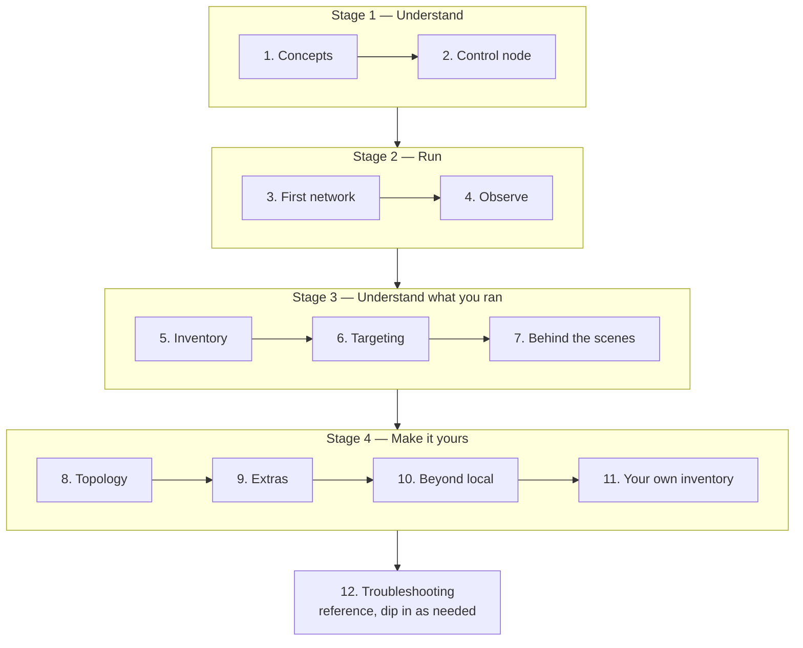

# Fabric-X Ansible Tutorial

Welcome. This tutorial teaches you how to run and reshape a Hyperledger Fabric-X network with the `hyperledger.fabricx` Ansible collection, one step at a time.

The rest of the documentation in this repository is **reference material**: it tells you what every role, playbook, and inventory variable does. This tutorial is different. It is a **learning path**. It starts with no assumptions about Fabric-X, gets a real network running on your laptop, and ends with you writing your own inventory from scratch.

## Table of Contents <!-- omit in toc -->

- [Who This Is For](#who-this-is-for)
- [What You Will Build](#what-you-will-build)
- [Before You Start](#before-you-start)
- [The Learning Path](#the-learning-path)
- [How Each Lesson Works](#how-each-lesson-works)
- [Start the Tutorial](#start-the-tutorial)
- [Next](#next)

## Who This Is For

You are the right reader if:

- You are **new to Fabric-X**. Every Fabric-X concept is explained before it is used. Prior Hyperledger Fabric experience helps but is not required.
- You are **comfortable with basic Ansible**. You should be able to read an inventory file, recognise a group and a group variable, and understand what `ansible-playbook` does. You do not need to know how to write roles.
- You want to **actually run something**, not just read about it.

> [!NOTE]
> If you already know Fabric-X and only want the variable reference, skip this tutorial and go to the [Inventory Guide](../../examples/inventory/README.md), the [playbooks documentation](../../playbooks/README.md), and the [roles documentation](../../roles/README.md).

## What You Will Build

By the end of the tutorial you will have:

- A complete Fabric-X network running on a single machine: Fabric CA services issuing identities, four orderer groups producing blocks, a PostgreSQL-backed committer validating and storing state, a load generator pushing transactions, and a full monitoring stack.
- Grafana dashboards showing your own network's throughput, and a Block Explorer browsing your own blocks.
- An Ethereum JSON-RPC endpoint, backed by Fabric-X, that Hardhat and Foundry can talk to.
- A hand-written inventory of your own design that the collection can deploy.

## Before You Start

You need one machine (your **control node**) with:

- `python` >= 3.11
- A container engine: Docker or Podman
- `git` and `make`
- Roughly 8 GB of free RAM and 20 GB of free disk for the default local network

[Lesson 2](./02-prepare-your-control-node.md) walks through the installation in detail, so do not install anything yet.

> [!TIP]
> Everything up to and including [lesson 9](./09-add-the-extras.md) runs entirely on your own machine. No cluster, no cloud account, no remote servers.

## The Learning Path

Lessons build on each other. Work through them in order the first time.

| Lesson | Title                                                                | Time      | What you take away                                                       |
| ------ | -------------------------------------------------------------------- | --------- | ------------------------------------------------------------------------ |
| 1      | [Fabric-X in 10 Minutes](./01-fabric-x-in-10-minutes.md)             | 10 min    | The vocabulary: what the orderer and committer are split into, and why   |
| 2      | [Prepare Your Control Node](./02-prepare-your-control-node.md)       | 15 min    | A working control node and an understanding of `make help`               |
| 3      | [Run Your First Network](./03-run-your-first-network.md)             | 30 min    | A live Fabric-X network, and what `setup`, `start`, and `init` each do   |
| 4      | [Observe the Network](./04-observe-the-network.md)                   | 20 min    | Grafana, Prometheus, Loki, Block Explorer, and how to change the load    |
| 5      | [Read the Inventory](./05-read-the-inventory.md)                     | 25 min    | How to read any inventory in this repository and know what it deploys    |
| 6      | [Target Hosts and the Lifecycle](./06-target-hosts-and-lifecycle.md) | 20 min    | Operating one group, or one host, instead of the whole network           |
| 7      | [Behind the Scenes](./07-behind-the-scenes.md)                       | 25 min    | What `make` actually runs, and how roles and playbooks fit together      |
| 8      | [Change the Topology](./08-change-the-topology.md)                   | 40 min    | Scaling components, swapping the database, changing the security posture |
| 9      | [Add the Extras](./09-add-the-extras.md)                             | 30 min    | The EVM gateway, the Block Explorer, and the monitoring stack            |
| 10     | [Go Beyond Local](./10-go-beyond-local.md)                           | 30 min    | Kubernetes, OpenShift, and multi-machine deployments                     |
| 11     | [Write Your Own Inventory](./11-write-your-own-inventory.md)         | 60 min    | A network topology you designed yourself                                 |
| 12     | [Troubleshooting](./12-troubleshooting.md)                           | reference | How to read failures and recover from them                               |

The twelve lessons fall into four stages:

## How Each Lesson Works

Every lesson has the same shape:

- **What You Will Learn** — the objectives, up front, so you can tell whether you need the lesson.
- **The content** — short sections, with the exact commands to run.
- **Exercise** — a small hands-on task. The solution is hidden behind a collapsible block, so try it first.
- **Next** — links back to the previous lesson and forward to the next one.

Do the exercises. They are short on purpose, and they are where the material sticks.

## Start the Tutorial

Ready? Begin with the concepts — no installation required yet.

## Next

| Previous | Next                                                        |
| -------- | ----------------------------------------------------------- |
| —        | [1. Fabric-X in 10 Minutes](./01-fabric-x-in-10-minutes.md) |
