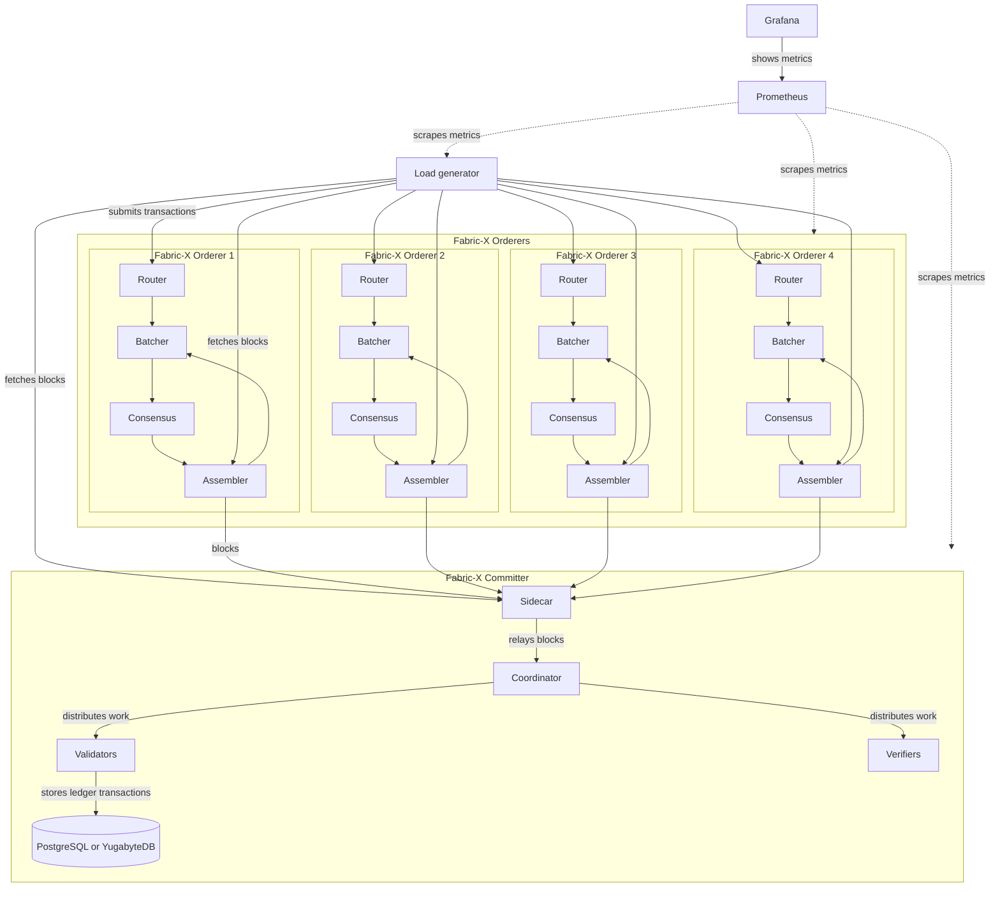

# Hyperledger Fabric-X Deployment Samples

This directory contains sample inventories and wrapper playbooks for running Hyperledger Fabric-X networks with the `hyperledger.fabricx` collection.

> [!NOTE]
> The samples are intentionally small enough to inspect and adapt. They are not a production blueprint. Use them to learn the inventory contract, validate changes locally, and create your own topology.

## Table of Contents <!-- omit in toc -->

- [Common Network Shape](#common-network-shape)
  - [Orderer Components](#orderer-components)
  - [Committer Components](#committer-components)
  - [Namespaces](#namespaces)
- [Inventory Families](#inventory-families)
  - [Local Inventories](#local-inventories)
  - [Kubernetes Inventories](#kubernetes-inventories)
  - [Distributed Inventories](#distributed-inventories)
- [Selecting an Inventory](#selecting-an-inventory)
- [Playbooks](#playbooks)

## Common Network Shape

If you are new to Fabric-X, read an inventory as a map of services:

| Service family | What to look for in inventory                                       |
| -------------- | ------------------------------------------------------------------- |
| Fabric CA      | Certificate authorities and CA databases used to enroll identities. |
| Orderer        | Router, batcher, consenter, and assembler services.                 |
| Committer      | Validator, verifier, coordinator, sidecar, query service, and a DB. |
| Load generator | A client process that submits test traffic.                         |
| Monitoring     | Exporters, Prometheus, and Grafana.                                 |

Fabric-X keeps the Fabric governance and identity model, but decomposes the ordering and peer-side work into independently scalable services. Fabric-X currently supports a single channel, and state is partitioned across namespaces within that channel.

Inventories define both topology and behavior. A variable such as `orderer_use_k8s: true` changes the runtime mode, while `orderer_use_mtls: true` changes the security posture. Most samples use the same logical Fabric-X shape:


```mermaid
flowchart TB
  LG[Load generator]

  subgraph ORDS[Fabric-X Orderers]
    direction LR
    subgraph O1[Fabric-X Orderer 1]
      direction TB
      R1[Router]
      B1[Batcher]
      C1[Consensus]
      A1[Assembler]
      R1 --> B1
      B1 --> C1
      C1 --> A1
      A1 --> B1
    end
    subgraph O2[Fabric-X Orderer 2]
      direction TB
      R2[Router]
      B2[Batcher]
      C2[Consensus]
      A2[Assembler]
      R2 --> B2
      B2 --> C2
      C2 --> A2
      A2 --> B2
    end
    subgraph O3[Fabric-X Orderer 3]
      direction TB
      R3[Router]
      B3[Batcher]
      C3[Consensus]
      A3[Assembler]
      R3 --> B3
      B3 --> C3
      C3 --> A3
      A3 --> B3
    end
    subgraph O4[Fabric-X Orderer 4]
      direction TB
      R4[Router]
      B4[Batcher]
      C4[Consensus]
      A4[Assembler]
      R4 --> B4
      B4 --> C4
      C4 --> A4
      A4 --> B4
    end
  end

  subgraph COM[Fabric-X Committer]
    SC[Sidecar]
    CO[Coordinator]
    VAL[Validators]
    VER[Verifiers]
    DB[(PostgreSQL or YugabyteDB)]
    SC -->|relays blocks| CO
    CO -->|distributes work| VAL
    CO -->|distributes work| VER
    VAL -->|stores ledger transactions| DB
  end

  PROM[Prometheus]
  GRAF[Grafana]

  LG -->|submits transactions| R1
  LG --> R2
  LG --> R3
  LG --> R4
  LG -->|fetches blocks| A1
  LG --> A2
  LG --> A3
  LG --> A4
  LG -->|fetches blocks| SC
  A1 -->|blocks| SC
  A2 --> SC
  A3 --> SC
  A4 --> SC
  PROM -.->|scrapes metrics| LG
  PROM -.->|scrapes metrics| ORDS
  PROM -.->|scrapes metrics| COM
  GRAF -->|shows metrics| PROM
```

Inventories differ mostly in runtime mode, security settings, crypto source, and database backend.

### Orderer Components

The Fabric-X orderer is based on Arma, a BFT ordering service that separates transaction dissemination from consensus. Consensus orders compact metadata for transaction batches rather than full transaction payloads.

| Component | Inventory value                     | Role in the pipeline                                                                                                                                                  |
| --------- | ----------------------------------- | --------------------------------------------------------------------------------------------------------------------------------------------------------------------- |
| Router    | `orderer_component_type: router`    | Accepts transaction submissions and dispatches business traffic to batchers. Routers are the client-facing orderer entry point.                                       |
| Batcher   | `orderer_component_type: batcher`   | Groups transactions into batches inside a shard and sends batch attestations to consenters. Adding batcher shards is the main orderer scaling lever in these samples. |
| Consenter | `orderer_component_type: consensus` | Runs the BFT consensus protocol and orders batch attestations.                                                                                                        |
| Assembler | `orderer_component_type: assembler` | Pulls ordered attestations and batches, then assembles ordered blocks for the committer.                                                                              |

Clients submit through routers. Committer sidecars consume blocks from assemblers.

### Committer Components

The Fabric-X committer handles post-ordering validation, commit, query, and notification work.

| Component           | Inventory value                           | Role in the pipeline                                                                                                                                                                                                                  | Deployment notes                                                                                                                              |
| ------------------- | ----------------------------------------- | ------------------------------------------------------------------------------------------------------------------------------------------------------------------------------------------------------------------------------------- | --------------------------------------------------------------------------------------------------------------------------------------------- |
| Sidecar             | `committer_component_type: sidecar`       | Receives ordered blocks from the orderer, persists block flow locally, relays work to the coordinator, delivers committed blocks to client applications, and exposes a notification service for per-transaction status subscriptions. | Stateful; single instance per committer in the samples.                                                                                       |
| Coordinator         | `committer_component_type: coordinator`   | Orchestrates validation and commit by splitting work across verifier and validator-committer services.                                                                                                                                | Stateless; keep one instance in the sample topologies unless intentionally changing the coordination model.                                   |
| Verifier            | `committer_component_type: verifier`      | Verifies transaction signatures against namespace endorsement policies.                                                                                                                                                               | Stateless and horizontally scalable.                                                                                                          |
| Validator-committer | `committer_component_type: validator`     | Performs MVCC validation and commits valid writes to the state database.                                                                                                                                                              | Stateless and horizontally scalable; validators must reference the selected committer database backend.                                       |
| Query service       | `committer_component_type: query-service` | Serves read-only state queries from the committed database state.                                                                                                                                                                     | Stateless.                                                                                                                                    |
| Database            | PostgreSQL or YugabyteDB hosts            | Stores world state, transaction status, and namespace policy data.                                                                                                                                                                    | Stateful; PostgreSQL is compact for local samples, while YugabyteDB is the horizontally scalable DB to choose for high performance use-cases. |

Validators and verifiers can be scaled by adding hosts with the matching `committer_component_type` and unique ports. Validators also need to reference the same database backend used by the rest of the committer deployment.

### Namespaces

A namespace is the unit of state isolation in Fabric-X, similar to a chaincode in Hyperledger Fabric. Each namespace carries an endorsement policy that specifies which organizations must endorse a transaction before it can be committed to that namespace's state.

Because Fabric-X uses a single channel, all namespaces share the same ordered block stream and the same committer pipeline. Isolation is enforced at the endorsement-policy and state-key level, not at the channel level.

Namespaces are created after the network is started, using the `fxconfig` role through the [init process](../playbooks/fxconfig/README.md#create_namespacesyaml). The `fxconfig` playbooks submit namespace-creation transactions to the running network. No namespace needs to exist for the network itself to start.

## Inventory Families

The inventories live under [`inventory/`](./inventory/) and are grouped by deployment environment. Choose the smallest inventory that exercises the behavior you care about.

### Local Inventories

Local inventories use `ansible_connection: local` to run a complete network on the controller machine as containers or binaries. They are useful for development, functional testing, and documentation examples.

Generated configuration defaults to `LOCAL_ANSIBLE_HOST` or `localhost`. When running containers on macOS, set:

```shell
export LOCAL_ANSIBLE_HOST=host.docker.internal
```

| Inventory                                                                       | Runtime    | TLS | mTLS | Best for                                                                    |
| ------------------------------------------------------------------------------- | ---------- | --- | ---- | --------------------------------------------------------------------------- |
| [`local/fabric-x.yaml`](./inventory/docs/local/fabric-x.md)                     | Containers | Yes | Yes  | Full local Fabric-X network.                                                |
| [`local/fabric-x-yugabyte.yaml`](./inventory/docs/local/fabric-x-yugabyte.md)   | Containers | Yes | Yes  | Full local Fabric-X network with YugabyteDB as committer persistence layer. |
| [`local/fabric-x-bin.yaml`](./inventory/docs/local/fabric-x-bin.md)             | Binaries   | Yes | Yes  | Full local Fabric-X network deployed using binaries.                        |
| [`local/fabric-x-cryptogen.yaml`](./inventory/docs/local/fabric-x-cryptogen.md) | Containers | Yes | Yes  | Local Fabric-X deployment without Fabric CA services for quick debug.       |
| [`local/fabric-x-no-mtls.yaml`](./inventory/docs/local/fabric-x-no-mtls.md)     | Containers | Yes | No   | Full local Fabric-X network without mTLS for debug only.                    |
| [`local/fabric-x-no-tls.yaml`](./inventory/docs/local/fabric-x-no-tls.md)       | Containers | No  | No   | Full local Fabric-X network without TLS and mTLS for debug only.            |

### Kubernetes Inventories

Kubernetes inventories use Ansible host entries to describe Kubernetes workloads and services rather than SSH machines. They require a reachable cluster, `kubectl`, and collection dependencies.

The samples expose externally useful services with NodePort settings. For remote clusters, set:

```shell
export K8S_NODE_IP=<node-ip>
```

| Inventory                                                                   | Runtime    | TLS | mTLS | Best for                                                                       |
| --------------------------------------------------------------------------- | ---------- | --- | ---- | ------------------------------------------------------------------------------ |
| [`k8s/fabric-x.yaml`](./inventory/docs/k8s/fabric-x.md)                     | Kubernetes | Yes | Yes  | Full Fabric-X network deploy on `k8s`.                                         |
| [`k8s/fabric-x-yugabyte.yaml`](./inventory/docs/k8s/fabric-x-yugabyte.md)   | Kubernetes | Yes | Yes  | Full Fabric-X network on `k8s` with YugabyteDB as committer persistence layer. |
| [`k8s/fabric-x-cryptogen.yaml`](./inventory/docs/k8s/fabric-x-cryptogen.md) | Kubernetes | Yes | Yes  | Fabric-X deployment on `k8s` without Fabric CA services for quick debug.       |
| [`k8s/fabric-x-no-mtls.yaml`](./inventory/docs/k8s/fabric-x-no-mtls.md)     | Kubernetes | Yes | No   | Full Fabric-X network on `k8s` without mTLS for debug only.                    |
| [`k8s/fabric-x-no-tls.yaml`](./inventory/docs/k8s/fabric-x-no-tls.md)       | Kubernetes | No  | No   | Full Fabric-X network on `k8s` without TLS and mTLS for debug only.            |

### Distributed Inventories

Distributed inventories use SSH-managed machines for performance-oriented topologies with containers, `cryptogen`, mTLS, and YugabyteDB. They require SSH access, remote Python, a container engine, and real hostnames.

> [!WARNING]
> The distributed sample uses `host_machine_*` placeholders. Replace all of them before running it.

| Inventory                                                               | Runtime    | TLS | mTLS | Best for                                                     |
| ----------------------------------------------------------------------- | ---------- | --- | ---- | ------------------------------------------------------------ |
| [`distributed/fabric-x.yaml`](./inventory/docs/distributed/fabric-x.md) | Containers | Yes | Yes  | Full distributed Fabric-X deploy for performance evaluation. |

## Selecting an Inventory

The default examples configuration points to `inventory/local/fabric-x.yaml`:

```ini
inventory = ./inventory/local/fabric-x.yaml
```

You can change the inventory in [`ansible.cfg`](./ansible.cfg), or override it at runtime:

```shell
export ANSIBLE_INVENTORY=examples/inventory/k8s/fabric-x.yaml
```

## Playbooks

The example playbooks in [`playbooks/`](./playbooks/) are wrappers around the [collection playbooks](../playbooks/README.md). They work with the group names used by the sample inventories.

Run the usual lifecycle through the repository `Makefile`:

```shell
make setup
make start
make init
make teardown
```

For the complete playbook workflow and group contract, see the [playbooks documentation](../playbooks/README.md).
