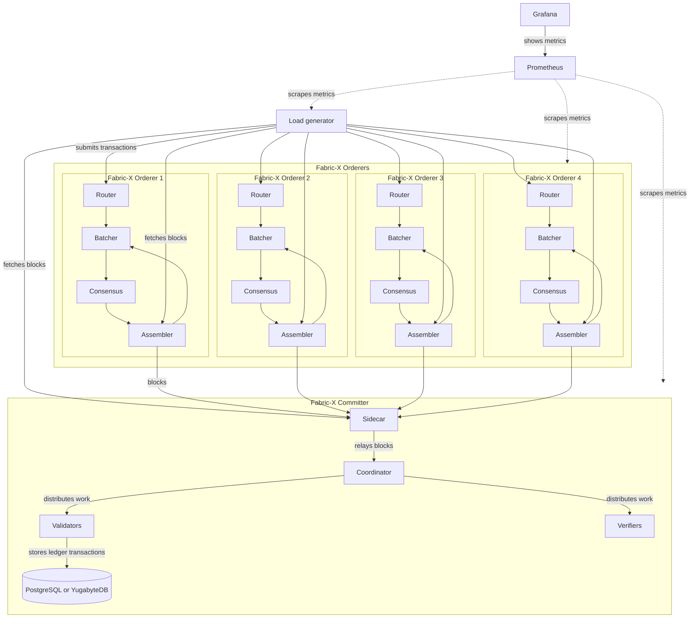

# Hyperledger Fabric-X Deployment Samples

This directory contains sample inventories and wrapper playbooks for running Hyperledger Fabric-X networks with the `hyperledger.fabricx` collection.

The samples are intentionally small enough to inspect and adapt. They are not a production blueprint. Use them to learn the inventory contract, validate changes locally, and create your own topology.

## Table of Contents <!-- omit in toc -->

- [Common Network Shape](#common-network-shape)
- [Inventory Families](#inventory-families)
  - [Local Inventories](#local-inventories)
  - [Kubernetes Inventories](#kubernetes-inventories)
  - [Distributed Inventories](#distributed-inventories)
- [Selecting an Inventory](#selecting-an-inventory)
- [Playbooks](#playbooks)
- [Scaling a Component](#scaling-a-component)
- [Moving a Service to Another Machine](#moving-a-service-to-another-machine)

## Common Network Shape

If you are new to Fabric-X, read an inventory as a map of services:

| Service family | What to look for in inventory                                       |
| -------------- | ------------------------------------------------------------------- |
| Fabric CA      | Certificate authorities and CA databases used to enroll identities. |
| Orderer        | Router, batcher, consenter, and assembler services.                 |
| Committer      | Validator, verifier, coordinator, sidecar, query service, and a DB. |
| Load generator | A client process that submits test traffic.                         |
| Monitoring     | Exporters, Prometheus, and Grafana.                                 |

Inventories define both topology and behavior. A variable such as `orderer_use_k8s: true` changes the runtime mode, while `orderer_use_mtls: true` changes the security posture. Most samples use the same logical Fabric-X shape:


```mermaid
flowchart TB
  LG[Load generator]

  subgraph ORDS[Fabric-X Orderers]
    direction LR
    subgraph O1[Fabric-X Orderer 1]
      direction TB
      R1[Router]
      B1[Batcher]
      C1[Consensus]
      A1[Assembler]
      R1 --> B1
      B1 --> C1
      C1 --> A1
      A1 --> B1
    end
    subgraph O2[Fabric-X Orderer 2]
      direction TB
      R2[Router]
      B2[Batcher]
      C2[Consensus]
      A2[Assembler]
      R2 --> B2
      B2 --> C2
      C2 --> A2
      A2 --> B2
    end
    subgraph O3[Fabric-X Orderer 3]
      direction TB
      R3[Router]
      B3[Batcher]
      C3[Consensus]
      A3[Assembler]
      R3 --> B3
      B3 --> C3
      C3 --> A3
      A3 --> B3
    end
    subgraph O4[Fabric-X Orderer 4]
      direction TB
      R4[Router]
      B4[Batcher]
      C4[Consensus]
      A4[Assembler]
      R4 --> B4
      B4 --> C4
      C4 --> A4
      A4 --> B4
    end
  end

  subgraph COM[Fabric-X Committer]
    SC[Sidecar]
    CO[Coordinator]
    VAL[Validators]
    VER[Verifiers]
    DB[(PostgreSQL or YugabyteDB)]
    SC -->|relays blocks| CO
    CO -->|distributes work| VAL
    CO -->|distributes work| VER
    VAL -->|stores ledger transactions| DB
  end

  PROM[Prometheus]
  GRAF[Grafana]

  LG -->|submits transactions| R1
  LG --> R2
  LG --> R3
  LG --> R4
  LG -->|fetches blocks| A1
  LG --> A2
  LG --> A3
  LG --> A4
  LG -->|fetches blocks| SC
  A1 -->|blocks| SC
  A2 --> SC
  A3 --> SC
  A4 --> SC
  PROM -.->|scrapes metrics| LG
  PROM -.->|scrapes metrics| ORDS
  PROM -.->|scrapes metrics| COM
  GRAF -->|shows metrics| PROM
```

Inventories differ mostly in runtime mode, security settings, crypto source, and database backend.

## Inventory Families

The inventories live under [`inventory/`](./inventory/) and are grouped by deployment environment. Choose the smallest inventory that exercises the behavior you care about.

### Local Inventories

Local inventories use `ansible_connection: local` to run a complete network on the controller machine as containers or binaries. They are useful for development, functional testing, and documentation examples.

Generated configuration defaults to `LOCAL_ANSIBLE_HOST` or `localhost`. When running containers on macOS, set:

```shell
export LOCAL_ANSIBLE_HOST=host.docker.internal
```

| Inventory                                                                       | Runtime    | TLS | mTLS | Best for                                                                    |
| ------------------------------------------------------------------------------- | ---------- | --- | ---- | --------------------------------------------------------------------------- |
| [`local/fabric-x.yaml`](./inventory/docs/local/fabric-x.md)                     | Containers | Yes | Yes  | Full local Fabric-X network.                                                |
| [`local/fabric-x-yugabyte.yaml`](./inventory/docs/local/fabric-x-yugabyte.md)   | Containers | Yes | Yes  | Full local Fabric-X network with YugabyteDB as committer persistence layer. |
| [`local/fabric-x-bin.yaml`](./inventory/docs/local/fabric-x-bin.md)             | Binaries   | Yes | Yes  | Full local Fabric-X network deployed using binaries.                        |
| [`local/fabric-x-cryptogen.yaml`](./inventory/docs/local/fabric-x-cryptogen.md) | Containers | Yes | Yes  | Local Fabric-X deployment without Fabric CA services for quick debug.       |
| [`local/fabric-x-no-mtls.yaml`](./inventory/docs/local/fabric-x-no-mtls.md)     | Containers | Yes | No   | Full local Fabric-X network without mTLS for debug only.                    |
| [`local/fabric-x-no-tls.yaml`](./inventory/docs/local/fabric-x-no-tls.md)       | Containers | No  | No   | Full local Fabric-X network without TLS and mTLS for debug only.            |

### Kubernetes Inventories

Kubernetes inventories use Ansible host entries to describe Kubernetes workloads and services rather than SSH machines. They require a reachable cluster, `kubectl`, and collection dependencies.

The samples expose externally useful services with NodePort settings. For remote clusters, set:

```shell
export K8S_NODE_IP=<node-ip>
```

| Inventory                                                                   | Runtime    | TLS | mTLS | Best for                                                                       |
| --------------------------------------------------------------------------- | ---------- | --- | ---- | ------------------------------------------------------------------------------ |
| [`k8s/fabric-x.yaml`](./inventory/docs/k8s/fabric-x.md)                     | Kubernetes | Yes | Yes  | Full Fabric-X network deploy on `k8s`.                                         |
| [`k8s/fabric-x-yugabyte.yaml`](./inventory/docs/k8s/fabric-x-yugabyte.md)   | Kubernetes | Yes | Yes  | Full Fabric-X network on `k8s` with YugabyteDB as committer persistence layer. |
| [`k8s/fabric-x-cryptogen.yaml`](./inventory/docs/k8s/fabric-x-cryptogen.md) | Kubernetes | Yes | Yes  | Fabric-X deployment on `k8s` without Fabric CA services for quick debug.       |
| [`k8s/fabric-x-no-mtls.yaml`](./inventory/docs/k8s/fabric-x-no-mtls.md)     | Kubernetes | Yes | No   | Full Fabric-X network on `k8s` without mTLS for debug only.                    |
| [`k8s/fabric-x-no-tls.yaml`](./inventory/docs/k8s/fabric-x-no-tls.md)       | Kubernetes | No  | No   | Full Fabric-X network on `k8s` without TLS and mTLS for debug only.            |

### Distributed Inventories

Distributed inventories use SSH-managed machines for performance-oriented topologies with containers, `cryptogen`, mTLS, and YugabyteDB. They require SSH access, remote Python, a container engine, and real hostnames.

The distributed sample uses `host_machine_*` placeholders. Replace all of them before running it.

| Inventory                                                               | Runtime    | TLS | mTLS | Best for                                                     |
| ----------------------------------------------------------------------- | ---------- | --- | ---- | ------------------------------------------------------------ |
| [`distributed/fabric-x.yaml`](./inventory/docs/distributed/fabric-x.md) | Containers | Yes | Yes  | Full distributed Fabric-X deploy for performance evaluation. |

## Selecting an Inventory

The default examples configuration points to `inventory/local/fabric-x.yaml`:

```ini
inventory = ./inventory/local/fabric-x.yaml
```

You can change the inventory in [`ansible.cfg`](./ansible.cfg), or override it at runtime:

```shell
export ANSIBLE_INVENTORY=examples/inventory/k8s/fabric-x.yaml
```

## Playbooks

The example playbooks in [`playbooks/`](./playbooks/) are wrappers around the [collection playbooks](../playbooks/README.md). They work with the group names used by the sample inventories.

Run the usual lifecycle through the repository `Makefile`:

```shell
make setup
make start
make teardown
```

For the complete playbook workflow and group contract, see the [playbooks documentation](../playbooks/README.md).

## Scaling a Component

Components marked as horizontally scalable can be replicated by adding hosts to the relevant group. For example, add a second batcher to `fabric_x_orderer_1`:

```yaml
fabric_x_orderer_1:
  hosts:
    orderer-batcher-1:
      orderer_shard_id: 1
      orderer_component_type: batcher
      orderer_rpc_port: 7053
    orderer-batcher-2:
      orderer_shard_id: 2
      orderer_component_type: batcher
      orderer_rpc_port: 7063
```

Each replicated instance needs unique ports on the same target machine. Batcher replicas also need a unique `orderer_shard_id` within their orderer group.

## Moving a Service to Another Machine

Local inventories use `ansible_connection: local`. To run services on remote machines, change the connection model and assign `ansible_host` per service:

```yaml
all:
  vars:
    ansible_connection: ssh

fabric_x_orderer_1:
  hosts:
    orderer-router-1:
      ansible_host: router1.example.com
      orderer_component_type: router
      orderer_rpc_port: 7050
```

The distributed sample shows a larger SSH-based layout.
