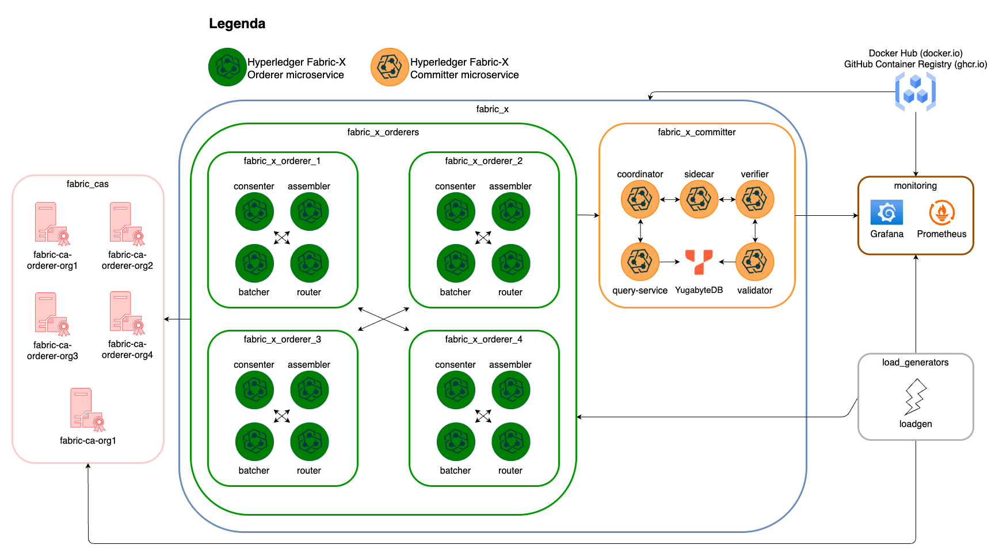
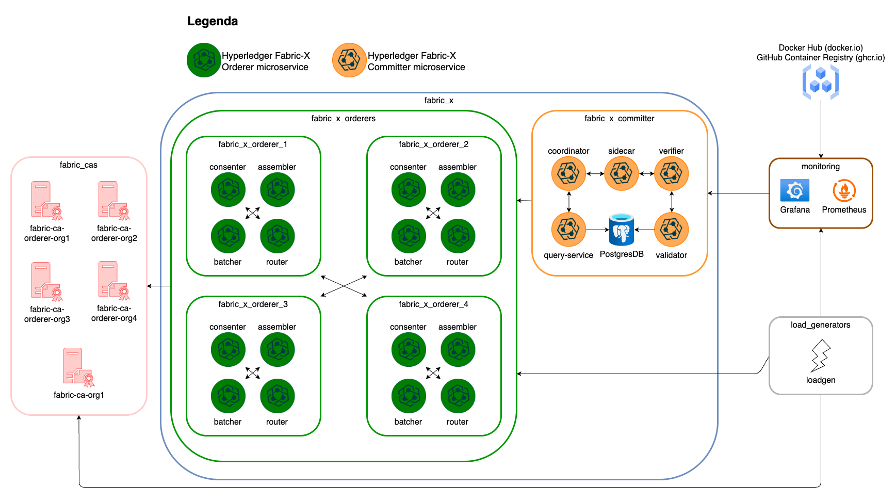
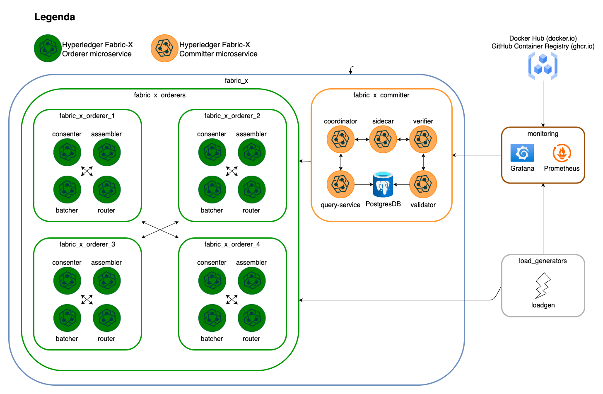

# Hyperledger Fabric-X Deployment Samples

This folder contains sample inspirational inventories and playbooks to deploy different Hyperledger Fabric-X networks on a single node.

## Table of Contents <!-- omit in toc -->

- [Inventories](#inventories)
  - [Define the inventory to run](#define-the-inventory-to-run)
    - [Use `ansible.cfg`](#use-ansiblecfg)
    - [Set via env](#set-via-env)
  - [local/fabric-x.yaml](#localfabric-xyaml)
  - [local/fabric-x-yugabyte.yaml](#localfabric-x-yugabyteyaml)
  - [local/fabric-x-bin.yaml](#localfabric-x-binyaml)
  - [local/fabric-x-cryptogen.yaml](#localfabric-x-cryptogenyaml)
  - [distributed/fabric-x.yaml](#distributedfabric-xyaml)
- [Playbooks](#playbooks)
- [How to replicate an horizontally scalable microservice](#how-to-replicate-an-horizontally-scalable-microservice)
- [How to run a microservice on a different machine](#how-to-run-a-microservice-on-a-different-machine)

## Inventories

There are currently 5 sample different [inventories](./inventory/) that can be used.

They are split into 2 folders:

- [`local/`](./inventory/local/): it contains inventories that can be used on a single machine (acting as both control node and remote node) to run an Hyperledger Fabric-X network;
- [`distributed/`](./inventory/distributed/): it contains inventories that require multiple machines to run and are useful to evaluate the network performance by distributing and fine-tuning the settings for each microservice.

The microservices indicated as _horizontally scalable_ can be replicated. To understand how to replicate them, look at [this section](#how-to-replicate-an-horizontally-scalable-microservice).

### Define the inventory to run

To decide the inventory to run, you can:

#### Use `ansible.cfg`

Set the inventory in the [ansible.cfg](./ansible.cfg) file directly:

```ini
inventory = <path_to_the_inventory>
```

#### Set via env

Set the inventory as env variable:

```shell
export ANSIBLE_INVENTORY=<path_to_the_inventory>
```

### local/fabric-x.yaml

The [local/fabric-x.yaml](./inventory/local/fabric-x.yaml) inventory represents the following network scenario:


It bootstraps a network with:

- 5 **Hyperledger Fabric CAs** containers;
- 4 **Hyperledger Fabric-X Orderers**, each one made by:
  - 1 consenter container;
  - 1 assembler container;
  - 1 batcher container (_horizontally scalable_);
  - 1 router container;
- 1 **Hyperledger Fabric-X Committer**, made by:
  - 1 validator container (_horizontally scalable_);
  - 1 verifier container (_horizontally scalable_);
  - 1 coordinator container;
  - 1 sidecar container;
  - 1 query service container;
  - 1 PostgreSQL container;
- 1 **Hyperledger Fabric-X Loadgen** binary;
- 1 **Grafana** container;
- 1 **Prometheus** container.

### local/fabric-x-yugabyte.yaml

The [local/fabric-x-yugabyte.yaml](./inventory/local/fabric-x-yugabyte.yaml) inventory represents the following network scenario:



It bootstraps a network with:

- 5 **Hyperledger Fabric CAs** containers;
- 4 **Hyperledger Fabric-X Orderers**, each one made by:
  - 1 consenter container;
  - 1 assembler container;
  - 1 batcher container (_horizontally scalable_);
  - 1 router container;
- 1 **Hyperledger Fabric-X Committer**, made by:
  - 1 validator container (_horizontally scalable_);
  - 1 verifier container (_horizontally scalable_);
  - 1 coordinator container;
  - 1 sidecar container;
  - 1 query service container;
  - 1 **YugabyteDB** container (_horizontally scalable_);
- 1 **Hyperledger Fabric-X Loadgen** binary;
- 1 **Grafana** container;
- 1 **Prometheus** container.

### local/fabric-x-bin.yaml

The [local/fabric-x-bin.yaml](./inventory/local/fabric-x-bin.yaml) inventory represents the following network scenario:



It bootstraps a network with:

- 5 **Hyperledger Fabric CAs** binaries;
- 4 **Hyperledger Fabric-X Orderers**, each one made by:
  - 1 consenter binary;
  - 1 assembler binary;
  - 1 batcher binary (_horizontally scalable_);
  - 1 router binary;
- 1 **Hyperledger Fabric-X Committer**, made by:
  - 1 validator binary (_horizontally scalable_);
  - 1 verifier binary (_horizontally scalable_);
  - 1 coordinator binary;
  - 1 sidecar binary;
  - 1 query service binary;
  - 1 PostgreSQL container;
- 1 **Hyperledger Fabric-X Loadgen** binary;
- 1 **Grafana** container;
- 1 **Prometheus** container.

### local/fabric-x-cryptogen.yaml

The [local/fabric-x-cryptogen.yaml](./inventory/local/fabric-x-cryptogen.yaml) inventory represents the following network scenario:



It bootstraps a network with:

- 4 **Hyperledger Fabric-X Orderers**, each one made by:
  - 1 consenter container;
  - 1 assembler container;
  - 1 batcher container (_horizontally scalable_);
  - 1 router container;
- 1 **Hyperledger Fabric-X Committer**, made by:
  - 1 validator container (_horizontally scalable_);
  - 1 verifier container (_horizontally scalable_);
  - 1 coordinator container;
  - 1 sidecar container;
  - 1 query service container;
  - 1 PostgreSQL container;
- 1 **Hyperledger Fabric-X Loadgen** binary;
- 1 **Grafana** container;
- 1 **Prometheus** container.

The absence of the Fabric CAs is due to the fact that the crypto material is generated on the control node using `cryptogen`. As stated within the inventory itself, this deployment is not meant for Production.

### distributed/fabric-x.yaml

The [distributed/fabric-x.yaml](./inventory/distributed/fabric-x.yaml) inventory represents an example of Fabric-X inventory that distributes the different components over multiple machines. This inventory specifically targets a total of 16 different machines which host some of the microservices. Use this inventory as reference to create your distributed network:


**NOTE**: this inventory is NOT ready to use! To use this inventory, you need to indicate the target machines, named as `host_machine_*`.

It bootstraps a network with:

- 4 **Hyperledger Fabric-X Orderers**, each one made by:
  - 1 consenter container;
  - 1 assembler container;
  - 2 batcher containers (_horizontally scalable_);
  - 1 router container;
- 1 **Hyperledger Fabric-X Committer**, made by:
  - 1 coordinator container;
  - 1 sidecar container;
  - 1 query service container;
  - 7 validator containers (_horizontally scalable_);
  - 7 verifier containers (_horizontally scalable_);
  - 3 Yugabyte master containers (_horizontally scalable_);
  - 7 Yugabyte tablet containers (_horizontally scalable_);
- 2 **Hyperledger Fabric-X Loadgen** binaries;
- 1 **Grafana** container;
- 1 **Prometheus** container.

We have used this inventory to deploy an Hyperledger Fabric-X network able to reach ~100k TPS using 16 BareMetal servers within the same datacenter and with the following properties:

- **OS**: RHEL9;
- **CPU**: Intel(R) Xeon(R) Silver 4210 CPU @ 2.20GHz;
- **RAM**: 64GB;
- **DISK**: 1000GB SSD (to get high-speed IOPS).

The absence of the Fabric CAs is due to the fact that the crypto material is generated on the control node using `cryptogen`. Thus, this deployment is not meant for Production, but for performance evaluation only.

## Playbooks

We have crafted some [playbooks](./playbooks/) that work with the groups indicated in the stated-above inventories. They make use of the playbooks coming with the collection itself.

You can either run a playbook directly using `ansible-playbook` or use the `Makefile` targets as stated in the [README.md](../README.md#1-generate-the-artifacts).

## How to replicate an horizontally scalable microservice

Replicating an horizontally scalable microservice using this collection is straightforward. All you need to do is add new entries into the reference inventory.

Let's make an example. Assume we want to add a new batcher for the `fabric_x_orderer_1` node, all you need to do is add a new `batcher` host within the node:

```yaml
# ...
fabric_x_orderer_1:
  # ...
  hosts:
    # batcher already present
    orderer-batcher-1:
      orderer_shard_id: 1
      orderer_component_type: batcher
      orderer_rpc_port: 7051
    # additional batcher
    orderer-batcher-2:
      orderer_shard_id: 2 # <- each batcher in the same node must have a unique shard ID
      orderer_component_type: batcher # <- define the orderer component type to "batcher"
      orderer_rpc_port: 7061 # <- make sure to assign a port not taken by others
```

This approach can be extended for all the other components marked as _horizontally scalable_.

## How to run a microservice on a different machine

All the inventories that are indicated in this repository run on a single machine. This is useful to quickly run a network and test its functionalities, but to achieve better performance each microservice can be run on a separate machine.

To do it, you must first switch from `ansible_connection: local` to `ansible_connection: ssh`:

```yaml
all:
  vars:
    # set the connection to ssh and make sure you can ssh from the control node to the target machines
    ansible_connection: ssh
```

Once you have done this, assign to each host the machine where to run it through the `ansible_host` variable.

Let's make an example. Assume we want to distribute the `fabric_x_orderer_1` node microservices over 4 different machines on the cloud, all you need to set is the following:

```yaml
# ...
fabric_x_orderer_1:
  # ...
  hosts:
    orderer-router-1:
      ansible_host: myremotemachine1.cloud.com # <- 1st machine on the cloud
      orderer_component_type: router
      orderer_rpc_port: 7050
    orderer-batcher-1:
      ansible_host: myremotemachine2.cloud.com # <- 2nd machine on the cloud
      orderer_shard_id: 1
      orderer_component_type: batcher
      orderer_rpc_port: 7051
    orderer-consenter-1:
      ansible_host: myremotemachine3.cloud.com # <- 3rd machine on the cloud
      orderer_component_type: consenter
      orderer_rpc_port: 7052
    orderer-assembler-1:
      ansible_host: myremotemachine4.cloud.com # <- 4th machine on the cloud
      orderer_component_type: assembler
      orderer_rpc_port: 7053
```

This approach is valid for all the microservices within the inventory.
