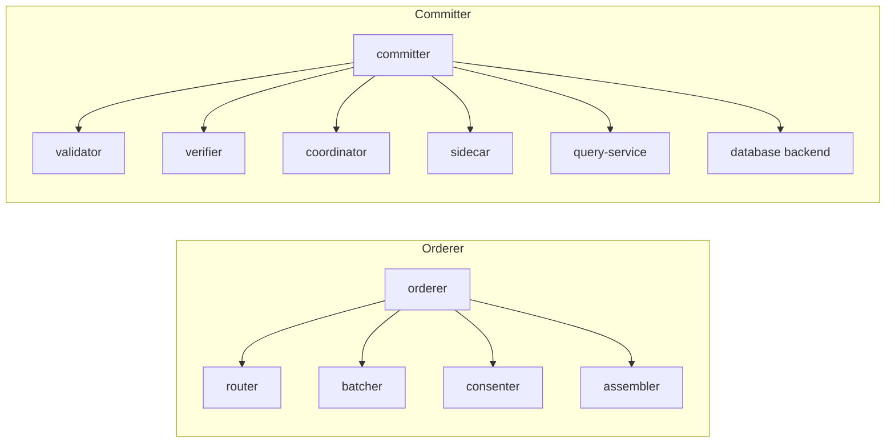
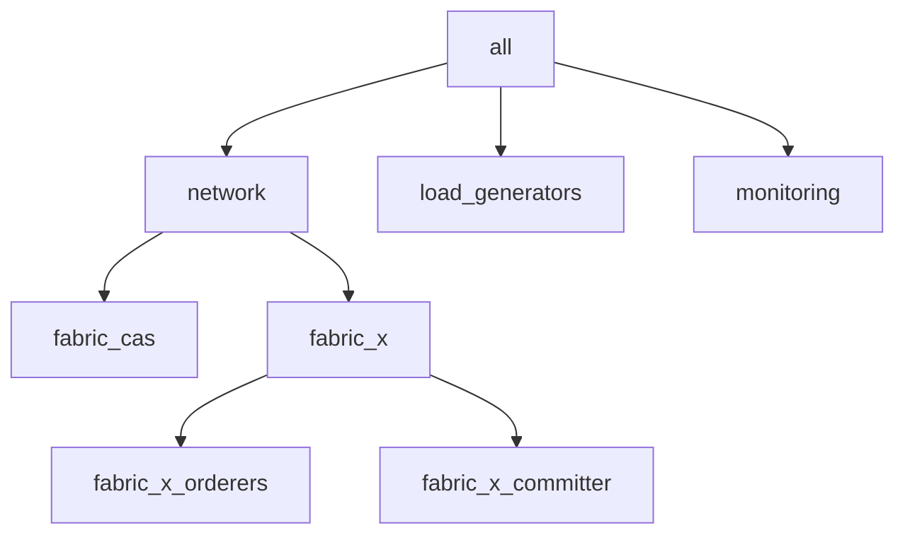
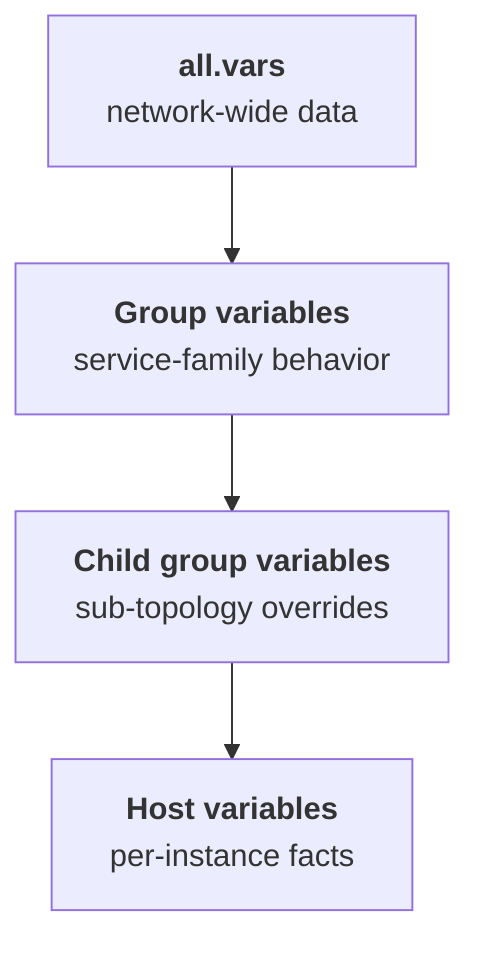

# Inventory Guide

The inventory is the deployment model for a Fabric-X network. It tells the collection which services exist, which machines or Kubernetes services they represent, how those services are connected, and which runtime and security mode each role should use.

This directory documents the example inventories shipped with the collection. Use those examples as working references, but treat this page as the starting point for designing your own inventory.

## Table of Contents <!-- omit in toc -->

- [What an Inventory Defines](#what-an-inventory-defines)
- [How Playbooks Read the Inventory](#how-playbooks-read-the-inventory)
- [Inventory Structure](#inventory-structure)
- [Authoring Rules](#authoring-rules)
- [Runtime Modes](#runtime-modes)
- [Security and Crypto](#security-and-crypto)
- [Sample Inventories](#sample-inventories)
  - [Common Variables](#common-variables)
  - [Local](#local)
  - [Kubernetes](#kubernetes)
  - [Distributed](#distributed)
- [Scaling a Component](#scaling-a-component)
- [Moving a Service to Another Machine](#moving-a-service-to-another-machine)

## What an Inventory Defines

An Ansible inventory for this collection is more than a host list. It is the contract between your topology and the Fabric-X roles.

At a minimum, an inventory answers these questions:

- Which Fabric-X services are part of the network?
- Which logical host represents each service instance?
- Which physical target runs each logical host?
- Which ports, hostnames, certificates, and database backends connect the services?
- Which deployment mode is used for each role: container, binary, or Kubernetes?
- Which identities and organizations own the orderer, committer, load generator, and Fabric CA components?

Fabric-X is composed of independently managed services. The orderer is split into routers, batchers, consenters, and assemblers. The committer is split into validators, verifiers, a coordinator, a sidecar, a query service, and a database backend. The inventory must preserve those component identities so the playbooks can render the correct configuration and start the correct role tasks.



The sample inventories all describe a complete network with orderers, a committer, load generation, and monitoring. Some also include Fabric CA services, while the `cryptogen` samples generate test crypto material centrally on the control node.

## How Playbooks Read the Inventory

The collection playbooks target well-known groups. Those group names are part of the public contract of the examples and the [`Makefile`](../../Makefile) workflow.

For example, the orderer lifecycle playbooks target `fabric_x_orderers`, the committer lifecycle playbooks target `fabric_x_committer`, load generator playbooks target `load_generators`, and monitoring playbooks target `monitoring`. The example wrapper playbooks compose those lifecycle playbooks into `make start`, `make stop`, `make teardown`, and related commands.

Keep the standard groups when adapting an example inventory. If you rename them, the roles can still be used directly, but the provided playbooks and generated `target_hosts` shortcuts will no longer know which hosts to operate on.

The most important groups are:

| Group                | Purpose                                                                   |
| -------------------- | ------------------------------------------------------------------------- |
| `network`            | Parent group for the deployable Fabric-X network.                         |
| `fabric_cas`         | Fabric CA servers and their databases, when the inventory uses Fabric CA. |
| `fabric_x`           | Parent group for Fabric-X orderer and committer components.               |
| `fabric_x_orderers`  | All Fabric-X orderer component hosts.                                     |
| `fabric_x_committer` | Fabric-X committer component hosts and the selected committer database.   |
| `load_generators`    | Load generator instances.                                                 |
| `monitoring`         | Monitoring components such as exporters, Prometheus, and Grafana.         |



## Inventory Structure

The examples use a layered structure:

- `all.vars` contains network-wide data such as organization definitions.
- Group variables describe behavior shared by a service family, such as `orderer_use_tls: true` or `committer_use_mtls: true`.
- Child groups divide a service family into logical sub-topologies, such as `fabric_x_orderer_1` through `fabric_x_orderer_4`.
- Host variables describe one service instance: its component type, ports, database reference, organization identity, and runtime-specific settings.
- Each inventory family has an environment file that describes how Ansible reaches the target environment and where generated files live on each target.
- [`examples/inventory/vars.yaml`](./vars.yaml) describes control-node paths used by the example playbooks.



Think of each inventory host as a logical service instance, not necessarily as a physical machine. Several logical hosts may map to the same local machine, the same Kubernetes cluster, or the same remote SSH host. The connection variables decide where the work actually runs.

## Authoring Rules

Start from the closest sample inventory and change one dimension at a time: runtime, security mode, database backend, or scale. That keeps the group contract and cross-role references intact.

Use these rules when crafting a custom inventory:

1. Keep hostnames stable and unique. They are used in generated configuration, service names, certificate names, output directories, and [`Makefile`](../../Makefile) targets.
2. Keep the standard parent groups unless you are also replacing the example playbooks.
3. Set the dispatcher variable on every Fabric-X component host. Orderer hosts need `orderer_component_type`; committer hosts need `committer_component_type`.
4. Assign unique ports for colocated services. This is especially important for local and distributed container deployments where several logical hosts can share one physical machine.
5. Use group variables for policy decisions shared by a family of components, such as TLS, mTLS, container mode, Kubernetes mode, or shared organization data.
6. Use host variables for per-instance facts, such as RPC ports, metrics ports, shard IDs, database hosts, and NodePort values.
7. Keep service references in inventory hostnames, not ad hoc addresses. For example, validators reference `postgres_db_host` or YugabyteDB hosts; load generators and monitoring discover orderer and committer hosts through inventory groups.
8. Define organizations consistently. Fabric CA inventories attach `fabric_ca_host`, enrollment names, secrets, and roles to organization data. `cryptogen` inventories still need organization names and domains so certificate material and channel configuration can be generated.
9. Preserve the runtime-specific path variables from the selected inventory family's environment file, especially `remote_deploy_dir`, `remote_node_dir`, `remote_config_dir`, and `remote_data_dir`.
10. After adding, removing, or renaming hosts, regenerate helper targets with `make targets` if you use the top-level [`Makefile`](../../Makefile).

The practical test is simple: a reader should be able to pick any host in the inventory and understand what service it runs, where it runs, which organization owns it, how other services reach it, and where its generated files will be written.

## Runtime Modes

Runtime mode is expressed through inventory variables consumed by each role:

- **Container inventories** start long-running services as containers on the target machine. They require a container engine and is the default runtime mode unless otherwise specified;
- **Binary inventories** build the services as binaries and run them on the target machine. Use this mode when you want to debug processes without container boundaries, but note that such mode is supported only by the Fabric-X services;
- **Kubernetes inventories** describe workloads, services, persistent storage, and externally reachable NodePorts. The inventory hosts are still Ansible hosts, but they represent Kubernetes resources rather than SSH machines.

## Security and Crypto

The examples intentionally cover several security postures:

- TLS with mTLS is the default for representative Fabric-X samples. Services encrypt traffic and supported service-to-service calls authenticate clients with certificates.
- TLS without mTLS keeps transport encryption but disables client certificate authentication where mTLS variables are omitted or disabled. Use it for debugging interoperability or certificate issues.
- Fabric CA inventories enroll identities through CA services. This is the safest sample pattern because private keys can be generated on the node that owns them.

> [!NOTE]
> `cryptogen` inventories generate test certificates centrally on the control node. They are convenient for repeatable tests and performance runs, but they are not a production certificate lifecycle.

Security choices affect several roles at once. If you disable TLS or mTLS for Fabric-X components, check the orderer, committer, load generator, monitoring, and database variables together so generated endpoints and certificate references remain consistent.

> [!WARNING]
> No TLS is only for local debugging. It should not be used as a production starting point.

## Sample Inventories

Choose the smallest sample that exercises the behavior you need, then adapt it.

### Common Variables

The [`examples/inventory/vars.yaml`](./vars.yaml) file defines general variables that are shared and valid across all the deployment environments. Among these vars there are:

| Variable                  | Meaning                                                                                                                                 |
| ------------------------- | --------------------------------------------------------------------------------------------------------------------------------------- |
| `project_dir`             | Repository or installed collection path on the control node. Defaults to `PROJECT_DIR` or the installed collection path.                |
| `out_dir`                 | Root output directory for generated material. Defaults to `PROJECT_DIR/out`. Override `OUT_DIR` to keep artifacts outside the checkout. |
| `control_node_dir`        | Control-node output directory under `out_dir`.                                                                                          |
| `cryptogen_artifacts_dir` | Control-node path for centrally generated `cryptogen` material.                                                                         |
| `channel_id`              | Channel name used by generated Fabric-X configuration.                                                                                  |

Each deployment environment also provides an environment file. The distinction matters: control-node paths hold generated or collected artifacts used by the operator, while environment files define how target nodes are reached and where their service files are written.

### Local

Local inventories run a complete network on the control machine with `ansible_connection: local`. They are the best starting point for development, functional testing, and learning the inventory contract.

[`local/group_vars/all/env.yaml`](./local/group_vars/all/env.yaml) uses local Ansible execution and writes deployment state below `out_dir`.

| Inventory                                                             | Description                                                                   |
| --------------------------------------------------------------------- | ----------------------------------------------------------------------------- |
| [`local/fabric-x.yaml`](./docs/local/fabric-x.md)                     | Default local container deployment with Fabric CA, PostgreSQL, TLS, and mTLS. |
| [`local/fabric-x-yugabyte.yaml`](./docs/local/fabric-x-yugabyte.md)   | Local container deployment using YugabyteDB as the committer database.        |
| [`local/fabric-x-bin.yaml`](./docs/local/fabric-x-bin.md)             | Local deployment that runs Fabric-X services as binaries.                     |
| [`local/fabric-x-cryptogen.yaml`](./docs/local/fabric-x-cryptogen.md) | Local container deployment using centrally generated `cryptogen` material.    |
| [`local/fabric-x-no-mtls.yaml`](./docs/local/fabric-x-no-mtls.md)     | Local container deployment with TLS enabled and mTLS disabled.                |
| [`local/fabric-x-no-tls.yaml`](./docs/local/fabric-x-no-tls.md)       | Local container deployment with TLS and mTLS disabled for debugging only.     |

When running local containers on macOS, set `LOCAL_ANSIBLE_HOST` so containers can reach services on the host:

```shell
export LOCAL_ANSIBLE_HOST=host.docker.internal
```

### Kubernetes

Kubernetes inventories deploy the same logical Fabric-X services as Kubernetes workloads and services. They are useful when you need to validate Kubernetes manifests, service exposure, storage, and cluster behavior.

[`k8s/group_vars/all/env.yaml`](./k8s/group_vars/all/env.yaml) uses local Ansible execution against Kubernetes services and adds Kubernetes defaults such as `k8s_namespace` and `k8s_storage_size`.

| Inventory                                                         | Description                                                              |
| ----------------------------------------------------------------- | ------------------------------------------------------------------------ |
| [`k8s/fabric-x.yaml`](./docs/k8s/fabric-x.md)                     | Default Kubernetes deployment with Fabric CA, PostgreSQL, TLS, and mTLS. |
| [`k8s/fabric-x-yugabyte.yaml`](./docs/k8s/fabric-x-yugabyte.md)   | Kubernetes deployment using YugabyteDB as the committer database.        |
| [`k8s/fabric-x-cryptogen.yaml`](./docs/k8s/fabric-x-cryptogen.md) | Kubernetes deployment using centrally generated `cryptogen` material.    |
| [`k8s/fabric-x-no-mtls.yaml`](./docs/k8s/fabric-x-no-mtls.md)     | Kubernetes deployment with TLS enabled and mTLS disabled.                |
| [`k8s/fabric-x-no-tls.yaml`](./docs/k8s/fabric-x-no-tls.md)       | Kubernetes deployment with TLS and mTLS disabled for debugging only.     |

For remote clusters, set the externally reachable node address used by NodePort services:

```shell
export K8S_NODE_IP=<node-ip>
```

### OpenShift

OpenShift inventories deploy Kubernetes-compatible workloads and services, then expose selected HTTP or HTTP2-capable ports with OpenShift Routes instead of Kubernetes NodePort or LoadBalancer services.

[`openshift/group_vars/all/env.yaml`](./openshift/group_vars/all/env.yaml) uses local Ansible execution against OpenShift services and stores generated deployment state below `out_dir`.

| Inventory                                                                     | Description                                                                                 |
| ----------------------------------------------------------------------------- | ------------------------------------------------------------------------------------------- |
| [`openshift/fabric-x-cryptogen.yaml`](./docs/openshift/fabric-x-cryptogen.md) | OpenShift deployment using centrally generated `cryptogen` material and route-based access. |

Set the OpenShift wildcard route domain before running the inventory:

```shell
export OPENSHIFT_APPS_DOMAIN=apps.example.com
```

### Distributed

The distributed inventory is a performance-oriented SSH topology. It uses containers, `cryptogen`, mTLS, YugabyteDB, multiple load generators, and multiple validator, verifier, batcher, and database instances.

[`distributed/group_vars/all/env.yaml`](./distributed/group_vars/all/env.yaml) uses SSH, defines remote machine placeholders, and writes deployment state below a remote directory such as `/root/perf-deployment`.

| Inventory                                                     | Description                                                                 |
| ------------------------------------------------------------- | --------------------------------------------------------------------------- |
| [`distributed/fabric-x.yaml`](./docs/distributed/fabric-x.md) | Multi-machine reference topology for performance evaluation and adaptation. |

> [!WARNING]
> This inventory is not ready to run as-is. Replace the `host_machine_*` placeholders in [`distributed/group_vars/all/env.yaml`](./distributed/group_vars/all/env.yaml), confirm SSH access, update `remote_deploy_dir`, and review all port assignments before using it.

## Scaling a Component

Components marked as horizontally scalable can be replicated by adding hosts to the relevant group. For example, add a second batcher to `fabric_x_orderer_1`:

```yaml
fabric_x_orderer_1:
  hosts:
    orderer-batcher-1:
      orderer_shard_id: 1
      orderer_component_type: batcher
      orderer_rpc_port: 7053
    orderer-batcher-2:
      orderer_shard_id: 2
      orderer_component_type: batcher
      orderer_rpc_port: 7063
```

Each replicated instance needs unique ports on the same target machine. Batcher replicas also need a unique `orderer_shard_id` within their orderer group.

## Moving a Service to Another Machine

Local inventories use `ansible_connection: local`. To run services on remote machines, change the connection model and assign `ansible_host` per service:

```yaml
fabric_x_orderer_1:
  hosts:
    orderer-router-1:
      # Use ansible_host to define on which machine you want the service to run.
      ansible_host: mysshmachine1.example.com
      orderer_component_type: router
      orderer_rpc_port: 7050
```

The [distributed sample](./docs/distributed/fabric-x.md) shows a larger SSH-based layout.
