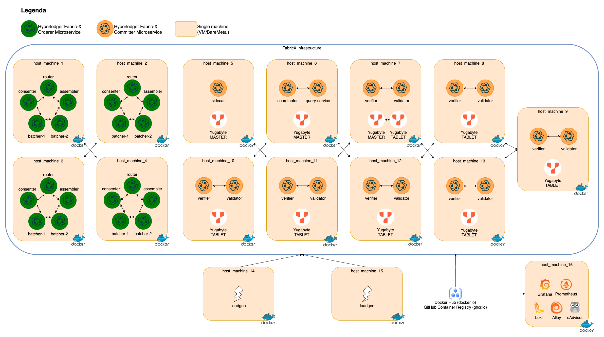
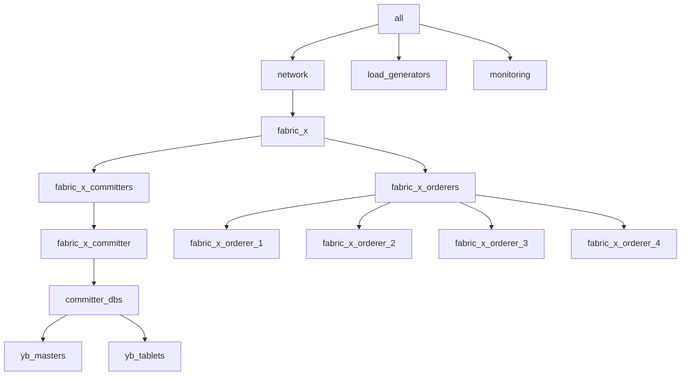

# distributed/fabric-x.yaml

[`fabric-x.yaml`](../../distributed/fabric-x.yaml) is a multi-machine SSH inventory for performance-oriented Fabric-X evaluation.

This inventory is not ready to run as-is. Replace the `host_machine_*` placeholders with real machines and confirm SSH access before using it.

## Table of Contents <!-- omit in toc -->

- [Network Diagram](#network-diagram)
- [Inventory Details](#inventory-details)

## Network Diagram

The diagram below summarizes this inventory's Fabric-X services and how they fit together.

## Inventory Details

Ansible reaches the target machines over SSH. The Fabric-X services, YugabyteDB, load generators, and monitoring components run as containers on remote hosts.

The environment file [`distributed/group_vars/all/env.yaml`](../../distributed/group_vars/all/env.yaml) defines the remote connection defaults, placeholder machines, and deployment directories.

This inventory describes a larger container-based Fabric-X deployment:

- No Fabric CA services. Crypto material is generated on the control node with `cryptogen`.
- 4 orderer groups. Each group has 1 router, 1 consenter, 1 assembler, and 2 batchers.
- 7 validators, 7 verifiers, 1 coordinator, 1 sidecar, and 1 query service.
- 3 YugabyteDB masters and 7 YugabyteDB tablets.
- 2 load generators.
- Monitoring with 16 node exporters, Prometheus, and Grafana.

This is a performance-oriented reference topology, not a small development sample. It scales validators, verifiers, batchers, load generators, and YugabyteDB tablets across 16 remote machine placeholders.

Fabric CA is intentionally omitted so large performance runs do not spend time starting CA services or enrolling identities. TLS and mTLS still use centrally generated `cryptogen` material.
