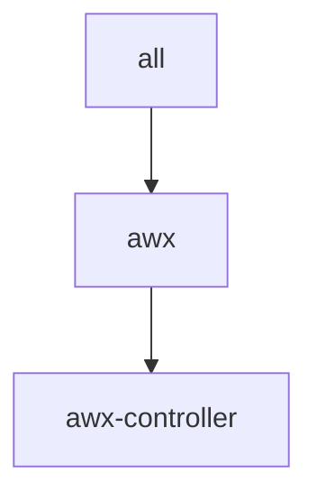

# k8s/awx.yaml

[`awx.yaml`](../../k8s/awx.yaml) deploys a standalone AWX (Ansible automation controller) instance on a local Kubernetes cluster.

Unlike the other sample inventories under [`k8s/`](../../k8s/), this is not a Fabric-X network sample. AWX is a general automation controller, deployed independently through the [`awx`](../../../../roles/awx/README.md) role and its [companion playbooks](../../../../playbooks/awx/README.md).

> [!WARNING]
> The AWX Operator installs cluster-scoped resources (CRDs, ClusterRoles, ClusterRoleBindings). The account running this inventory needs cluster-admin rights on the target cluster.

## Table of Contents <!-- omit in toc -->

- [Topology](#topology)
- [Inventory Details](#inventory-details)

## Topology



## Inventory Details

A single logical host, `awx-controller`, represents the AWX deployment:

- `awx_use_k8s: true` selects the Kubernetes task path.
- `awx_k8s_node_port: 30080` exposes the AWX web service through a NodePort, reachable at `http://localhost:30080` on a local cluster.
- `awx_restore_name: awx` restores in place by default, reusing the same NodePort without a service port conflict.

Run the lifecycle playbooks directly against this inventory, for example:

```shell
ansible-playbook -i examples/inventory/k8s/awx.yaml hyperledger.fabricx.awx.start
```

See the [playbooks/awx README](../../../../playbooks/awx/README.md) for the full lifecycle (start, teardown, wipe, backup, restore) and how to retrieve the generated admin credentials.
