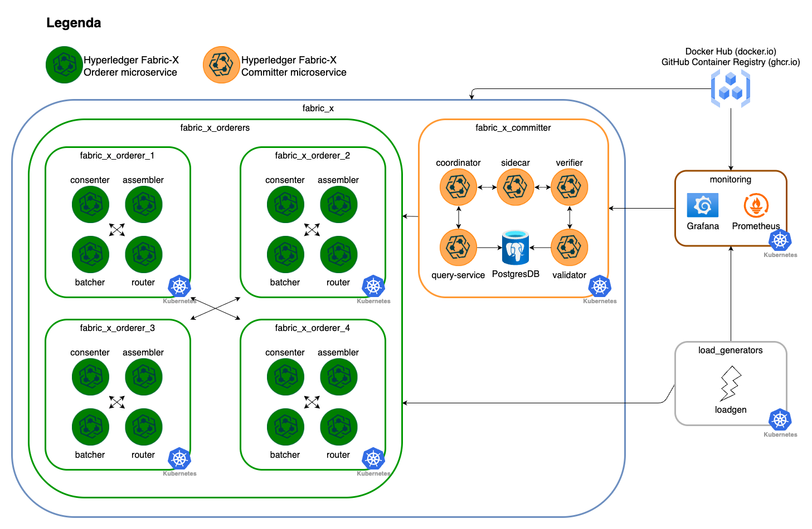
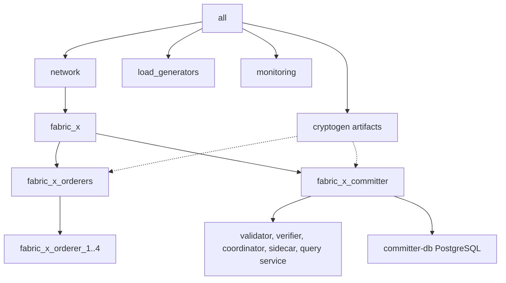

# k8s/fabric-x-cryptogen.yaml

[`fabric-x-cryptogen.yaml`](../../k8s/fabric-x-cryptogen.yaml) deploys the Kubernetes sample without Fabric CA services. Crypto material is generated on the control node with `cryptogen`.

Use it for repeatable Kubernetes tests that should not exercise Fabric CA enrollment.

## Table of Contents <!-- omit in toc -->

- [Network Diagram](#network-diagram)
- [Inventory Specs](#inventory-specs)
- [What Makes This Inventory Different](#what-makes-this-inventory-different)

## Network Diagram

The diagram below summarizes this inventory's Fabric-X services and how they fit together.

## Inventory Specs

Orderer, committer, PostgreSQL, load generator, node exporter, Prometheus, and Grafana use Kubernetes task paths. `cryptogen` runs on the control node and writes artifacts below `cryptogen_artifacts_dir`.

This inventory deploys these logical services as Kubernetes workloads and services:

- No Fabric CA servers or Fabric CA databases.
- 4 orderer groups. Each group has 1 router, 1 consenter, 1 assembler, and 1 batcher.
- 1 committer with validator, verifier, coordinator, sidecar, query service, and PostgreSQL storage.
- 1 load generator.
- Monitoring with node exporter, PostgreSQL exporter, Prometheus, and Grafana.

## What Makes This Inventory Different

Fabric CA is omitted entirely. Certificates and keys are generated centrally before Kubernetes-backed component configuration consumes them.

The resulting material enables TLS and mTLS for Fabric-X components, but this is not a production baseline because private keys are generated on the control node.
