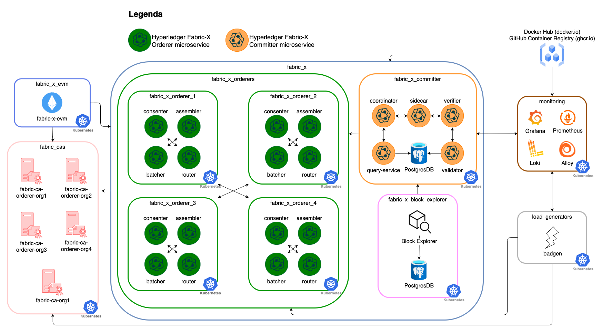

# k8s/fabric-x-evm.yaml

[`fabric-x-evm.yaml`](../../k8s/fabric-x-evm.yaml) is the Kubernetes equivalent of [`local/fabric-x-evm.yaml`](../local/fabric-x-evm.md): the default Kubernetes network with the Fabric-X EVM gateway attached, exposed through NodePort.

Use it to validate the EVM gateway's StatefulSet, PersistentVolumeClaim, Services, and probes on Kubernetes.

## Table of Contents <!-- omit in toc -->

- [Network Diagram](#network-diagram)
- [Inventory Details](#inventory-details)
- [Using the JSON-RPC endpoint](#using-the-json-rpc-endpoint)

## Network Diagram

The diagram below summarizes this inventory's Fabric-X services and how they fit together.



## Inventory Details

This inventory deploys the same Kubernetes workloads as the default Kubernetes sample ([`fabric-x.yaml`](./fabric-x.md)), plus one EVM gateway workload:

- 5 Fabric CA servers and 5 PostgreSQL databases for Fabric CA state.
- 4 orderer groups. Each group has 1 router, 1 consenter, 1 assembler, and 1 batcher.
- 1 committer with validator, verifier, coordinator, sidecar, query service, and PostgreSQL storage.
- 1 Block Explorer server and UI with PostgreSQL storage, streaming blocks from the committer sidecar and exposed through NodePort.
- 1 Fabric-X EVM gateway, deployed as a StatefulSet with a PersistentVolumeClaim for its state, exposed through NodePort `30545`.
- 1 load generator.
- Monitoring with node exporter, PostgreSQL exporter, Prometheus, Grafana, Loki, and Alloy.

`fabric-x-evm` is enrolled with Fabric CA in `Org1` — the same organization already trusted by the committer and orderers — so no additional mTLS trust configuration is required. `evm_persist_state: true` (the default) makes the StatefulSet request a `500Mi` PersistentVolumeClaim (`k8s_storage_size`) for the gateway's and embedded endorser's SQLite state; `k8s_storage_class` can be set to pin a specific StorageClass.

The pod's readiness and liveness probes use `tcpSocket`, not `httpGet`: the gateway's only HTTP route is JSON-RPC `POST /`, and it does not open that listener until its embedded endorser has synchronized with the committer sidecar, so a passing probe already proves Fabric-X connectivity.

## Using the JSON-RPC endpoint

`actual_host` defaults to `K8S_NODE_IP` or `localhost`. Once started, the gateway serves Ethereum JSON-RPC (and WebSocket, on the same port) at `http://<actual_host>:30545`, chain ID `4011` (`0xfab`):

```shell
curl -s -X POST -H 'Content-Type: application/json' \
  --data '{"jsonrpc":"2.0","id":1,"method":"eth_chainId","params":[]}' \
  http://localhost:30545
```

Point [Foundry](https://book.getfoundry.sh/), [Hardhat](https://hardhat.org/tutorial), or [MetaMask](https://support.metamask.io/configure/networks/how-to-add-a-custom-network-rpc/) at that URL and chain ID. See [hyperledger/fabric-x-evm](https://github.com/hyperledger/fabric-x-evm#build-your-own-contracts) for details and caveats.
