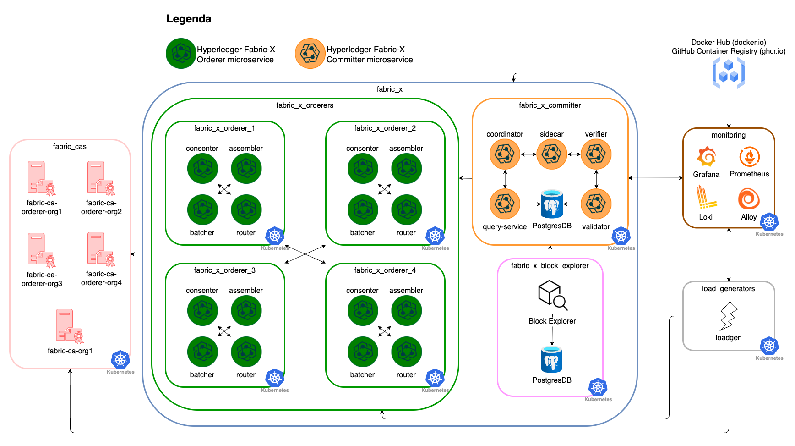
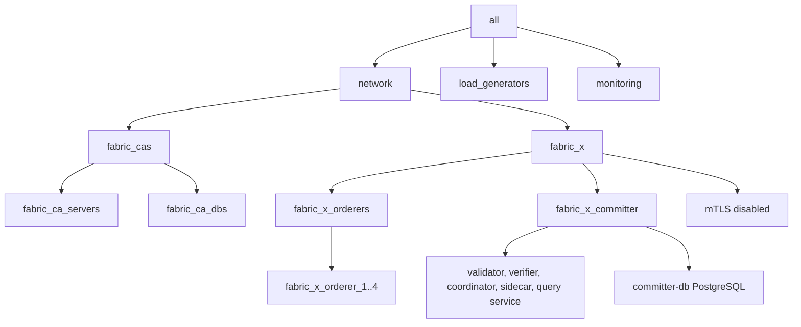

# k8s/fabric-x-no-mtls.yaml

[`fabric-x-no-mtls.yaml`](../../k8s/fabric-x-no-mtls.yaml) deploys the Kubernetes sample with TLS enabled and mTLS disabled.

Use it when you need encrypted Kubernetes service traffic but want to remove client certificate authentication from Fabric-X service-to-service calls.

> [!WARNING]
> This inventory is meant for debugging only. It disables mTLS client authentication between Fabric-X services.

## Table of Contents <!-- omit in toc -->

- [Network Diagram](#network-diagram)
- [Inventory Details](#inventory-details)

## Network Diagram

The diagram below summarizes this inventory's Fabric-X services and how they fit together.

## Inventory Details

Fabric CA, CA databases, orderer, committer, PostgreSQL, load generator, node exporter, Prometheus, and Grafana use Kubernetes task paths. External access follows the same NodePort pattern as [`fabric-x.yaml`](./fabric-x.md).

This inventory deploys the same service layout as the default Kubernetes sample:

- 5 Fabric CA servers and 5 PostgreSQL databases for Fabric CA state.
- 4 orderer groups. Each group has 1 router, 1 consenter, 1 assembler, and 1 batcher.
- 1 committer with validator, verifier, coordinator, sidecar, query service, and PostgreSQL storage.
- 1 load generator.
- Monitoring with node exporter, PostgreSQL exporter, Prometheus, and Grafana.

TLS remains enabled for services that declare TLS variables. The `orderer_use_mtls` and `committer_use_mtls` variables are omitted, so Fabric-X services do not require client certificates from each other.

This is useful for debugging Kubernetes TLS behavior without mTLS client-authentication noise.
