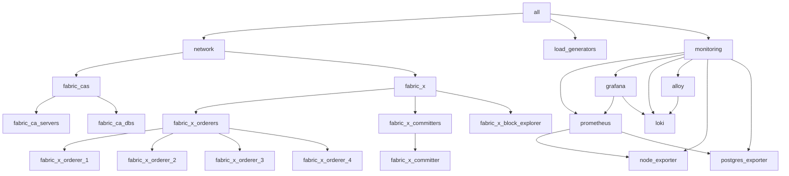

# k8s/fabric-x-no-tls.yaml

[`fabric-x-no-tls.yaml`](../../k8s/fabric-x-no-tls.yaml) deploys the Kubernetes sample with TLS and mTLS disabled.

Use it for local-cluster debugging when plaintext endpoints are deliberate and the goal is to remove certificate handling from the test.

> [!WARNING]
> This inventory is meant for debugging only. It disables both TLS encryption and mTLS client authentication.

## Table of Contents <!-- omit in toc -->

- [Network Diagram](#network-diagram)
- [Inventory Details](#inventory-details)

## Network Diagram

The diagram below summarizes this inventory's Fabric-X services and how they fit together.

## Inventory Details

Fabric CA, CA databases, orderer, committer, PostgreSQL, load generator, node exporter, Prometheus, Grafana, Loki, and Alloy use Kubernetes task paths. External access follows the same NodePort pattern as [`fabric-x.yaml`](./fabric-x.md).

This inventory deploys the same service layout as the default Kubernetes sample:

- 5 Fabric CA servers and 5 PostgreSQL databases for Fabric CA state.
- 4 orderer groups. Each group has 1 router, 1 consenter, 1 assembler, and 1 batcher.
- 1 committer with validator, verifier, coordinator, sidecar, query service, and PostgreSQL storage.
- 1 Block Explorer server and UI with PostgreSQL storage, streaming blocks from the committer sidecar and exposed through NodePort.
- 1 load generator.
- Monitoring with node exporter, PostgreSQL exporter, Prometheus, Grafana, Loki, and Alloy.

TLS-related variables are intentionally omitted for the Kubernetes services in this inventory. Service traffic is unencrypted, and mTLS client certificate checks are disabled.
