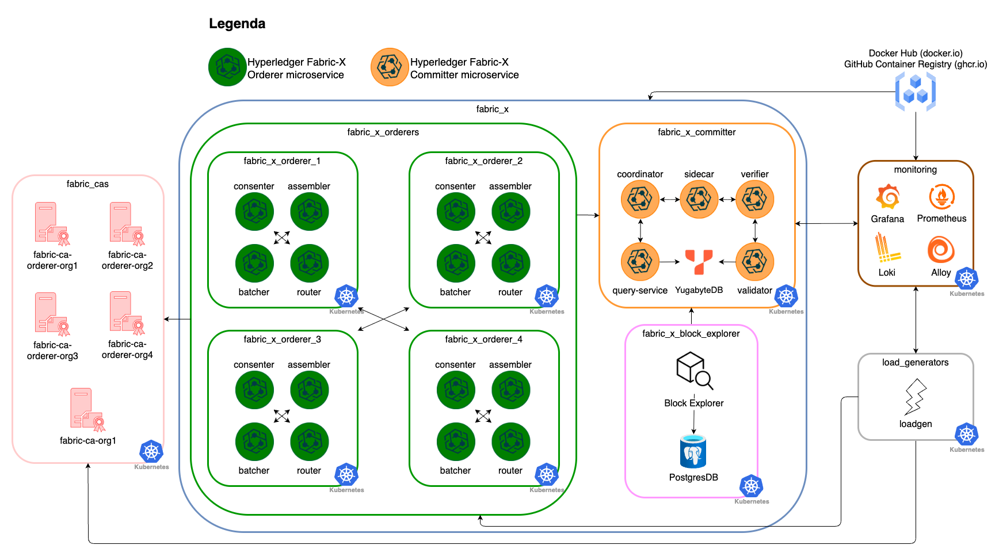
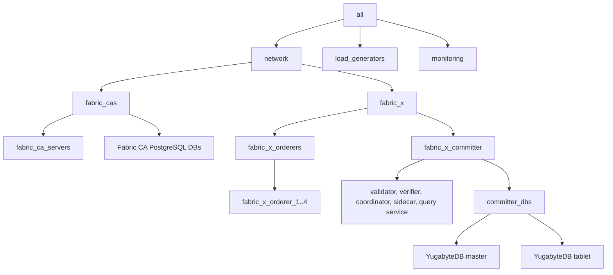

# k8s/fabric-x-yugabyte.yaml

[`fabric-x-yugabyte.yaml`](../../k8s/fabric-x-yugabyte.yaml) deploys the Kubernetes sample with the committer storage layer switched from PostgreSQL to YugabyteDB.

Use it when you need to validate Fabric-X plus YugabyteDB on Kubernetes: workloads, services, NodePort exposure, TLS material, and committer-to-YugabyteDB references.

## Table of Contents <!-- omit in toc -->

- [Network Diagram](#network-diagram)
- [Inventory Details](#inventory-details)

## Network Diagram

The diagram below summarizes this inventory's Fabric-X services and how they fit together.

## Inventory Details

Fabric CA, CA databases, orderer, committer, YugabyteDB, load generator, node exporter, Prometheus, and Grafana use Kubernetes task paths. YugabyteDB master and tablet webserver ports are exposed through fixed NodePorts for inspection.

This inventory deploys these logical services as Kubernetes workloads and services:

- 5 Fabric CA servers and 5 PostgreSQL databases for Fabric CA state.
- 4 orderer groups. Each group has 1 router, 1 consenter, 1 assembler, and 1 batcher.
- 1 committer with validator, verifier, coordinator, sidecar, and query service.
- 1 YugabyteDB master and 1 YugabyteDB tablet in cluster `1`.
- 1 load generator.
- Monitoring with node exporter, Prometheus, and Grafana.

!!! note

    You can scale YugabyteDB for stronger performance by adding more master and tablet hosts. See the [distributed Fabric-X inventory](../distributed/fabric-x.md) for a larger topology with replicated YugabyteDB masters and tablets.

The validator and query service both use `yugabyte_cluster_ref_id: 1`, which points them at the YugabyteDB hosts under `committer_dbs`.

PostgreSQL is still present for Fabric CA state, but the committer database is YugabyteDB. Monitoring omits the PostgreSQL exporter used by PostgreSQL-backed Kubernetes inventories.
