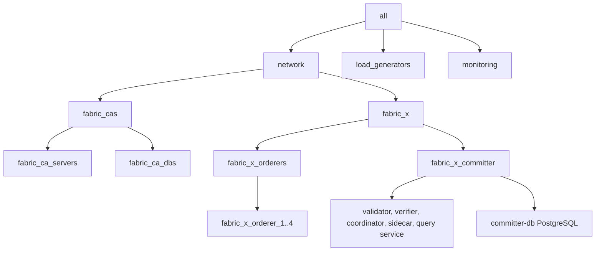

# k8s/fabric-x.yaml

[`fabric-x.yaml`](../../k8s/fabric-x.yaml) is the default Kubernetes sample. It deploys a complete Fabric-X network with Fabric CA, PostgreSQL, TLS, mTLS, and selected NodePort exposure.

Use it as the baseline when validating Kubernetes workloads, services, storage, and externally reachable endpoints.

## Table of Contents <!-- omit in toc -->

- [Network Diagram](#network-diagram)
- [Inventory Details](#inventory-details)

## Network Diagram

The diagram below summarizes this inventory's Fabric-X services and how they fit together.

## Inventory Details

Fabric CA, CA databases, orderer, committer, PostgreSQL, load generator, node exporter, Prometheus, and Grafana use Kubernetes task paths. Ansible still runs from the control node, but inventory hosts represent Kubernetes resources rather than SSH machines.

This inventory deploys these logical services as Kubernetes workloads and services:

- 5 Fabric CA servers and 5 PostgreSQL databases for Fabric CA state.
- 4 orderer groups. Each group has 1 router, 1 consenter, 1 assembler, and 1 batcher.
- 1 committer with validator, verifier, coordinator, sidecar, query service, and PostgreSQL storage.
- 1 load generator.
- Monitoring with node exporter, PostgreSQL exporter, Prometheus, and Grafana.

This is the Kubernetes equivalent of the default local inventory. External-facing services use fixed NodePort values, while internal services stay behind ClusterIP services.

`actual_host` defaults to `K8S_NODE_IP` or `localhost` for services that must be reachable through NodePort.
