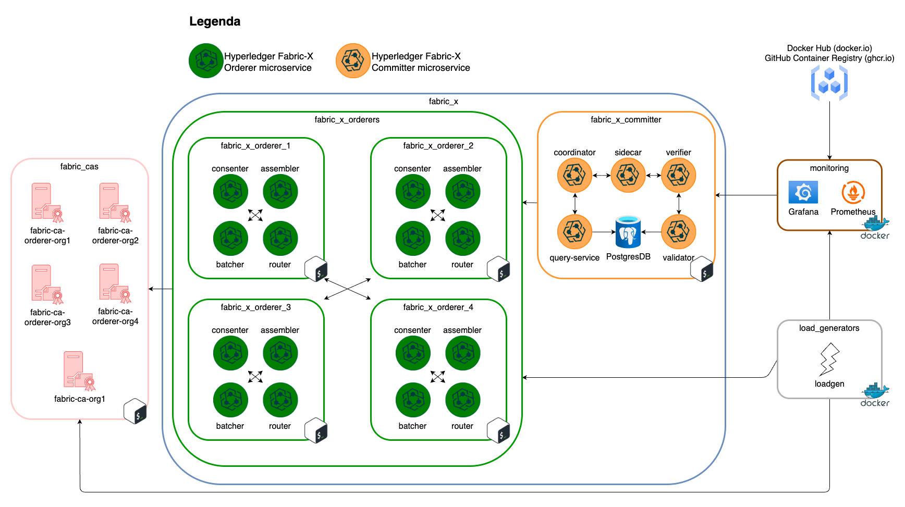
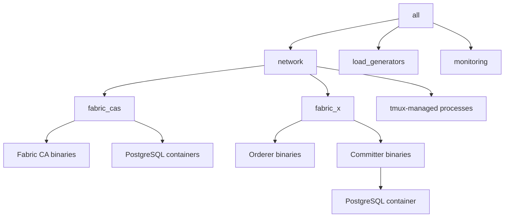

# local/fabric-x-bin.yaml

[`fabric-x-bin.yaml`](../../local/fabric-x-bin.yaml) exercises binary deployment mode for Fabric-X and Fabric CA components on a single machine.

Use it when you want to test install, start, stop, and log handling for local binaries instead of containers.

## Table of Contents <!-- omit in toc -->

- [Network Diagram](#network-diagram)
- [Inventory Specs](#inventory-specs)
- [What Makes This Inventory Different](#what-makes-this-inventory-different)

## Network Diagram

The diagram below summarizes this inventory's Fabric-X services and how they fit together.

## Inventory Specs

Fabric-X, Fabric CA, and the load generator use binary task paths and are managed through `tmux`. PostgreSQL databases still run through container task paths.

This inventory deploys these logical services on the local machine:

- 5 Fabric CA servers as binaries and 5 PostgreSQL databases for Fabric CA state as containers.
- 4 orderer groups. Each group has 1 router, 1 consenter, 1 assembler, and 1 batcher as binaries.
- 1 committer with validator, verifier, coordinator, sidecar, and query service as binaries.
- 1 PostgreSQL committer database as a container.
- 1 load generator as a binary.
- Monitoring with node exporter, PostgreSQL exporter, Prometheus, and Grafana.

## What Makes This Inventory Different

The variables `orderer_use_bin`, `committer_use_bin`, `fabric_ca_server_use_bin`, and `loadgen_use_bin` select binary task paths. `cryptogen_use_bin` and `fabric_ca_client_use_bin` exercise the local helper binaries too.

The security posture matches the default local inventory: Fabric CA, TLS, and mTLS are enabled where supported.
