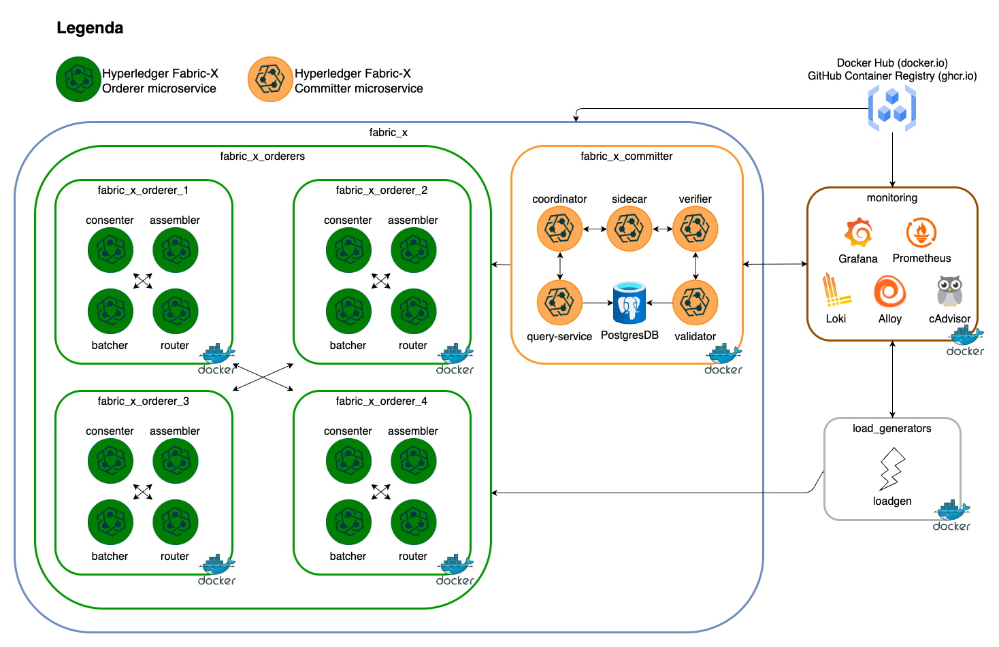
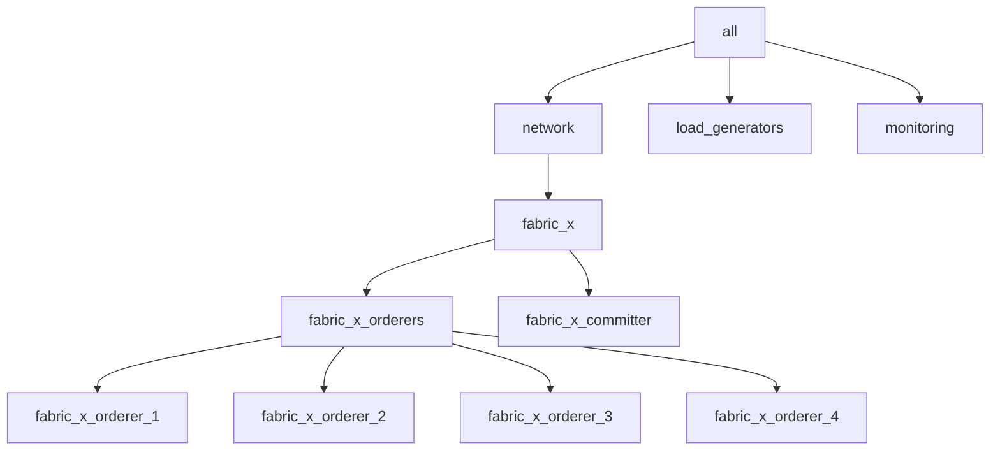

# local/fabric-x-cryptogen.yaml

[`fabric-x-cryptogen.yaml`](../../local/fabric-x-cryptogen.yaml) runs the local container topology without Fabric CA services. Crypto material is generated on the control node with `cryptogen`.

Use it for fast, repeatable local tests where Fabric CA enrollment is not under test.

> [!WARNING]
> This inventory is intended for debugging and repeatable test runs. For production-style deployments, start from the Fabric CA based [`local/fabric-x.yaml`](./fabric-x.md) inventory instead.

## Table of Contents <!-- omit in toc -->

- [Network Diagram](#network-diagram)
- [Inventory Details](#inventory-details)

## Network Diagram

The diagram below summarizes this inventory's Fabric-X services and how they fit together.

## Inventory Details

The Fabric-X services, PostgreSQL, load generator, and monitoring stack run as local containers. `cryptogen` runs on the control node and writes artifacts below `cryptogen_artifacts_dir`.

This inventory deploys these logical services on the local machine:

- No Fabric CA servers or Fabric CA databases.
- 4 orderer groups. Each group has 1 router, 1 consenter, 1 assembler, and 1 batcher.
- 1 committer with validator, verifier, coordinator, sidecar, query service, and PostgreSQL storage.
- 1 load generator.
- Monitoring with node exporter, PostgreSQL exporter, Prometheus, and Grafana.

Fabric CA is omitted entirely. Certificates and keys are generated centrally before the local container services consume them.
