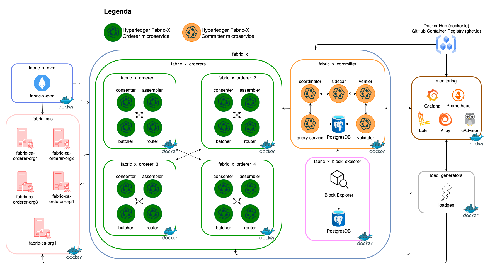

# local/fabric-x-evm.yaml

[`fabric-x-evm.yaml`](../../local/fabric-x-evm.yaml) runs the default local container network with the Fabric-X EVM gateway attached, so Ethereum-style JSON-RPC clients (Hardhat, Foundry, MetaMask) can submit transactions against it.

Use this inventory when you want the baseline single-machine Fabric-X network plus an Ethereum JSON-RPC endpoint.

## Table of Contents <!-- omit in toc -->

- [Network Diagram](#network-diagram)
- [Inventory Details](#inventory-details)
- [Using the JSON-RPC endpoint](#using-the-json-rpc-endpoint)

## Network Diagram

The diagram below summarizes this inventory's Fabric-X services and how they fit together.



## Inventory Details

This inventory deploys the same service layout as the default local sample ([`fabric-x.yaml`](./fabric-x.md)), plus one EVM gateway host:

- 5 Fabric CA servers and 5 PostgreSQL databases for Fabric CA state.
- 4 orderer groups. Each group has 1 router, 1 consenter, 1 assembler, and 1 batcher.
- 1 committer with validator, verifier, coordinator, sidecar, query service, and PostgreSQL storage.
- 1 Block Explorer server and UI with PostgreSQL storage, streaming blocks from the committer sidecar.
- 1 Fabric-X EVM gateway, with an embedded endorser, submitting to every orderer router and synchronizing with the committer sidecar.
- 1 load generator.
- Monitoring with node exporter, PostgreSQL exporter, cAdvisor, Prometheus, Grafana, Loki, and Alloy.

The `fabric-x-evm` host is enrolled with Fabric CA in `Org1` — the same organization already trusted by the committer and orderers — so no additional mTLS trust configuration (`committer_mtls_clients`, `orderer_mtls_clients`/`orderer_mtls_orgs`) is required. It declares one namespace (`basic`, `threshold` policy) under `organization.namespaces`; `fxconfig` creates it during `make init` from the `fabric-x-evm` user's signing certificate.

State is persisted by default (`evm_persist_state: true`): the gateway's block/transaction/log index and the embedded endorser's ledger are written to SQLite files under the host's data directory, so a restart resumes from where it left off instead of re-syncing from block `0`.

## Using the JSON-RPC endpoint

Once started, the gateway serves Ethereum JSON-RPC (and WebSocket, on the same port) at `http://localhost:8545`, chain ID `4011` (`0xfab`):

```shell
curl -s -X POST -H 'Content-Type: application/json' \
  --data '{"jsonrpc":"2.0","id":1,"method":"eth_chainId","params":[]}' \
  http://localhost:8545
```

Point [Foundry](https://book.getfoundry.sh/), [Hardhat](https://hardhat.org/tutorial), or [MetaMask](https://support.metamask.io/configure/networks/how-to-add-a-custom-network-rpc/) at that URL and chain ID — any Solidity tutorial works unchanged, gas is free, and any signing key is accepted. See [hyperledger/fabric-x-evm](https://github.com/hyperledger/fabric-x-evm#build-your-own-contracts) for details and caveats.
