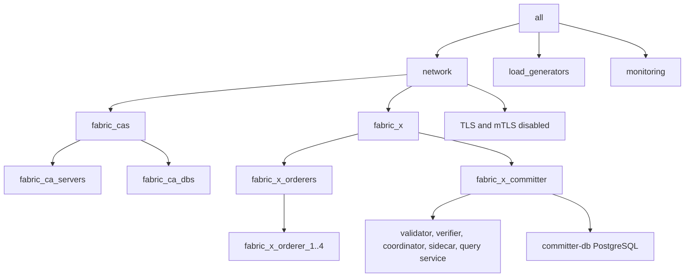

# local/fabric-x-no-tls.yaml

[`fabric-x-no-tls.yaml`](../../local/fabric-x-no-tls.yaml) is the local container sample with TLS and mTLS disabled.

Use it only when plaintext endpoints are deliberate, such as local protocol, connectivity, or compatibility debugging.

> [!WARNING]
> This inventory is meant for debugging only. It disables both TLS encryption and mTLS client authentication.

## Table of Contents <!-- omit in toc -->

- [Network Diagram](#network-diagram)
- [Inventory Details](#inventory-details)

## Network Diagram

The diagram below summarizes this inventory's Fabric-X services and how they fit together.

## Inventory Details

All long-running services run as local containers. Ansible connects locally and uses the same container runtime paths as [`fabric-x.yaml`](./fabric-x.md).

This inventory deploys the same service layout as the default local sample:

- 5 Fabric CA servers and 5 PostgreSQL databases for Fabric CA state.
- 4 orderer groups. Each group has 1 router, 1 consenter, 1 assembler, and 1 batcher.
- 1 committer with validator, verifier, coordinator, sidecar, query service, and PostgreSQL storage.
- 1 load generator.
- Monitoring with node exporter, PostgreSQL exporter, Prometheus, and Grafana.

TLS-related variables are intentionally omitted for Fabric-X, Fabric CA, PostgreSQL, load generator, and monitoring services. Because TLS is disabled, mTLS is disabled as well.
