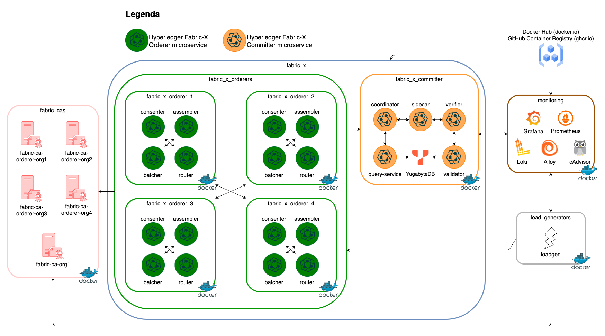
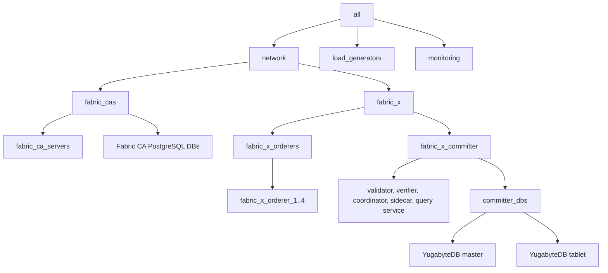

# local/fabric-x-yugabyte.yaml

[`fabric-x-yugabyte.yaml`](../../local/fabric-x-yugabyte.yaml) runs the default local container network with the committer storage layer switched from PostgreSQL to YugabyteDB.

Use it when you want to test the committer against YugabyteDB while keeping Fabric CA enrollment, TLS, mTLS, one load generator, and local monitoring.

## Table of Contents <!-- omit in toc -->

- [Network Diagram](#network-diagram)
- [Inventory Details](#inventory-details)

## Network Diagram

The diagram below summarizes this inventory's Fabric-X services and how they fit together.

## Inventory Details

All long-running services run as local containers. The Fabric CA databases still use PostgreSQL containers, while the committer database is a compact YugabyteDB deployment.

This inventory deploys these logical services on the local machine:

- 5 Fabric CA servers and 5 PostgreSQL databases for Fabric CA state.
- 4 orderer groups. Each group has 1 router, 1 consenter, 1 assembler, and 1 batcher.
- 1 committer with validator, verifier, coordinator, sidecar, and query service.
- 1 YugabyteDB master and 1 YugabyteDB tablet in cluster `1`.
- 1 load generator.
- Monitoring with node exporter, Prometheus, and Grafana.

!!! note

    You can scale YugabyteDB for stronger performance by adding more master and tablet hosts. See the [distributed Fabric-X inventory](../distributed/fabric-x.md) for a larger topology with replicated YugabyteDB masters and tablets.

The validator and query service both reference `yugabyte_cluster_ref_id: 1`, which points them at the YugabyteDB hosts under `committer_dbs`.

PostgreSQL is still present for Fabric CA state, but it is not the committer storage backend. Monitoring omits the PostgreSQL exporter used by PostgreSQL-backed local inventories.
