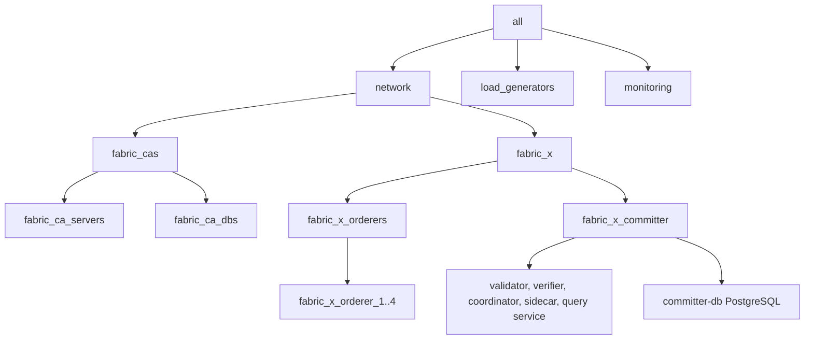

# local/fabric-x.yaml

[`fabric-x.yaml`](../../local/fabric-x.yaml) is the default local sample inventory. It runs a complete Fabric-X network on one machine with containers, Fabric CA enrollment, PostgreSQL, TLS, and mTLS.

Use this inventory first when you want the most representative single-machine deployment.

## Table of Contents <!-- omit in toc -->

- [Network Diagram](#network-diagram)
- [Inventory Specs](#inventory-specs)
- [What Makes This Inventory Different](#what-makes-this-inventory-different)

## Network Diagram

The diagram below summarizes this inventory's Fabric-X services and how they fit together.

## Inventory Specs

All long-running infrastructure services and the load generator run as containers. Ansible connects locally through the environment in [`local/group_vars/all/env.yaml`](../../local/group_vars/all/env.yaml), and deployment state is written below the configured output directory.

This inventory deploys these logical services on the local machine:

- 5 Fabric CA servers and 5 PostgreSQL databases for Fabric CA state.
- 4 orderer groups. Each group has 1 router, 1 consenter, 1 assembler, and 1 batcher.
- 1 committer with validator, verifier, coordinator, sidecar, query service, and PostgreSQL storage.
- 1 load generator.
- Monitoring with node exporter, PostgreSQL exporter, Prometheus, and Grafana.

## What Makes This Inventory Different

This is the baseline local topology. Fabric CA issues identities for the orderer organizations and Org1. Fabric-X services use TLS and mTLS, while Fabric CA, PostgreSQL, load generator, and monitoring traffic use TLS where supported.

The committer validator and query service use the PostgreSQL host `committer-db`.
