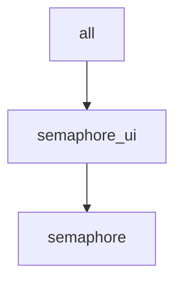

# local/semaphore-ui.yaml

[`semaphore-ui.yaml`](../../local/semaphore-ui.yaml) deploys a standalone Semaphore UI instance on the local control node.

Unlike the other sample inventories under [`local/`](../../local/), this is not a Fabric-X network sample. Semaphore UI is a general automation controller for this collection's playbooks and inventories, deployed independently through the [`semaphore_ui`](../../../../roles/semaphore_ui/README.md) role and its [companion playbooks](../../../../playbooks/semaphore_ui/README.md).

## Table of Contents <!-- omit in toc -->

- [Topology](#topology)
- [Inventory Details](#inventory-details)

## Topology



## Inventory Details

A single logical host, `semaphore`, represents the Semaphore UI deployment:

- `semaphore_ui_use_tls: true` enables Semaphore UI's own native HTTPS listener with a self-signed certificate.
- Kept in its own dedicated inventory, separate from every network inventory, so Semaphore UI can drive many inventories/playbooks and is never a host that a network `teardown`/`wipe` could stop.

Run the lifecycle playbooks directly against this inventory, for example:

```shell
ansible-playbook -i examples/inventory/local/semaphore-ui.yaml hyperledger.fabricx.semaphore_ui.start
```

See the [playbooks/semaphore_ui README](../../../../playbooks/semaphore_ui/README.md) for the full lifecycle (binaries, generate_crypto, configs, start, stop, teardown, wipe) and how to access the deployed instance.
