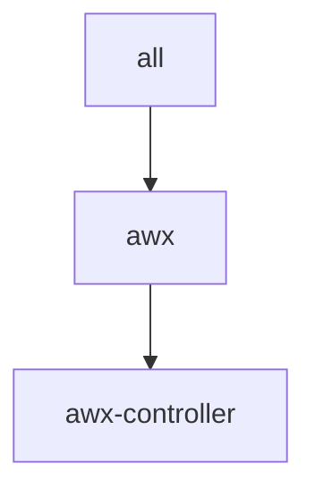

# openshift/awx.yaml

[`awx.yaml`](../../openshift/awx.yaml) deploys a standalone AWX (Ansible automation controller) instance on OpenShift.

Unlike the other sample inventories under [`openshift/`](../../openshift/), this is not a Fabric-X network sample. AWX is a general automation controller, deployed independently through the [`awx`](../../../../roles/awx/README.md) role and its [companion playbooks](../../../../playbooks/awx/README.md).

> [!WARNING]
> Supported only on CRC (CodeReady Containers). The AWX Operator installs cluster-scoped resources (CRDs, ClusterRoles, ClusterRoleBindings), which requires cluster-admin rights on the target cluster.

## Table of Contents <!-- omit in toc -->

- [Topology](#topology)
- [Inventory Details](#inventory-details)

## Topology



## Inventory Details

A single logical host, `awx-controller`, represents the AWX deployment:

- `awx_use_openshift: true` selects the OpenShift task path, which builds on the Kubernetes path and additionally publishes an OpenShift Route.
- `awx_openshift_route` and `awx_restore_openshift_route` derive their hostnames from `openshift_apps_domain`, the same cluster ingress domain used by the other OpenShift samples (defaults to `apps-crc.testing` on CRC).
- `awx_postgres_fix_pvc_permissions: true` and `awx_postgres_security_context_settings.runAsUser: 26` work around storage provisioners that don't apply correct PVC ownership on mount, which is common on CRC's default storage.
- `awx_restore_name: awx` restores in place by default, reusing the same Route without a naming conflict.

Run the lifecycle playbooks directly against this inventory, for example:

```shell
ansible-playbook -i examples/inventory/openshift/awx.yaml hyperledger.fabricx.awx.start
```

See the [playbooks/awx README](../../../../playbooks/awx/README.md) for the full lifecycle (start, teardown, wipe, backup, restore) and how to retrieve the generated admin credentials.
