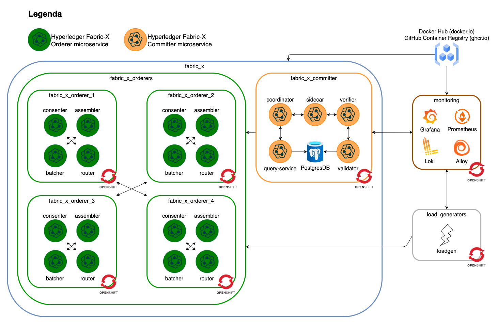
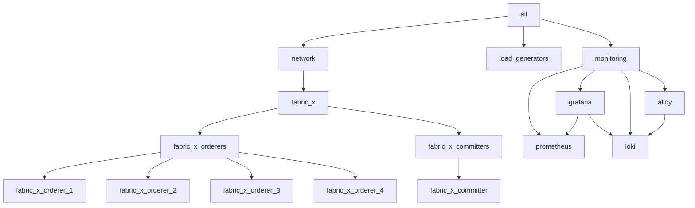

# openshift/fabric-x-cryptogen.yaml

[`fabric-x-cryptogen.yaml`](../../openshift/fabric-x-cryptogen.yaml) deploys the OpenShift sample without Fabric CA services. Crypto material is generated on the control node with `cryptogen`.

Use it for repeatable OpenShift tests that should not exercise Fabric CA enrollment or Kubernetes NodePort exposure.

> [!WARNING]
> This inventory is intended for debugging and repeatable test runs. For production-style deployments, start from a Fabric CA based inventory instead.

## Table of Contents <!-- omit in toc -->

- [Network Diagram](#network-diagram)
- [Inventory Details](#inventory-details)

## Network Diagram

The diagram below summarizes this inventory's Fabric-X services and how they fit together.

## Inventory Details

Orderer, committer, PostgreSQL, load generator, Prometheus, Grafana, Loki, and Alloy use OpenShift task paths. `cryptogen` runs on the control node and writes artifacts below `cryptogen_artifacts_dir`. Node Exporter is not deployed on OpenShift; node-level metrics come from the OpenShift platform monitoring stack.

This inventory deploys these logical services as OpenShift workloads, services, and routes:

- No Fabric CA servers or Fabric CA databases.
- 4 orderer groups. Each group has 1 router, 1 consenter, 1 assembler, and 1 batcher.
- 1 committer with validator, verifier, coordinator, sidecar, query service, and PostgreSQL storage.
- 1 load generator.
- Monitoring with PostgreSQL exporter, Prometheus, Grafana, Loki, Alloy, and OpenShift platform monitoring for node-level metrics.

> [!NOTE]
> If OpenShift routes map to `127.0.0.1`, binary CLIs can still work, but containerized binaries may fail because `127.0.0.1` is resolved inside the container network namespace. Run `make oc-config-hosts` (requires `sudo`) to setup the routes in `/etc/hosts` before starting Fabric-X.

Fabric CA is omitted entirely. Certificates and keys are generated centrally before OpenShift-backed component configuration consumes them.
