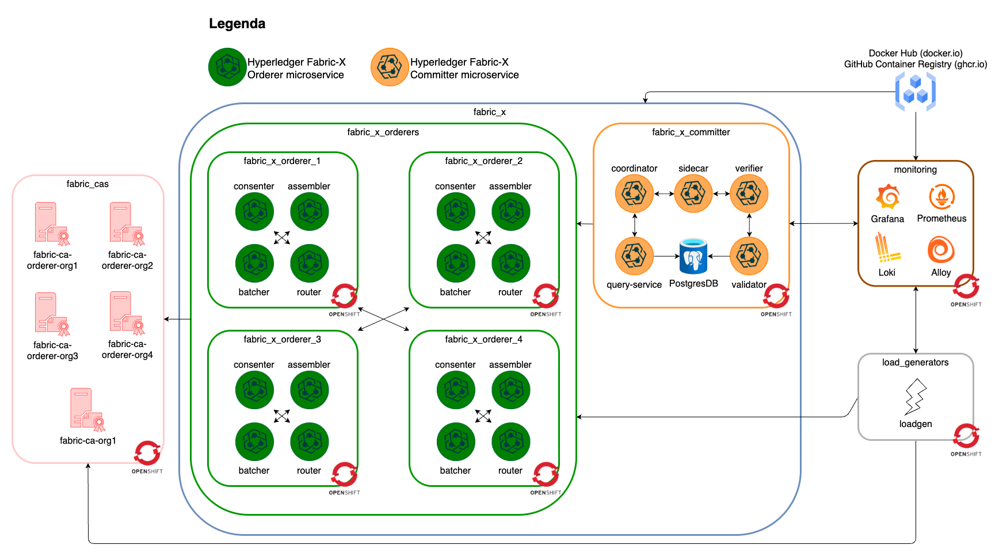
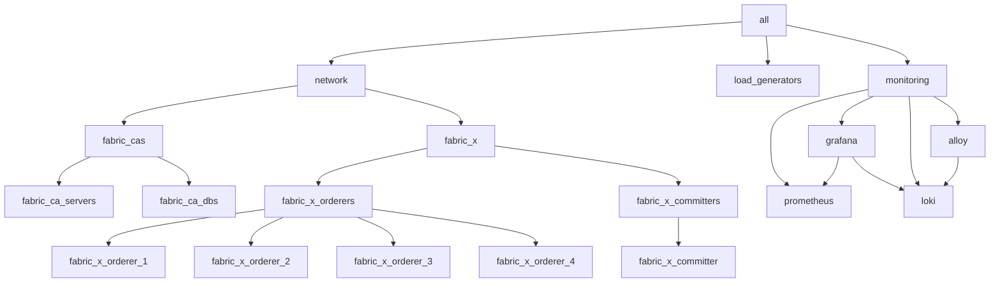

# openshift/fabric-x.yaml

[`fabric-x.yaml`](../../openshift/fabric-x.yaml) is the default OpenShift sample. It deploys a complete Fabric-X network with Fabric CA, PostgreSQL, TLS, mTLS, and OpenShift Route exposure.

Use it as the baseline when validating OpenShift workloads, services, storage, and externally reachable endpoints. Fabric CA servers are exposed via OpenShift Routes instead of Kubernetes NodePorts.

## Table of Contents <!-- omit in toc -->

- [Network Diagram](#network-diagram)
- [Inventory Details](#inventory-details)

## Network Diagram

The diagram below summarizes this inventory's Fabric-X services and how they fit together.

## Inventory Details

Fabric CA, CA databases, orderer, committer, PostgreSQL, load generator, node exporter, Prometheus, Grafana, Loki, and Alloy use OpenShift task paths. Ansible still runs from the control node, but inventory hosts represent OpenShift resources rather than SSH machines.

This inventory deploys these logical services as OpenShift workloads, services, and routes:

- 5 Fabric CA servers and 5 PostgreSQL databases for Fabric CA state.
- 4 orderer groups. Each group has 1 router, 1 consenter, 1 assembler, and 1 batcher.
- 1 committer with validator, verifier, coordinator, sidecar, query service, and PostgreSQL storage.
- 1 load generator.
- Monitoring with node exporter, PostgreSQL exporter, Prometheus, Grafana, Loki, and Alloy.

> [!NOTE]
> If OpenShift routes map to `127.0.0.1`, binary CLIs can still work, but containerized binaries may fail because `127.0.0.1` is resolved inside the container network namespace. Run `make oc-config-hosts` (requires `sudo`) to setup the routes in `/etc/hosts` before starting Fabric-X.

This is the OpenShift equivalent of the default Kubernetes inventory. External-facing services use OpenShift Routes, while internal services stay behind ClusterIP services.
