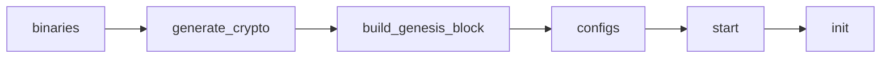

# Hyperledger Fabric-X Ansible Playbooks

This directory contains the reusable playbooks that the `hyperledger.fabricx` collection provides. They compose the collection roles into standard Fabric-X lifecycle operations and are the building blocks for any Ansible project that deploys a Fabric-X network.

Each playbook is importable by its fully-qualified collection name:

```yaml
- name: Start Fabric-X orderer components
  ansible.builtin.import_playbook: hyperledger.fabricx.orderer.start
```

## Table of Contents <!-- omit in toc -->

- [Lifecycle Order](#lifecycle-order)
- [Top-Level Utility Playbooks](#top-level-utility-playbooks)
  - [install\_prerequisites](#install_prerequisites)
  - [log\_in\_container\_registry](#log_in_container_registry)
  - [create\_container\_networks](#create_container_networks)
  - [remove\_container\_networks](#remove_container_networks)
  - [generate\_target\_hosts](#generate_target_hosts)
- [Namespaced playbooks](#namespaced-playbooks)
- [Targeting a Subset of Hosts](#targeting-a-subset-of-hosts)

## Lifecycle Order

The playbooks cover two phases: setup (run once before the network starts) and runtime (repeated as needed). The order within the setup phase is a hard dependency chain.



- **binaries** — Components need binaries or container image paths before configuration can reference them.
- **generate_crypto** — Identities and certificates must exist before any configuration is generated.
- **build_genesis_block** — Orderer and committer configuration depends on the channel genesis material.
- **configs** — Runtime configuration must be generated and distributed before services start.
- **start** — Services are launched after all runtime inputs exist.
- **init** — Post-start actions (such as namespace creation) run only after the relevant endpoints are reachable.

## Top-Level Utility Playbooks

The following playbooks live directly under `playbooks/` because they are not scoped to one component namespace.

### install_prerequisites

**Import path:** `hyperledger.fabricx.install_prerequisites`

Install container engine, tmux, OpenSSL, Git, Go, and required OS packages on target machines. Selects one host per physical machine to avoid duplicate package operations.

```yaml
- name: Prepare all machines
  ansible.builtin.import_playbook: hyperledger.fabricx.install_prerequisites
```

### log_in_container_registry

**Import path:** `hyperledger.fabricx.log_in_container_registry`

Authenticate container engines against a registry and create Kubernetes image pull secrets where needed.

```yaml
- name: Log in to container registry
  ansible.builtin.import_playbook: hyperledger.fabricx.log_in_container_registry
```

### create_container_networks

**Import path:** `hyperledger.fabricx.create_container_networks`

Create per-machine container networks as defined in the inventory. Run before `start` for container-based deployments.

```yaml
- name: Create container networks
  ansible.builtin.import_playbook: hyperledger.fabricx.create_container_networks
```

### remove_container_networks

**Import path:** `hyperledger.fabricx.remove_container_networks`

Remove the container networks created for the deployment.

```yaml
- name: Remove container networks
  ansible.builtin.import_playbook: hyperledger.fabricx.remove_container_networks
```

### generate_target_hosts

**Import path:** `hyperledger.fabricx.generate_target_hosts`

Emit a host-list file from the inventory for downstream tooling.

```yaml
- name: Generate target hosts file
  ansible.builtin.import_playbook: hyperledger.fabricx.generate_target_hosts
```

## Namespaced playbooks

Each subdirectory groups playbooks for one component family. Click the namespace name to see the full list of playbooks and their import paths.

| Namespace                                        | Description                                                                                                                              |
| ------------------------------------------------ | ---------------------------------------------------------------------------------------------------------------------------------------- |
| [artifacts](./artifacts/README.md)               | Generates network-wide crypto material and the genesis block on the control node. Not tied to a remote host group.                       |
| [fabric_ca_server](./fabric_ca_server/README.md) | Operates Fabric CA servers and their PostgreSQL databases: start, enroll admins, register identities, stop, teardown, and wipe.          |
| [fabric_ca_client](./fabric_ca_client/README.md) | Prepares the Fabric CA client binary used by enrollment and registration tasks.                                                          |
| [orderer](./orderer/README.md)                   | Operates Fabric-X orderer components (routers, batchers, consenters, assemblers) targeting the `fabric_x_orderers` group.                |
| [committer](./committer/README.md)               | Operates Fabric-X committer services and their PostgreSQL or YugabyteDB backend targeting the `fabric_x_committer` group.                |
| [fxconfig](./fxconfig/README.md)                 | Builds, endorses, and submits Fabric-X configuration transactions including namespace creation. Run after `start` during initialization. |
| [loadgen](./loadgen/README.md)                   | Operates load generators: start, stop, reconfigure submission rate at runtime, collect metrics and logs.                                 |
| [monitoring](./monitoring/README.md)             | Operates observability components: Prometheus, Grafana, node exporter, PostgreSQL exporter, Elasticsearch, and Jaeger.                   |
| [yugabyte](./yugabyte/README.md)                 | Standalone TLS certificate generation for YugabyteDB clusters. Most YugabyteDB lifecycle is handled through the `committer` namespace.   |

## Targeting a Subset of Hosts

All playbooks accept a `target_hosts` variable that restricts execution to a subset of the inventory group. Pass it as an extra variable when importing:

```yaml
- name: Restart only the orderer assemblers
  vars:
    target_hosts: fabric_x_orderer_1
  ansible.builtin.import_playbook: hyperledger.fabricx.orderer.start
```
