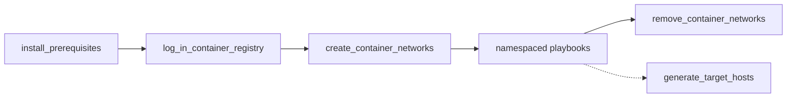

# Hyperledger Fabric-X Ansible Playbooks

This directory contains the reusable playbooks that the `hyperledger.fabricx` collection provides. They compose the collection roles into standard Fabric-X lifecycle operations and are the building blocks for any Ansible project that deploys a Fabric-X network.

Each playbook can be run by its fully-qualified collection name:

```shell
ansible-playbook hyperledger.fabricx.orderer.start
```

It can also be imported by another playbook:

```yaml
- name: Start Fabric-X orderer components
  ansible.builtin.import_playbook: hyperledger.fabricx.orderer.start
```

The top-level playbooks prepare shared host resources around the component-specific lifecycle. The normal setup flow runs prerequisites first, logs in to registries when private images are used, creates container networks for container-mode inventories, and then runs the namespaced playbooks for artifacts, configuration, services, and cleanup.



## install_prerequisites.yaml

[`install_prerequisites.yaml`](./install_prerequisites.yaml) prepares the machines that will run Fabric-X services. It first selects one representative inventory host per physical machine, then installs the shared operating-system and runtime prerequisites used by the rest of the collection: container engine support, tmux, OpenSSL, Git, Go, rsync, and chrony.

```shell
ansible-playbook hyperledger.fabricx.install_prerequisites --extra-vars '{"target_hosts": "all"}'
```

Properties:

- Target hosts: `all` by default for host discovery, then the generated `machines` group for installation.
- Nuance: only one representative host per physical machine installs packages, which avoids repeating package operations when several inventory hosts map to the same `ansible_host`.
- Nuance: use `target_hosts` to prepare only a subset of the inventory.

## log_in_container_registry.yaml

[`log_in_container_registry.yaml`](./log_in_container_registry.yaml) authenticates the deployment against a private container registry. It logs the container engine in once per physical machine, then creates Kubernetes image pull secrets once per selected Kubernetes namespace when Kubernetes hosts are present.

```shell
ansible-playbook hyperledger.fabricx.log_in_container_registry --extra-vars '{"target_hosts": "all"}'
```

Properties:

- Target hosts: `all` by default for host and namespace discovery, then the generated `machines` and `k8s_namespaces` groups for the actual login and pull-secret steps.
- Nuance: requires the registry variables consumed by the container and Kubernetes roles, including `container_registry`, `container_registry_username`, and `container_registry_password`.
- Nuance: useful before starting container or Kubernetes deployments that pull private images.

## create_container_networks.yaml

[`create_container_networks.yaml`](./create_container_networks.yaml) creates the container networks declared by the selected inventory hosts. It deduplicates work by building one execution target per `(ansible_host, container_network)` pair, so each required network is created once on each machine that needs it.

```shell
ansible-playbook hyperledger.fabricx.create_container_networks --extra-vars '{"target_hosts": "all"}'
```

Properties:

- Target hosts: `localhost` for discovery, then the generated `machines_with_container_networks` group for network creation.
- Nuance: only hosts with `container_network` defined contribute a network target.
- Nuance: run this before starting container-mode deployments that expect a pre-created network.

## remove_container_networks.yaml

[`remove_container_networks.yaml`](./remove_container_networks.yaml) removes the container networks that were created for the selected inventory hosts. It uses the same `(ansible_host, container_network)` deduplication as the create playbook, which makes cleanup operate once per machine and network.

```shell
ansible-playbook hyperledger.fabricx.remove_container_networks --extra-vars '{"target_hosts": "all"}'
```

Properties:

- Target hosts: `localhost` for discovery, then the generated `machines_with_container_networks` group for network removal.
- Nuance: only hosts with `container_network` defined contribute a network target.
- Nuance: run this after component teardown when the deployment no longer needs its container networks.

## generate_target_hosts.yaml

[`generate_target_hosts.yaml`](./generate_target_hosts.yaml) regenerates the Makefile helper targets for the selected inventory. It reads `groups['all']` and writes `target_hosts.mk` under `project_dir`, giving the top-level `Makefile` one target per inventory host that maps to `TARGET_HOSTS`.

```shell
ansible-playbook hyperledger.fabricx.generate_target_hosts
```

Properties:

- Target hosts: `localhost`.
- Nuance: writes `target_hosts.mk` to `project_dir`.
- Nuance: normally used by `make targets`, but it can be run directly after inventory changes when you want the generated host-specific Makefile targets refreshed.

## Namespaced Playbooks

Namespaced playbooks are collections of playbooks tailored for a specific group of hosts:

| Namespace                                        | Description                                                                                                                              |
| ------------------------------------------------ | ---------------------------------------------------------------------------------------------------------------------------------------- |
| [artifacts](./artifacts/README.md)               | Generates network-wide crypto material and the genesis block on the control node. Not tied to a remote host group.                       |
| [fabric_ca_server](./fabric_ca_server/README.md) | Operates Fabric CA servers and their PostgreSQL databases: start, enroll admins, register identities, stop, teardown, and wipe.          |
| [fabric_ca_client](./fabric_ca_client/README.md) | Prepares the Fabric CA client binary used by enrollment and registration tasks.                                                          |
| [orderer](./orderer/README.md)                   | Operates Fabric-X orderer components (routers, batchers, consenters, assemblers) targeting the `fabric_x_orderers` group.                |
| [committer](./committer/README.md)               | Operates Fabric-X committer services and their PostgreSQL or YugabyteDB backend targeting the `fabric_x_committer` group.                |
| [fxconfig](./fxconfig/README.md)                 | Builds, endorses, and submits Fabric-X configuration transactions including namespace creation. Run after `start` during initialization. |
| [loadgen](./loadgen/README.md)                   | Operates load generators: start, stop, reconfigure submission rate at runtime, collect metrics and logs.                                 |
| [monitoring](./monitoring/README.md)             | Operates observability components: Prometheus, Grafana, node exporter, PostgreSQL exporter, Elasticsearch, and Jaeger.                   |
| [yugabyte](./yugabyte/README.md)                 | Standalone TLS certificate generation for YugabyteDB clusters. Most YugabyteDB lifecycle is handled through the `committer` namespace.   |
