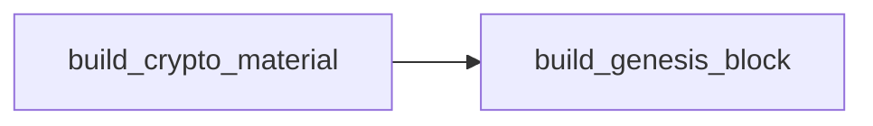

# Artifact Playbooks

The `artifacts` playbooks generate network-wide material on the control node. They are normally run by the example setup flow, but can also be imported directly when composing your own orchestration.



## build_crypto_material.yaml

[`build_crypto_material.yaml`](./build_crypto_material.yaml) is the control-node path for inventories that use centrally generated `cryptogen` material. It inspects the selected inventory, groups orderer and peer-style identities by organization, renders the `cryptogen` input, prepares the `cryptogen` binary if needed, runs generation, and stores the resulting MSP/TLS material in the configured artifacts directory.

```shell
ansible-playbook hyperledger.fabricx.artifacts.build_crypto_material
```

Properties:

- Target hosts: `localhost`.
- Nuance: this is the `cryptogen` path. It is most relevant for inventories that intentionally use centrally generated test material, such as the `*-cryptogen.yaml` samples and the distributed performance reference. Fabric CA based inventories normally enroll identities through the [Fabric CA playbooks](../fabric_ca_server/README.md) instead.

## build_genesis_block.yaml

[`build_genesis_block.yaml`](./build_genesis_block.yaml) creates the channel bootstrap material shared by the network. It derives orderer organizations and endpoints from `fabric_x_orderers`, renders Armageddon and configtxgen configuration, prepares `configtxgen` when needed, and writes the genesis block artifacts consumed later by configuration, orderer, and committer setup.

```shell
ansible-playbook hyperledger.fabricx.artifacts.build_genesis_block
```

Properties:

- Target hosts: `localhost`.
- Nuance: reads `groups['fabric_x_orderers']` and organization metadata from the selected inventory to build orderer channel material.
