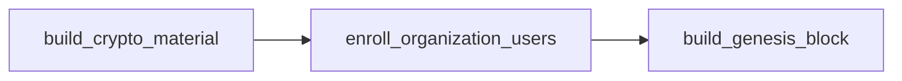

# Artifact Playbooks

The `artifacts` playbooks generate network-wide material on the control node. They are normally run by the example setup flow, but can also be imported directly when composing your own orchestration.

## Table of Contents <!-- omit in toc -->

- [Playbooks flow](#playbooks-flow)
- [build\_crypto\_material.yaml](#build_crypto_materialyaml)
- [enroll\_organization\_users.yaml](#enroll_organization_usersyaml)
- [build\_genesis\_block.yaml](#build_genesis_blockyaml)

## Playbooks flow


```mermaid
flowchart LR
  CRYPTO[build_crypto_material] --> ENROLL[enroll_organization_users] --> GENESIS[build_genesis_block]
```

## build_crypto_material.yaml

[`build_crypto_material.yaml`](./build_crypto_material.yaml) is the control-node path for inventories that use centrally generated `cryptogen` material. It inspects the selected inventory, groups orderer and peer-style identities by organization, renders the `cryptogen` input, prepares the `cryptogen` binary if needed, runs generation, and stores the resulting MSP/TLS material in the configured artifacts directory.

```shell
ansible-playbook hyperledger.fabricx.artifacts.build_crypto_material
```

Properties:

- Target hosts: `localhost`.
- Nuance: this is the `cryptogen` path. It is most relevant for inventories that intentionally use centrally generated test material, such as the `*-cryptogen.yaml` samples and the distributed performance reference. Fabric CA based inventories normally enroll identities through the [Fabric CA playbooks](../fabric_ca_server/README.md) instead.

## enroll_organization_users.yaml

[`enroll_organization_users.yaml`](./enroll_organization_users.yaml) is the Fabric CA counterpart of the cryptogen path. For every organization whose `organization.user` is an admin and whose hosts are backed by Fabric CA, it registers and enrolls that identity on the organization's CA host and fetches the MSP and TLS material to the control node in the cryptogen layout.

```shell
ansible-playbook hyperledger.fabricx.artifacts.enroll_organization_users
```

Properties:

- Target hosts: `localhost`, delegating each enrollment to the organization's `fabric_ca_host`.
- Nuance: runs after the Fabric CA identities are registered (`fabric_ca_server.register_identities`). Only admin users are enrolled; other users are provisioned by the roles that consume them.

## build_genesis_block.yaml

[`build_genesis_block.yaml`](./build_genesis_block.yaml) creates the channel bootstrap material shared by the network. It derives orderer organizations and endpoints from `fabric_x_orderers`, renders Armageddon and configtxgen configuration, prepares `configtxgen` when needed, and writes the genesis block artifacts consumed later by configuration, orderer, and committer setup.

```shell
ansible-playbook hyperledger.fabricx.artifacts.build_genesis_block
```

Properties:

- Target hosts: `localhost`.
- Nuance: reads `groups['fabric_x_orderers']` and organization metadata from the selected inventory to build orderer channel material.
