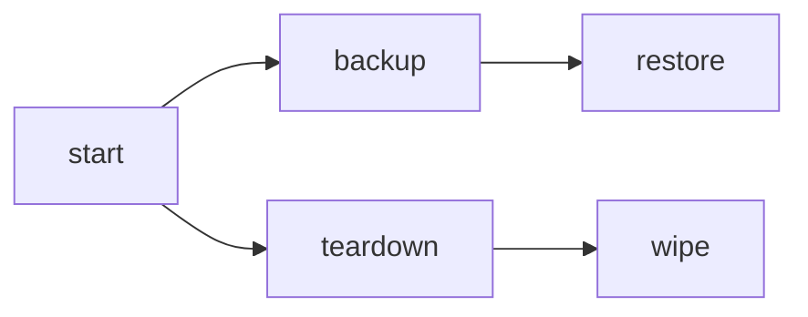

# AWX Playbooks

The `awx` playbooks operate AWX through the same lifecycle used by the rest of this collection. AWX has no `stop` operation: an AWX Operator deployment cannot be meaningfully paused in place, so use `teardown` instead.

## Table of Contents <!-- omit in toc -->

- [Operational model](#operational-model)
- [Playbooks flow](#playbooks-flow)
- [start.yaml](#startyaml)
- [teardown.yaml](#teardownyaml)
- [wipe.yaml](#wipeyaml)
- [backup.yaml](#backupyaml)
- [restore.yaml](#restoreyaml)
- [Accessing AWX](#accessing-awx)
- [Observing AWX](#observing-awx)

## Operational model

AWX is managed by the AWX Operator. This role installs and removes the AWX Operator as part of the AWX lifecycle on both Kubernetes and OpenShift — OpenShift support builds directly on top of the Kubernetes flow and additionally publishes an OpenShift route through `hyperledger.fabricx.openshift`. Installing the operator requires the ability to create cluster-scoped resources (CRDs, ClusterRoles, ClusterRoleBindings) in the target cluster.

The generated role README ([`roles/awx/README.md`](../../roles/awx/README.md)) documents all role variables. This playbook README explains how to operate the deployed AWX instance.

## Playbooks flow



## start.yaml

[`start.yaml`](./start.yaml) starts AWX on Kubernetes or OpenShift based on inventory variables:

- `awx_use_k8s: true` uses Kubernetes resources.
- `awx_use_openshift: true` uses Kubernetes resources and publishes an OpenShift route.

```shell
ansible-playbook hyperledger.fabricx.awx.start --extra-vars '{"target_hosts": "awx"}'
```

Properties:

- Target hosts: `awx` by default.
- For Kubernetes, define `awx_k8s_node_port` in the inventory to expose the AWX service outside the cluster.
- After a successful start, the playbook computes AWX's effective address (`tasks_from: effective_address`) and prints the URL, username, and password. The URL is derived automatically, in priority order, from the OpenShift route (`awx_openshift_route`), the Kubernetes NodePort (`awx_k8s_node_port`), or the ClusterIP port (`awx_port`) — no inventory variable needs to be set for the URL itself.

## teardown.yaml

[`teardown.yaml`](./teardown.yaml) removes the AWX custom resource, its residual namespaced workloads (Deployments, StatefulSets, Jobs, Services), and the PostgreSQL/backup persistent volume claims — the next `start` reconciles a fresh database.

```shell
ansible-playbook hyperledger.fabricx.awx.teardown --extra-vars '{"target_hosts": "awx"}'
```

Properties:

- Target hosts: `awx` by default.
- Never removes the namespace itself, since it may be shared with other components.
- The AWX Operator and its cluster-scoped resources are preserved (removed only by `wipe`).
- Secrets and ConfigMaps are preserved across teardown: the AWX Operator reuses the existing `<name>-secret-key` and `<name>-admin-password` Secrets on the next `start` instead of regenerating them — losing them would rotate the database encryption key and reset the admin password on every teardown/start cycle.
- One exception: `<name>-<deployment_type>-configmap` (for example `awx-awx-configmap`) is owned by the AWX custom resource via a Kubernetes owner reference, so it is garbage-collected automatically when the custom resource is deleted. This is expected and harmless: the Operator regenerates it from the AWX spec on the next `start`, and unlike the Secrets above it carries no state.

## wipe.yaml

[`wipe.yaml`](./wipe.yaml) runs the `teardown` tasks and then additionally removes AWX Secrets, ConfigMaps, the AWX Operator, its CRDs, and the rendered operator kustomization artifacts — on both Kubernetes and OpenShift, since this role manages the operator on both platforms.

```shell
ansible-playbook hyperledger.fabricx.awx.wipe --extra-vars '{"target_hosts": "awx"}'
```

Properties:

- Target hosts: `awx` by default.
- Preserves the namespace, since it may be shared with other components.

## backup.yaml

[`backup.yaml`](./backup.yaml) creates an `AWXBackup` resource and waits until it reaches a terminal status. On success, it reports the backup PVC and backup directory reported by the operator.

```shell
ansible-playbook hyperledger.fabricx.awx.backup --extra-vars '{"target_hosts": "awx"}'
```

Properties:

- Target hosts: `awx` by default.
- The AWX Operator already provisions the backup persistent volume — `awx_postgres_fix_pvc_permissions` does not create or resize it. It exists because some storage provisioners (for example `local-path-provisioner`, or plain `hostPath` PVs) don't reliably apply `fsGroup`/security-context ownership on mount, so a volume ends up owned by root while the backup pod runs as UID 26 and fails to start. Default is `false`; on managed clusters `fsGroup` is normally honored and it isn't needed.

## restore.yaml

[`restore.yaml`](./restore.yaml) validates the backup, removes the target AWX resource and target PostgreSQL PVC, creates an `AWXRestore` resource, waits for the restored deployment, and computes the restored URL and admin credentials.

```shell
ansible-playbook hyperledger.fabricx.awx.restore --extra-vars '{"target_hosts": "awx"}'
```

Properties:

- Target hosts: `awx` by default.
- Set `awx_restore_name` to the same value as the source instance to restore in place and reuse the existing NodePort/route without a service port conflict.
- After a successful restore, the playbook prints the restored admin URL and password to task output.
- `awx_new_admin_credential` is only used as a fallback if the restored instance's admin-password Secret is missing a password. It has no default; supply a vaulted or otherwise secret-managed value.

## Accessing AWX

The default AWX username is `admin`. The `start` and `restore` playbooks print the admin URL and password to task output.

If you need to retrieve the password separately, read it from the AWX admin password secret.

For Kubernetes:

```shell
kubectl -n <namespace> get secret awx-admin-password -o jsonpath='{.data.password}' | base64 --decode; echo
```

For OpenShift:

```shell
oc -n <namespace> get secret awx-admin-password -o jsonpath='{.data.password}' | base64 --decode; echo
```

For restored instances, the secret name follows the restored AWX resource name:

```shell
<awx_restore_name>-admin-password
```

## Observing AWX

Use the AWX custom resource, pods, services, PVCs, and routes to understand whether the operator has reconciled the deployment.

For Kubernetes:

```shell
kubectl -n <namespace> get awx,pods,pvc,svc
kubectl -n <namespace> logs deploy/awx-operator-controller-manager -c awx-manager --tail=200
```

For OpenShift:

```shell
oc -n <namespace> get awx,pods,pvc,svc,route
oc -n <namespace> get route awx
oc -n <namespace> logs deploy/awx-operator-controller-manager -c awx-manager --tail=200
```
