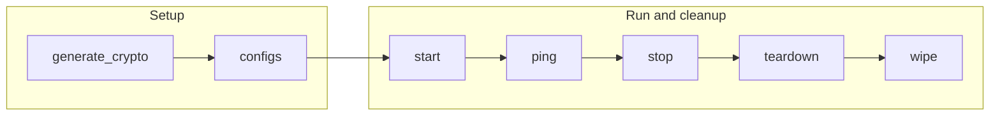

# Block Explorer Playbooks

The `block_explorer` playbooks operate the Fabric-X Block Explorer: the PostgreSQL storage backend and the combined server/UI container that streams blocks from the committer sidecar and serves the Next.js UI.

## Table of Contents <!-- omit in toc -->

- [Playbooks flow](#playbooks-flow)
- [generate\_crypto.yaml](#generate_cryptoyaml)
- [configs.yaml](#configsyaml)
- [start.yaml](#startyaml)
- [stop.yaml](#stopyaml)
- [teardown.yaml](#teardownyaml)
- [wipe.yaml](#wipeyaml)
- [ping.yaml](#pingyaml)
- [fetch\_crypto.yaml](#fetch_cryptoyaml)
- [fetch\_logs.yaml](#fetch_logsyaml)

## Playbooks flow



## generate_crypto.yaml

[`generate_crypto.yaml`](./generate_crypto.yaml) prepares PostgreSQL TLS material and, when the committer sidecar requires mTLS, a self-signed client certificate for the Block Explorer server.

```shell
ansible-playbook hyperledger.fabricx.block_explorer.generate_crypto --extra-vars '{"target_hosts": "fabric_x_block_explorer"}'
```

Properties:

- Target hosts: `fabric_x_block_explorer` by default.
- Nuance: the client certificate is generated only when the host named by `sidecar_host` has `committer_use_mtls: true`; there is no local TLS toggle for this.

## configs.yaml

[`configs.yaml`](./configs.yaml) renders the Block Explorer server configuration from the `sidecar_host` and `postgres_db_host` connection details declared in inventory.

```shell
ansible-playbook hyperledger.fabricx.block_explorer.configs --extra-vars '{"target_hosts": "fabric_x_block_explorer"}'
```

Properties:

- Target hosts: `fabric_x_block_explorer` by default.
- Nuance: `sidecar_host` must name the committer sidecar host directly; it is not derived from `fabric_x_committers`.

## start.yaml

[`start.yaml`](./start.yaml) starts the PostgreSQL backend, then the combined Block Explorer server and UI, in that order.

```shell
ansible-playbook hyperledger.fabricx.block_explorer.start --extra-vars '{"target_hosts": "fabric_x_block_explorer"}'
```

Properties:

- Target hosts: `fabric_x_block_explorer` by default.
- Nuance: each component is opt-in per host through its enabling variable: `postgres_port` and `block_explorer_port`.

## stop.yaml

[`stop.yaml`](./stop.yaml) stops the combined Block Explorer server and UI, then PostgreSQL, leaving generated files and runtime data in place.

```shell
ansible-playbook hyperledger.fabricx.block_explorer.stop --extra-vars '{"target_hosts": "fabric_x_block_explorer"}'
```

Properties:

- Target hosts: `fabric_x_block_explorer` by default.

## teardown.yaml

[`teardown.yaml`](./teardown.yaml) removes the combined Block Explorer server/UI and PostgreSQL runtime resources while leaving configuration and crypto material intact.

```shell
ansible-playbook hyperledger.fabricx.block_explorer.teardown --extra-vars '{"target_hosts": "fabric_x_block_explorer"}'
```

Properties:

- Target hosts: `fabric_x_block_explorer` by default.

## wipe.yaml

[`wipe.yaml`](./wipe.yaml) removes the combined Block Explorer server/UI and PostgreSQL artifacts from targeted hosts, including generated configuration and crypto material.

```shell
ansible-playbook hyperledger.fabricx.block_explorer.wipe --extra-vars '{"target_hosts": "fabric_x_block_explorer"}'
```

Properties:

- Target hosts: `fabric_x_block_explorer` by default.

## ping.yaml

[`ping.yaml`](./ping.yaml) checks the PostgreSQL and combined Block Explorer server/UI endpoints declared by targeted hosts.

```shell
ansible-playbook hyperledger.fabricx.block_explorer.ping --extra-vars '{"target_hosts": "fabric_x_block_explorer"}'
```

Properties:

- Target hosts: `fabric_x_block_explorer` by default.

## fetch_crypto.yaml

[`fetch_crypto.yaml`](./fetch_crypto.yaml) fetches PostgreSQL and Block Explorer server crypto material into the configured artifacts directory.

```shell
ansible-playbook hyperledger.fabricx.block_explorer.fetch_crypto --extra-vars '{"target_hosts": "fabric_x_block_explorer"}'
```

Properties:

- Target hosts: `fabric_x_block_explorer` by default.

## fetch_logs.yaml

[`fetch_logs.yaml`](./fetch_logs.yaml) fetches PostgreSQL and combined Block Explorer server/UI logs from targeted hosts into the configured output directory.

```shell
ansible-playbook hyperledger.fabricx.block_explorer.fetch_logs --extra-vars '{"target_hosts": "fabric_x_block_explorer"}'
```

Properties:

- Target hosts: `fabric_x_block_explorer` by default.
- Nuance: intended for troubleshooting Block Explorer and database failures from the control node.
