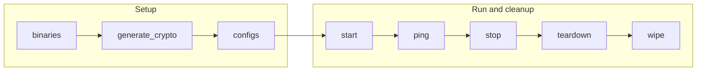

# Committer Playbooks

The `committer` playbooks operate Fabric-X committer services and their storage backend. A committer deployment can use PostgreSQL or YugabyteDB depending on the inventory.

## Table of Contents <!-- omit in toc -->

- [Playbooks flow](#playbooks-flow)
- [binaries.yaml](#binariesyaml)
- [generate\_crypto.yaml](#generate_cryptoyaml)
- [configs.yaml](#configsyaml)
- [start.yaml](#startyaml)
- [stop.yaml](#stopyaml)
- [teardown.yaml](#teardownyaml)
- [wipe.yaml](#wipeyaml)
- [ping.yaml](#pingyaml)
- [get\_metrics.yaml](#get_metricsyaml)
- [fetch\_crypto.yaml](#fetch_cryptoyaml)
- [fetch\_logs.yaml](#fetch_logsyaml)

## Playbooks flow



## binaries.yaml

[`binaries.yaml`](./binaries.yaml) prepares committer executables for binary-mode deployments. It handles control-node install/build work, then ensures targeted validator, verifier, coordinator, sidecar, and query-service hosts receive or build the binary they need.

```shell
ansible-playbook hyperledger.fabricx.committer.binaries --extra-vars '{"target_hosts": "fabric_x_committer"}'
```

Properties:

- Target hosts: `localhost` for control-node build/install decisions, then `fabric_x_committer` by default for remote binary setup.
- Binary activation: only hosts with `committer_use_bin: true` run the remote binary setup step.
- Build location: set `bin_build_on_control_node: true` with `committer_build_bin: true` to build on the control node and transfer the result to remote hosts. In that case, `go` must be installed on the control node. If `committer_build_bin: true` is set without `bin_build_on_control_node`, the build happens on each remote binary host and `go` is needed there.

## generate_crypto.yaml

[`generate_crypto.yaml`](./generate_crypto.yaml) prepares TLS/MSP material for committer services and whichever database backend the inventory declares. It handles PostgreSQL, YugabyteDB, and Fabric-X committer hosts in one pass so the committer pipeline and storage backend use consistent artifacts.

```shell
ansible-playbook hyperledger.fabricx.committer.generate_crypto --extra-vars '{"target_hosts": "fabric_x_committer"}'
```

Properties:

- Target hosts: `fabric_x_committer` by default.
- Nuance: hosts with `postgres_port` are handled by the PostgreSQL role, hosts with `yugabyte_component_type` are handled by the YugabyteDB role, and hosts with `committer_component_type` are handled by the committer role.

## configs.yaml

[`configs.yaml`](./configs.yaml) transfers database configuration when PostgreSQL or YugabyteDB hosts are present, then renders committer service configuration from the selected inventory. It discovers validators, verifiers, the coordinator, and orderer assemblers so the sidecar/coordinator path can connect to the right services.

```shell
ansible-playbook hyperledger.fabricx.committer.configs --extra-vars '{"target_hosts": "fabric_x_committer"}'
```

Properties:

- Target hosts: `fabric_x_committer` by default.
- Nuance: reads `groups['fabric_x_orderers']` to discover assembler endpoints needed by the committer sidecar/coordinator path.

## start.yaml

[`start.yaml`](./start.yaml) starts the committer storage backend before the Fabric-X committer services that depend on it. After PostgreSQL or YugabyteDB is running, it starts validators, verifiers, the coordinator, sidecar, and query service according to each host's `committer_component_type`.

```shell
ansible-playbook hyperledger.fabricx.committer.start --extra-vars '{"target_hosts": "fabric_x_committer"}'
```

Properties:

- Target hosts: `fabric_x_committer` by default.
- Nuance: the database backend is detected from inventory variables: PostgreSQL hosts define `postgres_port`, while YugabyteDB hosts define `yugabyte_component_type`.

## stop.yaml

[`stop.yaml`](./stop.yaml) stops committer services before stopping the configured database backend. It leaves generated files and runtime data in place so the same committer deployment can be started again.

```shell
ansible-playbook hyperledger.fabricx.committer.stop --extra-vars '{"target_hosts": "fabric_x_committer"}'
```

Properties:

- Target hosts: `fabric_x_committer` by default.
- Nuance: stops committer services before the database backend while preserving generated files and runtime data.

## teardown.yaml

[`teardown.yaml`](./teardown.yaml) tears down committer services and database runtime state. Use it when you want to remove the running deployment state rather than simply pause services.

```shell
ansible-playbook hyperledger.fabricx.committer.teardown --extra-vars '{"target_hosts": "fabric_x_committer"}'
```

Properties:

- Target hosts: `fabric_x_committer` by default.
- Nuance: removes runtime state for committer services and the configured database backend.

## wipe.yaml

[`wipe.yaml`](./wipe.yaml) removes committer and database artifacts from targeted hosts, including generated configuration, crypto, and role-managed files that should not remain after a full cleanup.

```shell
ansible-playbook hyperledger.fabricx.committer.wipe --extra-vars '{"target_hosts": "fabric_x_committer"}'
```

Properties:

- Target hosts: `fabric_x_committer` by default.
- Nuance: removes role-managed committer and database artifacts, including generated configuration and crypto.

## ping.yaml

[`ping.yaml`](./ping.yaml) checks committer and database endpoints declared by targeted hosts. It is the quickest post-start validation for sidecar/query access and backend availability.

```shell
ansible-playbook hyperledger.fabricx.committer.ping --extra-vars '{"target_hosts": "fabric_x_committer"}'
```

Properties:

- Target hosts: `fabric_x_committer` by default.
- Nuance: useful as a post-start validation for committer service and backend availability.

## get_metrics.yaml

[`get_metrics.yaml`](./get_metrics.yaml) queries committer metrics endpoints on targeted hosts and returns the collected metrics through Ansible output.

```shell
ansible-playbook hyperledger.fabricx.committer.get_metrics --extra-vars '{"target_hosts": "fabric_x_committer"}'
```

Properties:

- Target hosts: `fabric_x_committer` by default.
- Nuance: intended for ad hoc metrics inspection; Prometheus is the normal continuous metrics collector in sample inventories.

## fetch_crypto.yaml

[`fetch_crypto.yaml`](./fetch_crypto.yaml) fetches committer and database crypto material into the configured artifacts directory for inspection, reuse, or debugging.

```shell
ansible-playbook hyperledger.fabricx.committer.fetch_crypto --extra-vars '{"target_hosts": "fabric_x_committer"}'
```

Properties:

- Target hosts: `fabric_x_committer` by default.
- Nuance: fetches committer and database crypto for inspection, reuse, or debugging.

## fetch_logs.yaml

[`fetch_logs.yaml`](./fetch_logs.yaml) fetches committer service and database logs from targeted hosts into the configured output directory.

```shell
ansible-playbook hyperledger.fabricx.committer.fetch_logs --extra-vars '{"target_hosts": "committer-validator"}'
```

Properties:

- Target hosts: `fabric_x_committer` by default; the example narrows collection to `committer-validator`.
- Nuance: intended for troubleshooting committer service and database failures from the control node.
