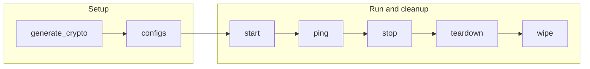

# EVM Playbooks

The `evm` playbooks operate the Fabric-X EVM gateway: the Ethereum JSON-RPC container that embeds an EVM and its own endorser, submitting transactions to the Fabric-X orderers and synchronizing with the committer sidecar.

## Table of Contents <!-- omit in toc -->

- [Playbooks flow](#playbooks-flow)
- [generate\_crypto.yaml](#generate_cryptoyaml)
- [configs.yaml](#configsyaml)
- [start.yaml](#startyaml)
- [stop.yaml](#stopyaml)
- [teardown.yaml](#teardownyaml)
- [wipe.yaml](#wipeyaml)
- [ping.yaml](#pingyaml)
- [fetch\_crypto.yaml](#fetch_cryptoyaml)
- [fetch\_logs.yaml](#fetch_logsyaml)

## Playbooks flow



## generate_crypto.yaml

[`generate_crypto.yaml`](./generate_crypto.yaml) enrolls the peer identity backing the embedded endorser, each declared user identity, and (when `evm_use_tls` is `true`) a shared client TLS key pair.

```shell
ansible-playbook hyperledger.fabricx.evm.generate_crypto --extra-vars '{"target_hosts": "fabric_x_evm"}'
```

Properties:

- Target hosts: `fabric_x_evm` by default.
- Nuance: `organization.role` must be `peer`, and `organization.users` must declare at least one entry; the first entry becomes the gateway's transaction-signing identity.

## configs.yaml

[`configs.yaml`](./configs.yaml) renders the EVM gateway configuration. The committer sidecar is discovered automatically from `fabric_x_committers`, preferring hosts that share `organization.domain` with the EVM host, and falling back to the whole group; the sidecar is the entry whose `committer_component_type` is `sidecar`. Orderer routers are discovered from every host in `fabric_x_orderers` whose `orderer_component_type` is `router`, across all organizations.

```shell
ansible-playbook hyperledger.fabricx.evm.configs --extra-vars '{"target_hosts": "fabric_x_evm"}'
```

Properties:

- Target hosts: `fabric_x_evm` by default.

## start.yaml

[`start.yaml`](./start.yaml) starts the EVM gateway and its embedded endorser.

```shell
ansible-playbook hyperledger.fabricx.evm.start --extra-vars '{"target_hosts": "fabric_x_evm"}'
```

Properties:

- Target hosts: `fabric_x_evm` by default.
- Nuance: opt-in per host through `evm_port`. The gateway does not open its JSON-RPC listener until the embedded endorser has synchronized with the committer sidecar, so a slow or unreachable sidecar delays (or fails) container startup.

## stop.yaml

[`stop.yaml`](./stop.yaml) stops the EVM gateway, leaving generated files and persisted state in place.

```shell
ansible-playbook hyperledger.fabricx.evm.stop --extra-vars '{"target_hosts": "fabric_x_evm"}'
```

Properties:

- Target hosts: `fabric_x_evm` by default.

## teardown.yaml

[`teardown.yaml`](./teardown.yaml) removes the EVM gateway runtime resources while leaving configuration, crypto material, and persisted state intact.

```shell
ansible-playbook hyperledger.fabricx.evm.teardown --extra-vars '{"target_hosts": "fabric_x_evm"}'
```

Properties:

- Target hosts: `fabric_x_evm` by default.

## wipe.yaml

[`wipe.yaml`](./wipe.yaml) removes the EVM gateway artifacts from targeted hosts, including generated configuration, crypto material, and persisted state.

```shell
ansible-playbook hyperledger.fabricx.evm.wipe --extra-vars '{"target_hosts": "fabric_x_evm"}'
```

Properties:

- Target hosts: `fabric_x_evm` by default.

## ping.yaml

[`ping.yaml`](./ping.yaml) checks the EVM gateway's JSON-RPC endpoint declared by targeted hosts.

```shell
ansible-playbook hyperledger.fabricx.evm.ping --extra-vars '{"target_hosts": "fabric_x_evm"}'
```

Properties:

- Target hosts: `fabric_x_evm` by default.
- Nuance: asserts `eth_chainId` matches `evm_chain_id` and that `eth_blockNumber` succeeds, not just that the port is open.

## fetch_crypto.yaml

[`fetch_crypto.yaml`](./fetch_crypto.yaml) fetches EVM peer and user sign certificates, and (when `evm_use_tls` is `true`) the client TLS CA certificate, into the configured artifacts directory.

```shell
ansible-playbook hyperledger.fabricx.evm.fetch_crypto --extra-vars '{"target_hosts": "fabric_x_evm"}'
```

Properties:

- Target hosts: `fabric_x_evm` by default.

## fetch_logs.yaml

[`fetch_logs.yaml`](./fetch_logs.yaml) fetches EVM gateway logs from targeted hosts into the configured output directory.

```shell
ansible-playbook hyperledger.fabricx.evm.fetch_logs --extra-vars '{"target_hosts": "fabric_x_evm"}'
```

Properties:

- Target hosts: `fabric_x_evm` by default.
- Nuance: intended for troubleshooting gateway startup and Fabric-X connectivity failures from the control node.
