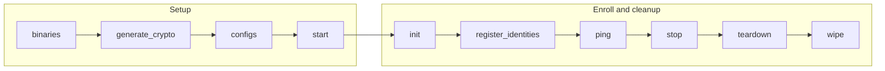

# Fabric CA Server Playbooks

The `fabric_ca_server` playbooks operate Fabric CA servers and the PostgreSQL databases used by those CA servers. Fabric CA inventories use them to create CA server crypto, start the CAs, enroll CA admins, and register identities for Fabric-X components and load generators.

## Table of Contents <!-- omit in toc -->

- [Playbooks flow](#playbooks-flow)
- [binaries.yaml](#binariesyaml)
- [generate\_crypto.yaml](#generate_cryptoyaml)
- [configs.yaml](#configsyaml)
- [start.yaml](#startyaml)
- [init.yaml](#inityaml)
- [register\_identities.yaml](#register_identitiesyaml)
- [stop.yaml](#stopyaml)
- [teardown.yaml](#teardownyaml)
- [wipe.yaml](#wipeyaml)
- [ping.yaml](#pingyaml)
- [fetch\_crypto.yaml](#fetch_cryptoyaml)
- [fetch\_logs.yaml](#fetch_logsyaml)

## Playbooks flow



## binaries.yaml

[`binaries.yaml`](./binaries.yaml) prepares Fabric CA server executables for binary-mode CA deployments. It handles control-node install/build decisions, then ensures remote CA server hosts have the binary by transfer, local build, or install.

=== "Command line"

    ```shell
    ansible-playbook hyperledger.fabricx.fabric_ca_server.binaries --extra-vars '{"target_hosts": "fabric_cas"}'
    ```

=== "From a playbook"

    ```yaml
    - name: Run fabric-ca-server binaries playbook
      vars:
        target_hosts: fabric_cas
      ansible.builtin.import_playbook: hyperledger.fabricx.fabric_ca_server.binaries
    ```

Properties:

- Target hosts: `localhost` for control-node build/install decisions, then `fabric_ca_servers` by default for remote binary setup. With the example `target_hosts: fabric_cas`, the remote phase is narrowed to `fabric_cas:&fabric_ca_servers`.
- Binary activation: only hosts with `fabric_ca_server_use_bin: true` run the remote binary setup step.
- Build location: set `bin_build_on_control_node: true` with `fabric_ca_server_build_bin: true` to build on the control node and transfer the result to remote hosts. In that case, `go` must be installed on the control node. If `fabric_ca_server_build_bin: true` is set without `bin_build_on_control_node`, the build happens on each remote binary host and `go` is needed there.

## generate_crypto.yaml

[`generate_crypto.yaml`](./generate_crypto.yaml) prepares TLS material for Fabric CA servers and their PostgreSQL database hosts. It runs CA-server crypto setup/fetch tasks on hosts with `fabric_ca_port` and database crypto tasks on matching PostgreSQL hosts.

=== "Command line"

    ```shell
    ansible-playbook hyperledger.fabricx.fabric_ca_server.generate_crypto --extra-vars '{"target_hosts": "fabric_cas"}'
    ```

=== "From a playbook"

    ```yaml
    - name: Run fabric-ca-server generate-crypto playbook
      vars:
        target_hosts: fabric_cas
      ansible.builtin.import_playbook: hyperledger.fabricx.fabric_ca_server.generate_crypto
    ```

Properties:

- Target hosts: `fabric_cas` by default.
- Nuance: hosts with `fabric_ca_port` are handled as Fabric CA servers; CA database hosts are handled through the PostgreSQL role.

## configs.yaml

[`configs.yaml`](./configs.yaml) transfers the PostgreSQL and Fabric CA server configuration needed before the CA stack starts. It configures CA database access as well as the Fabric CA server runtime settings.

=== "Command line"

    ```shell
    ansible-playbook hyperledger.fabricx.fabric_ca_server.configs --extra-vars '{"target_hosts": "fabric_cas"}'
    ```

=== "From a playbook"

    ```yaml
    - name: Run fabric-ca-server configs playbook
      vars:
        target_hosts: fabric_cas
      ansible.builtin.import_playbook: hyperledger.fabricx.fabric_ca_server.configs
    ```

Properties:

- Target hosts: `fabric_cas` by default.
- Nuance: transfers both CA server configuration and PostgreSQL database configuration where present.

## start.yaml

[`start.yaml`](./start.yaml) starts the CA PostgreSQL databases first, then starts the Fabric CA servers that depend on them. This gives enrollment and registration tasks live CA endpoints to use.

=== "Command line"

    ```shell
    ansible-playbook hyperledger.fabricx.fabric_ca_server.start --extra-vars '{"target_hosts": "fabric_cas"}'
    ```

=== "From a playbook"

    ```yaml
    - name: Run fabric-ca-server start playbook
      vars:
        target_hosts: fabric_cas
      ansible.builtin.import_playbook: hyperledger.fabricx.fabric_ca_server.start
    ```

Properties:

- Target hosts: `fabric_cas` by default.
- Nuance: starts CA PostgreSQL databases before Fabric CA servers.

## init.yaml

[`init.yaml`](./init.yaml) enrolls Fabric CA administrator identities with the Fabric CA client. These admin identities are required before the registration playbook can create component users.

=== "Command line"

    ```shell
    ansible-playbook hyperledger.fabricx.fabric_ca_server.init --extra-vars '{"target_hosts": "fabric_ca_servers"}'
    ```

=== "From a playbook"

    ```yaml
    - name: Run fabric-ca-server init playbook
      vars:
        target_hosts: fabric_ca_servers
      ansible.builtin.import_playbook: hyperledger.fabricx.fabric_ca_server.init
    ```

Properties:

- Target hosts: `fabric_ca_servers` by default.
- Nuance: run this after the CA servers are started and before registering component identities.

## register_identities.yaml

[`register_identities.yaml`](./register_identities.yaml) derives Fabric-X component users from the inventory and registers them on the correct Fabric CA servers. It covers orderer, committer, and load generator identities as well as organization-level metadata.

=== "Command line"

    ```shell
    ansible-playbook hyperledger.fabricx.fabric_ca_server.register_identities --extra-vars '{"target_hosts": "fabric_ca_servers"}'
    ```

=== "From a playbook"

    ```yaml
    - name: Run fabric-ca-server register-identities playbook
      vars:
        target_hosts: fabric_ca_servers
      ansible.builtin.import_playbook: hyperledger.fabricx.fabric_ca_server.register_identities
    ```

Properties:

- Target hosts: `fabric_ca_servers` by default.
- Nuance: derives registration requests from orderer, committer, load generator, and organization metadata. Each identity is registered on the Fabric CA referenced by the host or organization, so this must run after `init.yaml` and before component crypto generation.

## stop.yaml

[`stop.yaml`](./stop.yaml) stops Fabric CA servers first, then stops their PostgreSQL databases. It leaves generated files and database data in place for a later restart.

=== "Command line"

    ```shell
    ansible-playbook hyperledger.fabricx.fabric_ca_server.stop --extra-vars '{"target_hosts": "fabric_cas"}'
    ```

=== "From a playbook"

    ```yaml
    - name: Run fabric-ca-server stop playbook
      vars:
        target_hosts: fabric_cas
      ansible.builtin.import_playbook: hyperledger.fabricx.fabric_ca_server.stop
    ```

Properties:

- Target hosts: `fabric_cas` by default.
- Nuance: stops Fabric CA servers before their PostgreSQL databases while preserving generated files and database data.

## teardown.yaml

[`teardown.yaml`](./teardown.yaml) tears down Fabric CA servers and their databases, removing runtime state according to the selected runtime mode.

=== "Command line"

    ```shell
    ansible-playbook hyperledger.fabricx.fabric_ca_server.teardown --extra-vars '{"target_hosts": "fabric_cas"}'
    ```

=== "From a playbook"

    ```yaml
    - name: Run fabric-ca-server teardown playbook
      vars:
        target_hosts: fabric_cas
      ansible.builtin.import_playbook: hyperledger.fabricx.fabric_ca_server.teardown
    ```

Properties:

- Target hosts: `fabric_cas` by default.
- Nuance: removes Fabric CA and CA database runtime state according to the selected runtime mode.

## wipe.yaml

[`wipe.yaml`](./wipe.yaml) removes Fabric CA server artifacts, Fabric CA client binaries, and CA database files managed by the roles.

=== "Command line"

    ```shell
    ansible-playbook hyperledger.fabricx.fabric_ca_server.wipe --extra-vars '{"target_hosts": "fabric_cas"}'
    ```

=== "From a playbook"

    ```yaml
    - name: Run fabric-ca-server wipe playbook
      vars:
        target_hosts: fabric_cas
      ansible.builtin.import_playbook: hyperledger.fabricx.fabric_ca_server.wipe
    ```

Properties:

- Target hosts: `fabric_cas` by default.
- Nuance: removes Fabric CA server artifacts, Fabric CA client binaries, and CA database files managed by the roles.

## ping.yaml

[`ping.yaml`](./ping.yaml) checks CA database and Fabric CA server endpoints so you can confirm the enrollment stack is reachable before initialization or identity registration.

=== "Command line"

    ```shell
    ansible-playbook hyperledger.fabricx.fabric_ca_server.ping --extra-vars '{"target_hosts": "fabric_cas"}'
    ```

=== "From a playbook"

    ```yaml
    - name: Run fabric-ca-server ping playbook
      vars:
        target_hosts: fabric_cas
      ansible.builtin.import_playbook: hyperledger.fabricx.fabric_ca_server.ping
    ```

Properties:

- Target hosts: `fabric_cas` by default.
- Nuance: useful before `init.yaml` or `register_identities.yaml` to confirm the enrollment stack is reachable.

## fetch_crypto.yaml

[`fetch_crypto.yaml`](./fetch_crypto.yaml) fetches Fabric CA server and CA database crypto material into the configured artifacts directory.

=== "Command line"

    ```shell
    ansible-playbook hyperledger.fabricx.fabric_ca_server.fetch_crypto --extra-vars '{"target_hosts": "fabric_cas"}'
    ```

=== "From a playbook"

    ```yaml
    - name: Run fabric-ca-server fetch-crypto playbook
      vars:
        target_hosts: fabric_cas
      ansible.builtin.import_playbook: hyperledger.fabricx.fabric_ca_server.fetch_crypto
    ```

Properties:

- Target hosts: `fabric_cas` by default.
- Nuance: fetches Fabric CA server and CA database crypto into the configured artifacts directory.

## fetch_logs.yaml

[`fetch_logs.yaml`](./fetch_logs.yaml) fetches Fabric CA server and CA database logs into the configured output directory for debugging enrollment, registration, or database startup issues.

=== "Command line"

    ```shell
    ansible-playbook hyperledger.fabricx.fabric_ca_server.fetch_logs --extra-vars '{"target_hosts": "fabric_cas"}'
    ```

=== "From a playbook"

    ```yaml
    - name: Run fabric-ca-server fetch-logs playbook
      vars:
        target_hosts: fabric_cas
      ansible.builtin.import_playbook: hyperledger.fabricx.fabric_ca_server.fetch_logs
    ```

Properties:

- Target hosts: `fabric_cas` by default.
- Nuance: intended for debugging enrollment, registration, or CA database startup issues.

Inventories that use `cryptogen` do not include Fabric CA servers, so these playbooks are skipped by the example wrappers through inventory targeting.
