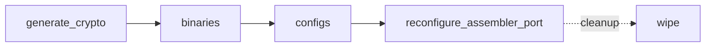

# fxadmin Playbooks

The `fxadmin` playbooks drive live Fabric-X network reconfigurations. `fxadmin` is an admin CLI that pulls the current channel configuration, edits it, collects endorsements from the affected organizations, and broadcasts the resulting reconfiguration transaction -- the same control-plane style as `fxconfig`, but for the channel's own configuration instead of namespace transactions.

## Table of Contents <!-- omit in toc -->

- [Playbooks flow](#playbooks-flow)
- [generate_crypto.yaml](#generate_cryptoyaml)
- [binaries.yaml](#binariesyaml)
- [configs.yaml](#configsyaml)
- [reconfigure_assembler_port.yaml](#reconfigure_assembler_portyaml)
- [wipe.yaml](#wipeyaml)

## Playbooks flow



## generate_crypto.yaml

[`generate_crypto.yaml`](./generate_crypto.yaml) provisions one admin identity per Fabric-X orderer organization on the control node -- a prerequisite for `configs.yaml` and every reconfiguration flow, since submitting a channel `ConfigUpdate` requires a signature from an identity NodeOU-classified as that organization's `admin`, and nothing else in this collection provisions one for orderer organizations (`fxconfig`'s endorsers are a peer/committer-org concept).

```shell
ansible-playbook hyperledger.fabricx.fxadmin.generate_crypto
```

Properties:

- Target hosts: `localhost` only, wired into `examples/playbooks/20-generate-crypto.yaml` right after `hyperledger.fabricx.orderer.generate_crypto`, while cryptogen's own generation output still exists to fetch from.
- Dispatch: for a `cryptogen`-based organization, fetches the `Admin@<domain>` identity `cryptogen` already generates unconditionally (`roles/cryptogen/tasks/fetch.yaml` never does, since it only fetches the organization's root MSP). For a Fabric CA-based organization (`organization.fabric_ca_host` defined), registers and enrolls a new `<Org>Admin` identity directly on that CA host, then fetches the result back.

> [!NOTE]
> The Fabric CA path is the less battle-tested of the two -- it hasn't been run against a live CA server end-to-end yet. If registration or enrollment fails, check that the CA host's bootstrap registrar (`fabric_ca_admin`) is initialized and reachable.

## binaries.yaml

[`binaries.yaml`](./binaries.yaml) prepares the `fxadmin` CLI. Like `fxconfig`, it builds/installs once on the control node and then ensures the binary also exists on every orderer organization's own hosts -- `configs.yaml` and `reconfigure_assembler_port.yaml` authenticate as an organization's identity on that organization's own reference host, never the control node, so the CLI must be there too.

```shell
ansible-playbook hyperledger.fabricx.fxadmin.binaries
```

Properties:

- Target hosts: `localhost` for the initial build/install, then `fabric_x_orderers` (hosts whose `organization.user` is defined) for the remote-node install/build/transfer.
- Binary activation: only runs when `fxadmin_use_bin: true`.
- Build location: set `fxadmin_build_bin: true` to build on the control node and transfer the binary out instead of each host installing it independently via `go install`.

## configs.yaml

[`configs.yaml`](./configs.yaml) picks one reference orderer host per organization (its alphabetically-first consenter in `fabric_x_orderers`) and renders `fxadmin`'s admin configuration (MSP identity, TLS/mTLS material) directly on it, for the single identity declared in `organization.user` -- the admin identity `generate_crypto.yaml` provisioned, used for every `fxadmin` operation. The identity's private key material is synced from the control node onto that reference host and never persists on the control node itself.

```shell
ansible-playbook hyperledger.fabricx.fxadmin.configs
```

Properties:

- Target hosts: `localhost` to resolve reference hosts, then `fabric_x_orderers` (one host per organization actually renders anything; every other host is a no-op).
- Nuance: run this during setup after `generate_crypto.yaml` and before any `fxadmin` reconfiguration flow.

## reconfigure_assembler_port.yaml

[`reconfigure_assembler_port.yaml`](./reconfigure_assembler_port.yaml) changes the network-level port of one Fabric-X orderer Assembler. It fetches the latest channel configuration block, decodes it, patches the target Assembler's endpoint, computes the resulting `ConfigUpdate`, collects an endorsement from every orderer organization, merges them, and submits the transaction.

```shell
ansible-playbook hyperledger.fabricx.fxadmin.reconfigure_assembler_port \
  --extra-vars '{"target_hosts": "orderer-assembler-1", "new_assembler_port": 7065}'
```

Or via the dedicated Makefile target:

```shell
make reconfigure-assembler-port TARGET_HOSTS=orderer-assembler-1 NEW_PORT=7065
```

Properties:

- Target hosts: every step that authenticates as an organization's identity (fetching the current config block, endorsing, preparing, submitting, following) runs on that organization's own reference orderer host, resolved the same way as `configs.yaml`. Only pure, identity-less artifact transforms (decode, patch, compute-update, merge) run on `localhost`. Artifacts hand off through the control node between phases, matching `playbooks/fxconfig/create_namespaces.yaml`.
- `target_hosts` must name a single Assembler host in the `fabric_x_orderers` inventory group; `new_assembler_port` is the port to write into the channel configuration.
- Scope: this playbook only submits the channel `ConfigUpdate`. It does **not** restart the affected Assembler process with the new port -- run `make <affected_orderer_node> configs restart` afterwards to apply the change to the running component.
- Nuance: run this after the network is started, since fetching and submitting configuration requires live Fabric-X orderer endpoints. Requires `binaries.yaml` and `configs.yaml` to have already run so every organization's reference host already has the CLI and its admin configuration.

> [!NOTE]
> The JSON path patched (`channel_group.groups.Orderer.groups.<OrgName>.values.Endpoints.value.addresses`, keyed by the plain organization name -- e.g. `OrdererOrg1`, not its `OrdererOrg1MSP` MSP ID) has been confirmed against a real `fxadmin decode` sample from a live local dev network.

## wipe.yaml

[`wipe.yaml`](./wipe.yaml) removes the `fxadmin` binary (when `fxadmin_use_bin: true`) from every orderer organization's hosts, and every generated `fxadmin` configuration and reconfiguration artifact on the control node, so they can be rebuilt cleanly during another setup or debug cycle.

```shell
ansible-playbook hyperledger.fabricx.fxadmin.wipe
```

Properties:

- Target hosts: `fabric_x_orderers` (hosts whose `organization.user` is defined) for the binary, then `localhost` for control-node artifacts.
