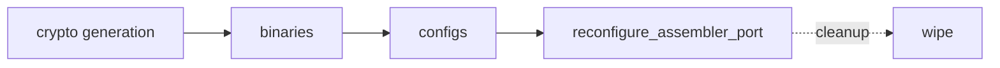

# fxadmin Playbooks

The `fxadmin` playbooks drive live Fabric-X network reconfigurations. `fxadmin` is an admin CLI that pulls the current channel configuration, edits it, collects endorsements from the affected organizations, and broadcasts the resulting reconfiguration transaction -- the same control-plane style as `fxconfig`, but for the channel's own configuration instead of namespace transactions.

`fxadmin` never generates or fetches crypto material of its own. It consumes the admin identity declared in an organization's `organization.user`. Cryptogen-generated users are copied to the control node by the cryptogen fetch, and Fabric CA admin users are registered and enrolled there by `playbooks/artifacts/enroll_organization_users.yaml`, for any organization and inventory group.

## Supported reconfiguration flows

Each row is one specific network-level change `fxadmin` can drive end-to-end today. Add a row here whenever a new one lands.

| Flow | Playbook | Changes |
| --- | --- | --- |
| Change an orderer Assembler's port | [`reconfigure_assembler_port.yaml`](#reconfigure_assembler_portyaml) | The Assembler's org-level `Endpoints` entry and the channel-wide `ConsensusType.metadata.PartiesConfig` entry for that party |

## Table of Contents <!-- omit in toc -->

- [Supported reconfiguration flows](#supported-reconfiguration-flows)
- [Playbooks flow](#playbooks-flow)
- [binaries.yaml](#binariesyaml)
- [configs.yaml](#configsyaml)
- [reconfigure_assembler_port.yaml](#reconfigure_assembler_portyaml)
- [wipe.yaml](#wipeyaml)

## Playbooks flow


```mermaid
flowchart LR
  CRYPTO[crypto generation] --> BIN[binaries] --> CONFIGS[configs]
  CONFIGS --> RECONFIG[reconfigure_assembler_port]
  RECONFIG -. cleanup .-> WIPE[wipe]
```

## Admin hosts

An **admin host** is any inventory host whose `organization.user` has `type: admin`, in any group, except Fabric CA server hosts: they inherit their organization's anchor, including its user, but only run the CA. Binaries, configs and wipe act on every admin host. The `build_crypto_material` playbook rejects an orderer organization whose user is not `type: admin`. Every step that signs does so as the organization's identity on that host.

Reconfiguration uses the same admin hosts, in any organization, as the rest of the tool. Within it:

- Every admin host endorses, as `fxconfig` does. Each endorsement is named by the organization's identity, so duplicates from one organization overwrite one file and the merge sees one endorsement per identity.
- A single admin host, the leader, prepares and submits the merged `ConfigUpdate`. It is the first admin host by inventory name, the same `hosts[0] == inventory_hostname` pattern `fxconfig` uses for its submitter.
- Only the orderer organizations' admins count toward the `Orderer` group's `Admins` policy, which is `MAJORITY Admins` over the orderer organizations in the `configtxgen` defaults. Endorsements from other organizations are included as requested, but on their own they do not satisfy that policy.

## binaries.yaml

[`binaries.yaml`](./binaries.yaml) prepares the `fxadmin` CLI. It is built once per target platform on the control node, which also runs the control-node-only steps (decode, compute-update, merge), and then delivered to every admin host.

```shell
ansible-playbook hyperledger.fabricx.fxadmin.binaries
```

Properties:

- Target hosts: `localhost` for the build, then the admin hosts (narrowed by `target_hosts`) for delivery.
- Binary activation: only runs when `fxadmin_use_bin: true`.
- Build location: with `bin_build_on_control_node: true` the binary is built once on the control node and transferred out; otherwise each admin host installs it independently via `go install`.
- Why two plays: `bin/install` builds into the control node's bin directory, and only `bin/transfer` copies it onto a remote host. The transfer's source path depends on each host's platform, which the bin role resolves in that host's own context. Every other binaries playbook in the repo (`fxconfig`, `orderer`, `committer`, `loadgen`, `fabric_ca_server`, `fabric_ca_client`) uses the same split. Folding delivery into the build play would need the platform path reimplemented there, or `delegate_to` on `include_role`, which this Ansible version rejects.

## configs.yaml

[`configs.yaml`](./configs.yaml) renders `fxadmin`'s admin configuration (MSP identity, TLS/mTLS material) on every admin host, for the identity declared in its organization's `organization.user`. The identity's MSP and TLS material is provisioned onto the control node and synced from there, so a private key only reaches a host that signs with it.

```shell
ansible-playbook hyperledger.fabricx.fxadmin.configs
```

Properties:

- Target hosts: the admin hosts, narrowed by `target_hosts`.
- TLS settings are read from the orderers (`orderer_use_tls`, `orderer_use_mtls`), since they describe the network `fxadmin` connects to, not the host being configured.
- Nuance: run this during setup after the crypto generation in `examples/playbooks/20-generate-crypto.yaml` and before any `fxadmin` reconfiguration flow.

## reconfigure_assembler_port.yaml

[`reconfigure_assembler_port.yaml`](./reconfigure_assembler_port.yaml) changes the network-level port of one Fabric-X orderer Assembler. It fetches the latest channel configuration block on each admin host, decodes it, patches the Assembler's endpoint, computes the resulting `ConfigUpdate`, collects an endorsement from every admin host, merges them, and submits the transaction from the leader.

```shell
ansible-playbook hyperledger.fabricx.fxadmin.reconfigure_assembler_port \
  --extra-vars '{"target_hosts": "all", "assembler_host": "orderer-assembler-1", "new_assembler_port": 7065}'
```

Or via the dedicated Makefile target:

```shell
make reconfigure-assembler-port ASSEMBLER_HOST=orderer-assembler-1 NEW_PORT=7065
```

Properties:

- `assembler_host` names the single Assembler whose port changes. It must be in the `fabric_x_orderers` group and have `orderer_component_type: assembler`.
- `target_hosts` (`TARGET_HOSTS` in the Makefile, default `all`) selects the admin hosts that take part. It must cover at least one admin host of every organization that has one, and the leader, and the playbook fails otherwise rather than submitting a partial endorsement set.
- Host roles: fetch and endorsement run on every selected admin host, and prepare, submit and follow on the leader only. Decode, patch, compute-update and merge run on `localhost`.
- Patch: only two values change. The assembler's deliver address in the organization's `Endpoints` is replaced in place, and its `AssemblerConfig.port` in `PartiesConfig` is updated. Everything else is copied unchanged from the decoded current configuration, so the `ConfigUpdate` carries no other change.
- Scope: this playbook only submits the channel `ConfigUpdate`. It does **not** restart the affected Assembler process with the new port -- run `make <assembler_host> configs restart` afterwards to apply the change to the running component.
- Nuance: run this after the network is started, since fetching and submitting configuration requires live Fabric-X orderer endpoints. Requires `binaries.yaml` and `configs.yaml` to have already run so every admin host already has the CLI and its admin configuration.

> [!NOTE]
> The JSON path patched (`channel_group.groups.Orderer.groups.<OrgName>.values.Endpoints.value.addresses`, keyed by the plain organization name -- e.g. `OrdererOrg1`, not its `OrdererOrg1MSP` MSP ID) has been confirmed against a real `fxadmin decode` sample from a live local dev network.

## wipe.yaml

[`wipe.yaml`](./wipe.yaml) removes the `fxadmin` binary (when `fxadmin_use_bin: true`) and the rendered `fxadmin` configuration from every host that belongs to an organization. On the control node it removes the generated `fxadmin` reconfiguration artifacts and each admin organization's identity material, so the next setup re-provisions the identity instead of reusing a stale key.

```shell
ansible-playbook hyperledger.fabricx.fxadmin.wipe
```

Properties:

- Target hosts: every host with an `organization` (narrowed by `target_hosts`), whether or not it declares an `organization.user`, so removing a user from the inventory still cleans up what an earlier run rendered. Then `localhost` for control-node artifacts.
