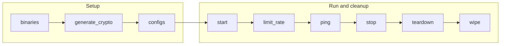

# Load Generator Playbooks

The `loadgen` playbooks operate Fabric-X load generators. A load generator submits traffic to the orderer path and can expose control, metrics, and web endpoints depending on inventory settings.

## Table of Contents <!-- omit in toc -->

- [Playbooks flow](#playbooks-flow)
- [binaries.yaml](#binariesyaml)
- [generate\_crypto.yaml](#generate_cryptoyaml)
- [configs.yaml](#configsyaml)
- [start.yaml](#startyaml)
- [stop.yaml](#stopyaml)
- [teardown.yaml](#teardownyaml)
- [wipe.yaml](#wipeyaml)
- [limit\_rate.yaml](#limit_rateyaml)
- [ping.yaml](#pingyaml)
- [get\_metrics.yaml](#get_metricsyaml)
- [fetch\_crypto.yaml](#fetch_cryptoyaml)
- [fetch\_logs.yaml](#fetch_logsyaml)

## Playbooks flow



## binaries.yaml

[`binaries.yaml`](./binaries.yaml) prepares the load generator executable for binary-mode deployments. It handles control-node install/build decisions, then ensures targeted load generator hosts have the binary by transfer, local build, or install.

```shell
ansible-playbook hyperledger.fabricx.loadgen.binaries --extra-vars '{"target_hosts": "load_generators"}'
```

Properties:

- Target hosts: `localhost` for control-node build/install decisions, then `load_generators` by default for remote binary setup.
- Binary activation: only hosts with `loadgen_use_bin: true` run the remote binary setup step.
- Build location: set `bin_build_on_control_node: true` with `loadgen_build_bin: true` to build on the control node and transfer the result to remote hosts. In that case, `go` must be installed on the control node. If `loadgen_build_bin: true` is set without `bin_build_on_control_node`, the build happens on each remote binary host and `go` is needed there.

## generate_crypto.yaml

[`generate_crypto.yaml`](./generate_crypto.yaml) prepares the identity and TLS material used by load generators when they submit traffic and fetch transaction/block status from Fabric-X services. It also fetches generated material back to the configured artifacts location.

```shell
ansible-playbook hyperledger.fabricx.loadgen.generate_crypto --extra-vars '{"target_hosts": "load_generators"}'
```

Properties:

- Target hosts: `load_generators` by default.

## configs.yaml

[`configs.yaml`](./configs.yaml) renders and transfers load generator configuration from the selected topology. It discovers orderer routers and committer endpoints, then writes the connection, identity, namespace, and rate-related settings needed before startup.

```shell
ansible-playbook hyperledger.fabricx.loadgen.configs --extra-vars '{"target_hosts": "load_generators"}'
```

Properties:

- Target hosts: `load_generators` by default.
- Nuance: reads `groups['fabric_x_committer']` and `groups['fabric_x_orderers']` to render connection configuration.

## start.yaml

[`start.yaml`](./start.yaml) starts targeted load generator services using the rendered configuration and the runtime mode declared in the inventory. The started process submits transactions to orderer routers and observes commit status through committer endpoints.

```shell
ansible-playbook hyperledger.fabricx.loadgen.start --extra-vars '{"target_hosts": "load_generators"}'
```

Properties:

- Target hosts: `load_generators` by default.
- Nuance: starts load generators with the rendered orderer and committer endpoint context.

## stop.yaml

[`stop.yaml`](./stop.yaml) stops targeted load generator processes, containers, or Kubernetes workloads without deleting generated files or runtime output.

```shell
ansible-playbook hyperledger.fabricx.loadgen.stop --extra-vars '{"target_hosts": "load_generators"}'
```

Properties:

- Target hosts: `load_generators` by default.
- Nuance: stops load generators without deleting generated files or runtime output.

## teardown.yaml

[`teardown.yaml`](./teardown.yaml) stops load generators and removes runtime state according to the selected runtime mode. Use it when a fresh load generator run should not reuse previous runtime data.

```shell
ansible-playbook hyperledger.fabricx.loadgen.teardown --extra-vars '{"target_hosts": "load_generators"}'
```

Properties:

- Target hosts: `load_generators` by default.
- Nuance: removes runtime state so a later load test does not reuse the previous run data.

## wipe.yaml

[`wipe.yaml`](./wipe.yaml) removes load generator artifacts from targeted hosts, including generated configuration, crypto, and binary files managed by the role.

```shell
ansible-playbook hyperledger.fabricx.loadgen.wipe --extra-vars '{"target_hosts": "load_generators"}'
```

Properties:

- Target hosts: `load_generators` by default.
- Nuance: removes role-managed load generator configuration, crypto, and binary files.

## limit_rate.yaml

[`limit_rate.yaml`](./limit_rate.yaml) changes the transaction submission rate on targeted running load generators. It is useful for ramping traffic up or down without regenerating the whole load generator configuration.

```shell
ansible-playbook hyperledger.fabricx.loadgen.limit_rate --extra-vars '{"target_hosts": "load_generators", "loadgen_limit_rate": "5000"}'
```

Properties:

- Target hosts: `load_generators` by default.
- Nuance: if an inventory does not set `loadgen_limit_rate`, the rendered load generator configuration uses the role default of 10 transactions per second. The Makefile `limit-rate` target defaults `LIMIT` to `1000`, so `make limit-rate` without extra arguments changes a running load generator to 1000 TPS.

## ping.yaml

[`ping.yaml`](./ping.yaml) checks targeted load generator endpoints, including the service endpoints exposed by the selected runtime mode.

```shell
ansible-playbook hyperledger.fabricx.loadgen.ping --extra-vars '{"target_hosts": "load_generators"}'
```

Properties:

- Target hosts: `load_generators` by default.
- Nuance: checks the service endpoints exposed by the selected runtime mode.

## get_metrics.yaml

[`get_metrics.yaml`](./get_metrics.yaml) queries load generator metrics endpoints and returns the collected metrics through Ansible output.

```shell
ansible-playbook hyperledger.fabricx.loadgen.get_metrics --extra-vars '{"target_hosts": "load_generators"}'
```

Properties:

- Target hosts: `load_generators` by default.
- Nuance: intended for ad hoc metrics inspection; Prometheus is the normal continuous metrics collector in sample inventories.

## fetch_crypto.yaml

[`fetch_crypto.yaml`](./fetch_crypto.yaml) fetches load generator certificates and keys from targeted hosts into the configured artifacts directory.

```shell
ansible-playbook hyperledger.fabricx.loadgen.fetch_crypto --extra-vars '{"target_hosts": "load_generators"}'
```

Properties:

- Target hosts: `load_generators` by default.
- Nuance: fetches load generator certificates and keys into the configured artifacts directory.

## fetch_logs.yaml

[`fetch_logs.yaml`](./fetch_logs.yaml) fetches load generator logs from targeted hosts into the configured output directory for run analysis and troubleshooting.

```shell
ansible-playbook hyperledger.fabricx.loadgen.fetch_logs --extra-vars '{"target_hosts": "load-generator"}'
```

Properties:

- Target hosts: `load_generators` by default; the example narrows collection to `load-generator`.
- Nuance: intended for run analysis and troubleshooting from the control node.
