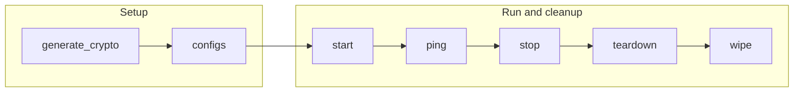

# Monitoring Playbooks

The `monitoring` playbooks operate observability components: node exporter, PostgreSQL exporter, Prometheus, Grafana, Elasticsearch, and Jaeger when those hosts are present in the inventory.

## Table of Contents <!-- omit in toc -->

- [Playbooks flow](#playbooks-flow)
- [generate\_crypto.yaml](#generate_cryptoyaml)
- [configs.yaml](#configsyaml)
- [start.yaml](#startyaml)
- [stop.yaml](#stopyaml)
- [teardown.yaml](#teardownyaml)
- [wipe.yaml](#wipeyaml)
- [ping.yaml](#pingyaml)
- [fetch\_crypto.yaml](#fetch_cryptoyaml)
- [fetch\_logs.yaml](#fetch_logsyaml)

## Playbooks flow



## generate_crypto.yaml

[`generate_crypto.yaml`](./generate_crypto.yaml) prepares TLS material for observability components that require it. It runs the relevant crypto setup/fetch tasks for monitoring hosts that define component-specific variables, such as Prometheus, Grafana, exporters, Elasticsearch, or Jaeger.

```shell
ansible-playbook hyperledger.fabricx.monitoring.generate_crypto --extra-vars '{"target_hosts": "monitoring"}'
```

Properties:

- Target hosts: `monitoring` by default.
- Nuance: roles only run where matching component variables are defined.

## configs.yaml

[`configs.yaml`](./configs.yaml) assembles the monitoring configuration for the selected topology. It transfers exporter configuration, discovers scrape targets from Fabric-X and database hosts, renders Prometheus configuration, transfers Grafana dashboards, and configures optional Elasticsearch or Jaeger services when present.

```shell
ansible-playbook hyperledger.fabricx.monitoring.configs --extra-vars '{"target_hosts": "monitoring"}'
```

Properties:

- Target hosts: `monitoring` by default.
- Nuance: reads orderer, committer, load generator, YugabyteDB, PostgreSQL exporter, and node exporter groups to build Prometheus scrape configuration.

## start.yaml

[`start.yaml`](./start.yaml) starts the monitoring stack described by the inventory. It conditionally starts node exporter, PostgreSQL exporter, Prometheus, Grafana, Elasticsearch, and Jaeger only on hosts that declare the matching variables.

```shell
ansible-playbook hyperledger.fabricx.monitoring.start --extra-vars '{"target_hosts": "monitoring"}'
```

Properties:

- Target hosts: `monitoring` by default.
- Nuance: the sample inventories include Prometheus and Grafana. Elasticsearch and Jaeger are opt-in and start only when matching hosts and variables exist.

## stop.yaml

[`stop.yaml`](./stop.yaml) stops the monitoring components running on targeted hosts while leaving generated configuration and collected artifacts in place for later restart or inspection.

```shell
ansible-playbook hyperledger.fabricx.monitoring.stop --extra-vars '{"target_hosts": "monitoring"}'
```

Properties:

- Target hosts: `monitoring` by default.
- Nuance: stops monitoring services while leaving generated configuration and collected artifacts in place.

## teardown.yaml

[`teardown.yaml`](./teardown.yaml) tears down monitoring runtimes and their service data according to each role's implementation. Use it when you want to remove running observability services rather than just stop them.

```shell
ansible-playbook hyperledger.fabricx.monitoring.teardown --extra-vars '{"target_hosts": "monitoring"}'
```

Properties:

- Target hosts: `monitoring` by default.
- Nuance: removes monitoring runtime/service data according to each role's implementation.

## wipe.yaml

[`wipe.yaml`](./wipe.yaml) removes generated monitoring artifacts from targeted hosts, including configuration and role-managed files that should not survive a full cleanup.

```shell
ansible-playbook hyperledger.fabricx.monitoring.wipe --extra-vars '{"target_hosts": "monitoring"}'
```

Properties:

- Target hosts: `monitoring` by default.
- Nuance: removes generated monitoring artifacts and role-managed files.

## ping.yaml

[`ping.yaml`](./ping.yaml) checks the reachable endpoints for monitoring services declared by targeted hosts. It is useful after startup to confirm dashboards, scrape services, and optional backends are responding.

```shell
ansible-playbook hyperledger.fabricx.monitoring.ping --extra-vars '{"target_hosts": "monitoring"}'
```

Properties:

- Target hosts: `monitoring` by default.
- Nuance: useful after startup to confirm dashboards, scrape services, and optional backends are responding.

## fetch_crypto.yaml

[`fetch_crypto.yaml`](./fetch_crypto.yaml) fetches monitoring TLS material from targeted hosts into the configured artifacts location for inspection or reuse.

```shell
ansible-playbook hyperledger.fabricx.monitoring.fetch_crypto --extra-vars '{"target_hosts": "monitoring"}'
```

Properties:

- Target hosts: `monitoring` by default.
- Nuance: fetches monitoring TLS material for inspection or reuse.

## fetch_logs.yaml

[`fetch_logs.yaml`](./fetch_logs.yaml) collects logs from the monitoring services declared on targeted hosts, which is useful when Prometheus targets, Grafana dashboards, or optional tracing/logging backends do not come up cleanly.

```shell
ansible-playbook hyperledger.fabricx.monitoring.fetch_logs --extra-vars '{"target_hosts": "monitoring"}'
```

Properties:

- Target hosts: `monitoring` by default.
- Nuance: intended for troubleshooting Prometheus targets, Grafana dashboards, or optional tracing/logging backends.
