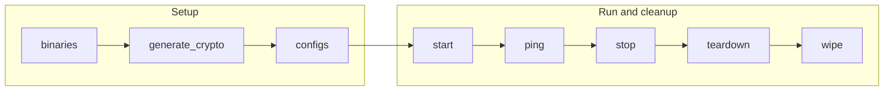

# Orderer Playbooks

The `orderer` playbooks operate Fabric-X orderer components: routers, batchers, consenters, and assemblers. They target `fabric_x_orderers` by default and dispatch through each host's `orderer_component_type`.

## Table of Contents <!-- omit in toc -->

- [Playbooks flow](#playbooks-flow)
- [binaries.yaml](#binariesyaml)
- [generate\_crypto.yaml](#generate_cryptoyaml)
- [configs.yaml](#configsyaml)
- [start.yaml](#startyaml)
- [stop.yaml](#stopyaml)
- [teardown.yaml](#teardownyaml)
- [wipe.yaml](#wipeyaml)
- [ping.yaml](#pingyaml)
- [get\_metrics.yaml](#get_metricsyaml)
- [fetch\_crypto.yaml](#fetch_cryptoyaml)
- [fetch\_logs.yaml](#fetch_logsyaml)

## Playbooks flow



## binaries.yaml

[`binaries.yaml`](./binaries.yaml) prepares the orderer executable for inventories that run Fabric-X orderer components as binaries. It decides whether the control node should install or build the binary, then makes sure each targeted binary-mode router, batcher, consenter, or assembler has the executable by transfer, local build, or install.

```shell
ansible-playbook hyperledger.fabricx.orderer.binaries --extra-vars '{"target_hosts": "fabric_x_orderers"}'
```

Properties:

- Target hosts: `localhost` for control-node build/install decisions, then `fabric_x_orderers` by default for remote binary setup.
- Binary activation: only hosts with `orderer_use_bin: true` run the remote binary setup step.
- Build location: set `bin_build_on_control_node: true` with `orderer_build_bin: true` to build on the control node and transfer the result to remote hosts. In that case, `go` must be installed on the control node. If `orderer_build_bin: true` is set without `bin_build_on_control_node`, the build happens on each remote binary host and `go` is needed there.

## generate_crypto.yaml

[`generate_crypto.yaml`](./generate_crypto.yaml) creates the TLS/MSP material needed by targeted orderer components and fetches the resulting certificates and keys back to the configured artifacts location. Use it for inventories where orderer identities are generated or enrolled on the component hosts rather than supplied by the central `cryptogen` artifact flow.

```shell
ansible-playbook hyperledger.fabricx.orderer.generate_crypto --extra-vars '{"target_hosts": "fabric_x_orderers"}'
```

Properties:

- Target hosts: `fabric_x_orderers` by default.

## configs.yaml

[`configs.yaml`](./configs.yaml) transfers the generated orderer configuration to each targeted component host. The role uses `orderer_component_type` to place the router, batcher, consensus, or assembler configuration expected by that host.

```shell
ansible-playbook hyperledger.fabricx.orderer.configs --extra-vars '{"target_hosts": "fabric_x_orderers"}'
```

Properties:

- Target hosts: `fabric_x_orderers` by default.
- Nuance: each host receives configuration for its `orderer_component_type`.

## start.yaml

[`start.yaml`](./start.yaml) starts the selected orderer components using the runtime mode declared in the inventory. Each host dispatches to the router, batcher, consensus, or assembler start task based on `orderer_component_type`.

```shell
ansible-playbook hyperledger.fabricx.orderer.start --extra-vars '{"target_hosts": "fabric_x_orderers"}'
```

Properties:

- Target hosts: `fabric_x_orderers` by default.
- Nuance: each host dispatches to the start task for its `orderer_component_type`.
- Nuance: while debugging, set `target_hosts` to one component host such as `orderer-router-1`.

## stop.yaml

[`stop.yaml`](./stop.yaml) stops the selected orderer processes, containers, or Kubernetes workloads without deleting generated configuration, crypto, or runtime data. Use it when you expect to restart the same deployment.

```shell
ansible-playbook hyperledger.fabricx.orderer.stop --extra-vars '{"target_hosts": "fabric_x_orderers"}'
```

Properties:

- Target hosts: `fabric_x_orderers` by default.
- Nuance: stops services without deleting generated configuration, crypto, or runtime data.

## teardown.yaml

[`teardown.yaml`](./teardown.yaml) stops targeted orderer components and removes their runtime data according to the selected runtime mode. Use it for a stronger cleanup than `stop.yaml` when the current service state should not be preserved.

```shell
ansible-playbook hyperledger.fabricx.orderer.teardown --extra-vars '{"target_hosts": "fabric_x_orderers"}'
```

Properties:

- Target hosts: `fabric_x_orderers` by default.
- Nuance: removes runtime data, making this a stronger cleanup than `stop.yaml`.

## wipe.yaml

[`wipe.yaml`](./wipe.yaml) removes generated orderer files from targeted hosts, including configuration, fetched/generated crypto, and binary artifacts managed by the orderer role.

```shell
ansible-playbook hyperledger.fabricx.orderer.wipe --extra-vars '{"target_hosts": "fabric_x_orderers"}'
```

Properties:

- Target hosts: `fabric_x_orderers` by default.
- Nuance: removes role-managed orderer files, including generated configuration, crypto, and binary artifacts.

## ping.yaml

[`ping.yaml`](./ping.yaml) checks that targeted orderer endpoints are reachable after startup. It is a quick smoke test for router, batcher, consensus, and assembler service availability.

```shell
ansible-playbook hyperledger.fabricx.orderer.ping --extra-vars '{"target_hosts": "fabric_x_orderers"}'
```

Properties:

- Target hosts: `fabric_x_orderers` by default.
- Nuance: useful as a post-start smoke test for routers, batchers, consenters, and assemblers.

## get_metrics.yaml

[`get_metrics.yaml`](./get_metrics.yaml) queries orderer metrics endpoints on targeted hosts and returns the collected metrics through Ansible output.

```shell
ansible-playbook hyperledger.fabricx.orderer.get_metrics --extra-vars '{"target_hosts": "fabric_x_orderers"}'
```

Properties:

- Target hosts: `fabric_x_orderers` by default.
- Nuance: intended for ad hoc metrics inspection; Prometheus is the normal continuous metrics collector in sample inventories.

## fetch_crypto.yaml

[`fetch_crypto.yaml`](./fetch_crypto.yaml) fetches orderer certificates and keys from targeted hosts into the configured artifacts directory. It is useful when crypto was generated remotely and later playbooks or troubleshooting need a control-node copy.

```shell
ansible-playbook hyperledger.fabricx.orderer.fetch_crypto --extra-vars '{"target_hosts": "fabric_x_orderers"}'
```

Properties:

- Target hosts: `fabric_x_orderers` by default.
- Nuance: useful when crypto was generated remotely and later playbooks or troubleshooting need a control-node copy.

## fetch_logs.yaml

[`fetch_logs.yaml`](./fetch_logs.yaml) fetches orderer logs from targeted hosts into the configured output directory so component failures can be inspected from the control node.

```shell
ansible-playbook hyperledger.fabricx.orderer.fetch_logs --extra-vars '{"target_hosts": "orderer-router-1"}'
```

Properties:

- Target hosts: `fabric_x_orderers` by default; the example narrows collection to `orderer-router-1`.
- Nuance: intended for troubleshooting targeted component failures from the control node.
